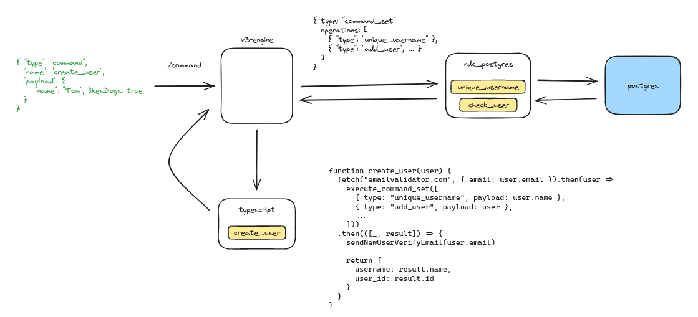
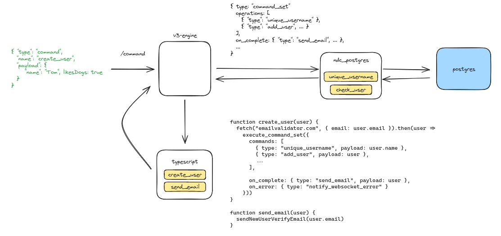

# Commands

While reads are very well-suited to the "models" abstraction in V3, writes seem trickier. We have a bunch of problems to worry about (transactions, foreign key constraints, eventual consistency) that can't be particularly neatly described within the framework of GraphQL. Because of this, we seem to be talking more and more about a command graph as distinct from a read graph. This would be a set of commands that determine what we can do as distinct commands (much like commands in the CQRS/ES sense). Here's an idea about what this could look like.

An example
----------

Let's imagine I want to insert a user called Tom who likes dogs. To do this, I want to check that the email address is valid using some external API, and that no one else has the same username. I then want to verify their email address. In this model:

-   I write a command handler (create_user) in the [TS connector](https://github.com/hasura/ndc-typescript-deno), which takes the user, does the validation, and tries to execute some PG connector commands:

-   unique_username: a check to see whether the username is available

-   add_user: an insert command to add the user

-   The TS connector makes some command calls to ndc_postgres (via the same engine endpoint as the user's original command).

-   I write the commands in ndc_postgres, which turns each command into a SQL statement, runs it, and returns results/errors. Note that this doesn't involve outside I/O - that is handled by the TS connector.

-   The TS connector receives this response, sends the verification email, and returns the command response (the username and user_id).

What if I want non-blocking writes?
-----------------------------------

It's basically the same, except we have an optional `on_complete` and `on_error` handler, and if these are included, we're into continuation country - these commands get issued when the others succeed/fail, and execute_command_set can return immediately. Not necessarily a first release feature, but a nice second release feature (and very appealing to anyone who does want to build event sourcing with Hasura).

What if I want transactions?
----------------------------

We can have something like transactional_command_set. As part of the engine's request validation, we can ensure that every command in that set will execute on the same datasource (and that this datasource supports transactions). All we're really doing here is extending the command vocabulary of the engine.

What if I want nested inserts?
------------------------------

You may find that, in many cases, manipulating data atomically might be more pertinent than specifically aiming for nested inserts - what you more likely want is a way to manipulate data atomically. Nested inserts are tricky because of all the things you have to worry about (which way do the foreign key constraints go? Which data should I insert first?), but in this model, that's the user's concern, and they're free to design their commands in a chunk of code.

What if I want event sourcing?
------------------------------

Go for it - the ndc_postgres (or ndc_kafka or whatever) commands can just write to an event log, and something else can do the projection to a read model. We're making no assumptions here, so the user is free to handle things like consistency / conflict resolution in their own code.

What if I want multi-connector atomicity?
-----------------------------------------

This is difficult in general, as this concept won't exist for most (read: any) backends. However, a possible solution is to add a mutex to the TypeScript command that guarantees only one execution of a given command (or set of conflicting commands) at any given time. The pro is that you can manipulate as many sources (via as many connectors) as you want, but the con is that you could get into trouble if any other outside program mutates one of your data sources. With enough caveats, though, this is something a user could implement via the TS connector.

What if I want arbitrary validation?
------------------------------------

Let's imagine I want to forbid users from calling add_user on the ndc-postgres connector directly, and instead require them to go via the TypeScript connector (for example, maybe I need to check their email address against a spam directory online).

Our proposal was that we take a model similar to Docker networking: permissions apply to users when they reach the border of the Hasura cluster, but once you're inside, permissions are not re-applied. So, if the user doesn't have permission to call add_user, the TS connector can call add_user because it's calling the engine from within the network.