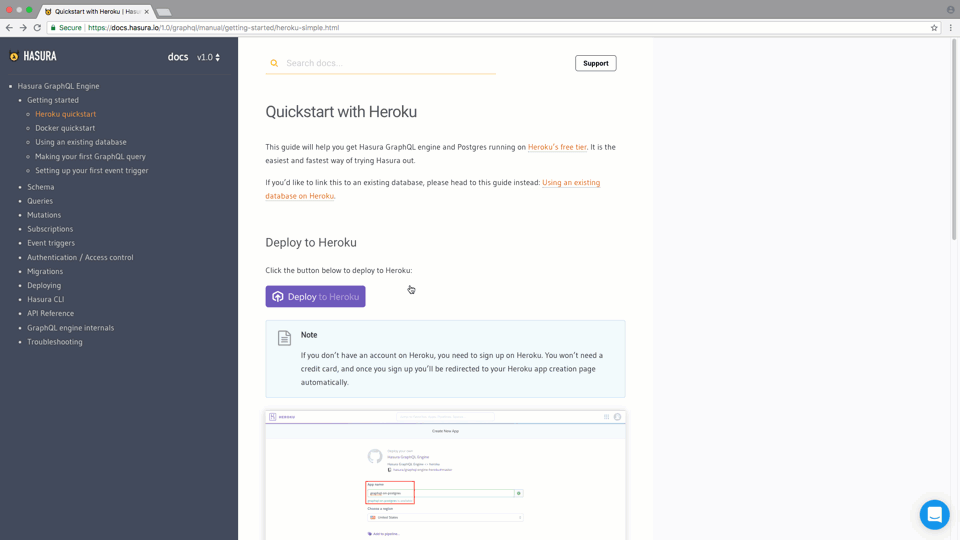
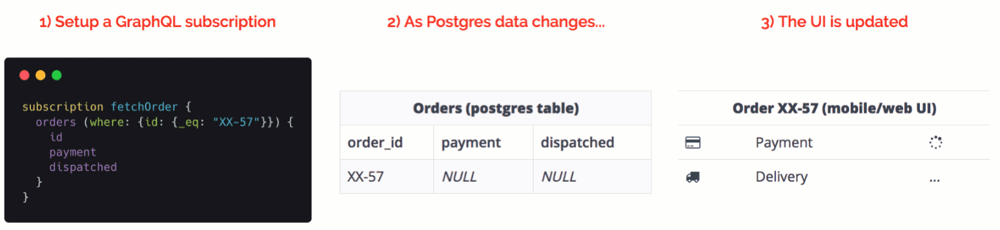

# Hasura GraphQL Engine

[](https://docs.hasura.io)
[](https://circleci.com/gh/hasura/graphql-engine)


<a href="https://discord.gg/vBPpJkS"></a>
<a href="https://twitter.com/intent/follow?screen_name=HasuraHQ"></a>
<a href="https://eepurl.com/dBUfJ5"></a>

Hasura GraphQL Engine je nevjerovatno brzi GraphQL server koji vam nudi **trenutne, API-je GraphQL API-ja preko Postgres-a**, sa [**webhook pokretačima**](../event-triggers.md) na dešavanja u bazi podataka, i [**udaljenim šemama**](../remote-schemas.md) za poslovnu logiku.

Hasura vam pomaže da napravite GraphQL aplikacije podržane Postgres-om ili postepeno pređite na GraphQL za postojeće aplikacije pomoću Postgres-a.

Pročitajte više na [hasura.io](https://hasura.io) i [dokumentima](https://docs.hasura.io).

------------------



------------------



-------------------

## Značajke

* **Napravite snažne upite**: Ugrađeno filtriranje, prelistavanje, pretraživanje po uzorcima, grupno ubacivanje, ažuriranje, brisanje mutacija
* **U stvarnom vremenu**: Pretvorite bilo koji GraphQL upit u živi upit koristeći pretplate
* **Spajanje udaljenih šema**: Pristupite prilagođenim GraphQL šemama za poslovnu logiku putem jedne krajnje tačke GraphQL Engine-a. [**Pročitaj više**](../remote-schemas.md).
* **Okinite webhook ili funkcije bez servera**: Na Postgres sačuvaj/ažuriraj/izbriši dešavanjima ([pročitaj više](../event-triggers.md))
* **Radi s postojećim, aktivnim bazama podataka**: Usmjerite ga na postojeću Postgres bazu podataka da odmah dobijete spreman na korištenje GraphQL API
* **Fina kontrola pristupa**: Dinamička kontrola pristupa koja se integriše na vaš sistem pristupa (npr: auth0, firebase-auth)
* **Visoke performanse i mali tragovi**: ~15MB docker slika; ~50MB RAM @ 1000 zahtjeva/s; više jezgra
* **Administratorsko sučelje & Migracije**: Administratorska ploča & Rails-inspirisana migracija šeme
* **Postgres** ❤️: Podržava Postgres tipove (PostGIS/geo-location, i sl.), pretvara poglede u *grafikone*, pokreće pohranjene funkcije ili procedure s mutacijama

Pročitaj više na [hasura.io](https://hasura.io) i [dokumentima](https://docs.hasura.io).

## Tabela sadržaja
<!-- markdown-toc start - Don't edit this section. Run M-x markdown-toc-refresh-toc -->
**Tabela sadržaja**

- [Brzi početak:](#brzi-pocetak)
    - [Implementacija jednim klikom na Heroku](#implementacija-jednim-klikom-na-heroku)
    - [Ostale metode implementacije](#ostale-medote-implementacije-jednim-klikom)
- [Arhitektura](#arhitektura)
- [Klijentski alati](#alati-na-klijentskoj-strani)
- [Dodavanje poslovne logike](#dodavanje-poslovne-logike)
    - [Daljinske šeme](#daljinske-seme)
    - [Pokretanje webhook-ova na dešavanjima u bazi podataka](#pokrenite-webhook-na-desavanja-u-bazi-podataka)
- [Demo](#demo)
    - [Aplikacije u stvarnom vremenu](#stvarne-aplikacije)
    - [Video](#video)
- [Podrška & Rješavanje problema](#podrska--rjesavanje-problema)
- [Doprinos](#doprinos)
- [Brendirani sadržaj](#brendirani-sadrzaj)
- [Licenca](#licenca)
- [Prijevodi](#prijevodi)

<!-- markdown-toc end -->

## Brzi početak:

### Implementacija jednim klikom na Heroku

Najbrži način da isprobate Hasura je putem Heroku-a.

1. Klikni na link ispod da postaviš GraphQL Engine na Heroku uz besplatan Postgres dodatak:

    [](https://heroku.com/deploy?template=https://github.com/hasura/graphql-engine-heroku)

2. Otvori Hasura konzolu

   Posjeti `https://<app-name>.herokuapp.com` (*zamijeni \<app-name\> sa nazivom svoje aplikacije*) da otvoriš administratorsku konzolu.

3. Napravi prvi GraphQL upit

   Kreiraj tabelu i odmah isprobaj svoj prvi upit. Prati ovaj [jednostavni vodič](https://docs.hasura.io/1.0/graphql/manual/getting-started/first-graphql-query.html).

### Ostale metode implementacije jednim klikom

Pogledaj instrukcije za ostale mogućnosti implementacije jednim klikom:

| **Infra provajder** | **Veza** | **Dodatne informacije** |
|:------------------:|:------------------------------------------------------------------------------------------------------------------------------------------------------------------------------------------------------------------------------------------------------------------:|:-------------------------------------------------------------------------------------------------------------------------------------------------:|
| DigitalOcean | [](https://marketplace.digitalocean.com/apps/hasura?action=deploy&refcode=c4d9092d2c48&utm_source=hasura&utm_campaign=readme) | [docs](https://docs.hasura.io/1.0/graphql/manual/guides/deployment/digital-ocean-one-click.html#hasura-graphql-engine-digitalocean-one-click-app) |
| Azure | [](https://portal.azure.com/#create/Microsoft.Template/uri/https%3a%2f%2fraw.githubusercontent.com%2fhasura%2fgraphql-engine%2fmaster%2finstall-manifests%2fazure-container-with-pg%2fazuredeploy.json) | [docs](https://docs.hasura.io/1.0/graphql/manual/guides/deployment/azure-container-instances-postgres.html) |

### Ostale metode implementacije

Za Docker-baziranu implementaciju i napredne konfiguracije, pogledajte [implementacijski vodič](https://docs.hasura.io/1.0/graphql/manual/getting-started/index.html) ili
[instalirajte manifest](../install-manifests).

## Arhitektura

Hasura GraphQL Engine frontira se na Postgres instancu i prihvata GraphQL zahtjeve sa vaših klijentskih aplikacija. Može se konfigurisati da koristi vaš postojeći sistem autentikacije i može upravljati kontrolom pristupa koristeći pravila na razini polja s dinamičkim varijablama vašeg sistema autentikacije.

Također možete spojiti daljinske GraphQL šeme i pružiti objedinjeni GraphQL API.


## Alati na klijentskoj strani

Hasura radi sa bilo kojim GraphQL klijentom. Mi preporučujemo [Apollo Client](https://github.com/apollographql/apollo-client). Pogledajte [awesome-graphql](https://github.com/chentsulin/awesome-graphql) listu klijenata.

## Dodavanje poslovne logike

GraphQL Engine pruža jednostavne, skalabilne i izvodljive metode za dodavanje prilagođene poslovne logike u vaš backend:

### Daljinske šeme

Dodajte prilagođene razrešivače u daljinsku šemu pored Hasura-ine Postgres-bazirane GraphQL šeme. Idealno za slučajeve upotrebe poput implementacije API-ja za plaćanje, ili upita za podatke koji nisu u vašoj bazi podataka - [pročitaj više](../remote-schemas.md).

### Pokrenite webhook na dešavanja u bazi podataka

Dodajte asinhronu poslovnu logiku koja se pokreće na osnovu događaja u bazi podataka.
Idealno za obavijesti, propust podataka iz Postgres-a ili asinhronu
obradu - [pročitaj više](../event-triggers.md).

### Izvedeni podaci ili transformacije podataka

Pretvorite podatke u Postgres ili pokrenite poslovnu logiku na njemu da biste dobili drugi skup podataka koji se može zatražiti koristeći GraphQL Engine - [pročitaj više](https://docs.hasura.io/1.0/graphql/manual/queries/derived-data.html).

## Demo

Pogledajte sve primjere dostupne u
[community/examples](../community/examples) mapi.

### Stvarne aplikacije

- Aplikacija za grupno dopisivanje koja koristi React, uključuje pokazatelj tipkanja, online korisnike & obavijesti o novim porukama.
  - [Isprobajte odmah](https://realtime-chat.demo.hasura.app/)
  - [Tutorijal](../community/sample-apps/realtime-chat)
  - [Pogledaj API](https://realtime-chat.demo.hasura.app/console)

- Aplikacija za praćenje lokacije vozila uživo koja prikazuje GPS koordinate dok se vozilo kreće po mapi..
  - [Isprobajte odmah](https://realtime-location-tracking.demo.hasura.app/)
  - [Tutorijal](../community/sample-apps/realtime-location-tracking)
  - [Pogledaj API](https://realtime-location-tracking.demo.hasura.app/console)

- Nadzorna ploča u stvarnom vremenu koja objedinjuje podatke o kontinuirano mijenjanim podacima.
  - [Isprobajte odmah](https://realtime-poll.demo.hasura.app/)
  - [Tutorijal](../community/sample-apps/realtime-poll)
  - [Pogledaj API](https://realtime-poll.demo.hasura.app/console)

### Video

* [Dodajte GraphQL u samostojeću GitLab instancu](https://www.youtube.com/watch?v=a2AhxKqd82Q) (*3:44 min*)
* [Todo aplikacija sa Auth0 i GraphQL backendom](https://www.youtube.com/watch?v=15ITBYnccgc) (*4:00 min*)
* [GraphQL na GitLab-u integrirana sa GitLab autentikacijom](https://www.youtube.com/watch?v=m1ChRhRLq7o) (*4:05 min*)
* [Nadzorna ploča za 10 miliona vožnji sa geografskom lokacijom (PostGIS, Timescale)](https://www.youtube.com/watch?v=tsY573yyGWA) (*3:06 min*)


## Podrška & Rješavanje problema

Dokumentacija i zajednica će vam pomoći da riješite mnogo problema. Ako pronađete grešku ili želite da nas kontaktirate, možete nas pronaći na kanalima ispod:

* Podrška & povratne informacije: [Discord](https://discord.gg/vBPpJkS)
* Problem & praćenje gresaka: [GitHub issues](https://github.com/hasura/graphql-engine/issues)
* Pratite ažuriranja o proizvodima: [@HasuraHQ](https://twitter.com/hasurahq)
* Pričajte s nama na [nasoj web lokaciji](https://hasura.io)

Zalažemo se za njegovanje otvorenog i dobrodošlog okruženja u zajednici. Molimo da pogledate [kodeks ponašanja](../code-of-conduct.md).

Ako želite prijaviti sigurnosni propust, molimo [pročitajte ovo](../SECURITY.md).

## Doprinos

Pogledajte naš [vodič za doprinos](../CONTRIBUTING.md) za više detalja.

## Brendirani sadržaj

Hasura bendirani sadržaj (logo, Hasura maskota, powered by bedževi i slično.) mogu biti pronađeni u [assets/brand](../assets/brand) mapi. Slobodno ih možete koristiti u vašoj aplikaciji/web stranici. Biti će nam drago i ako dodate "Pokreće Hasura" bedž na vašu aplikaciju koju ste napravili uz pomoć Hasura-e. ❤️

<div style="display: flex;">
  
  
</div>

```html
<!-- Za svijetle pozadine -->
<a href="https://hasura.io">
  
</a>

<!-- Za tamne pozadine -->
<a href="https://hasura.io">
  
</a>
```

## Licenca

GraphQL Engine je dostupan pod [Apache License 2.0](https://www.apache.org/licenses/LICENSE-2.0) (Apache-2.0).

Sav **ostali sadržaj** (osim onog u [`server`](../server), [`cli`](../cli) i
[`console`](../console) mapama) su dostupni pod [MIT License](../LICENSE-community).
To uključuje sve u [`docs`](../docs) i [`community`](../community)
mapama.

## Prijevodi

Ova stranica je dostupna u sljedećim jezicima:

- [Japanski :jp:](../translations/README.japanese.md) (:pray: [@moksahero](https://github.com/moksahero))
- [Francuski :fr:](../translations/README.french.md) (:pray: [@l0ck3](https://github.com/l0ck3))
- [Engleski :uk:](../translations/README.md)

Prijevodi za ostale fajlove mogu biti pronađeni [ovdje](../translations).
