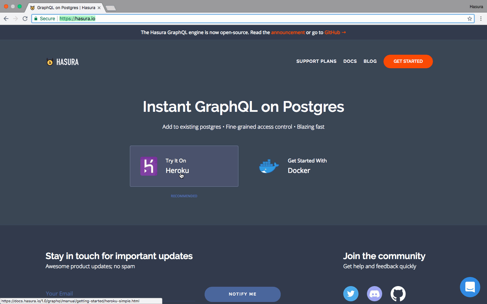
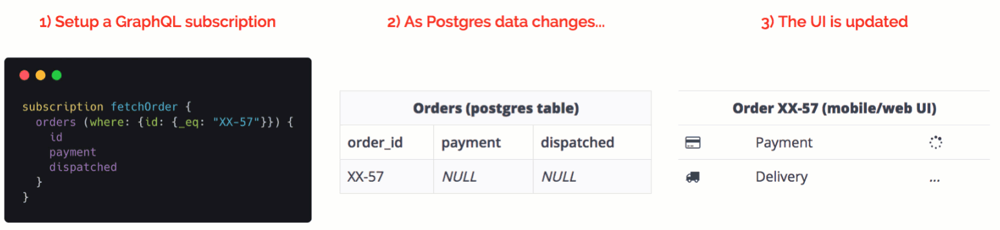
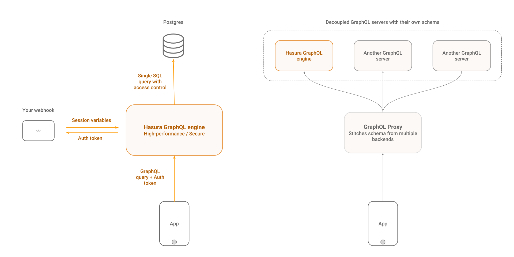

# Hasura GraphQL Engine

[](https://docs.hasura.io)
[](https://circleci.com/gh/hasura/graphql-engine)


<a href="https://discord.gg/vBPpJkS"></a>
<a href="https://twitter.com/intent/follow?screen_name=HasuraHQ"></a>
<a href="https://eepurl.com/dBUfJ5"></a>

Hasura GraphQL Engine est un serveur GraphQL ultra-rapide qui vous permet de créer **instantanément, des APIs GraphQL basées sur Postgres**, avec des [**déclencheurs de webhoook**](event-triggers.french.md) pour la logique métier.

Hasura vous aide à construire des applications GraphQL basées sur Posgres ou à adopter graduellement GraphQL pour des applications existantes utilisant Postgres.


Plus d'informations sur [hasura.io](https://hasura.io) et dans la [documentation](https://docs.hasura.io).

------------------



------------------



-------------------

## Fonctionnalités

* **Réalisez des requêtes avancées**: filtrage intégré, pagination, recherche par patterns, mutations d'insertions en masse, mises-à-jour et suppression.
* **Temps réel**: Convertissez n'importe quelle requête GraphQL en requête temps-réel en uttilisant les `subscriptions`.
* **Fusionnez des schémas distants**: Accédez à vos propres schémas GraphQL pour votre logique métier, via un point d'accès GraphQL unique. [Plus d'informations](remote-schemas.french.md).
* **Déclenchez des webhooks ou des fonctions serverless**: En réactions aux évènements Postgres insert/update/delete ([Plus d'informations](event-triggers.french.md))
* **Fonctionne avec les bases de données existantes**: Pointez GraphQL Engine vers une base de données Postgres existante afin d'obtenir instantanément une API GraphQL prête à l'emploi.
* **Contrôle d'accès détaillé**: Contrôle d'accès dynamique qui s'intègre avec votre système d'authentification (ex: auth0, firebase-auth)
* **Haute performance & faible impact**: Image Docker de ~15MB; ~50MB RAM @ 1000 req/s; prise en compte du multi-core
* **Interface d'administration & Migrations**: Interface d'administration & migrations de schéma à la Rails
* **Postgres** ❤️: Supporte les types Postgres (PostGIS/geo-location, etc.), transforme les vues en *graphs*, déclenche des procédures ou fonctions stockées via les mutations

Plus d'informations sur [hasura.io](https://hasura.io) et dans la [documentation](https://docs.hasura.io).

## Table des matières
<!-- markdown-toc start - Don't edit this section. Run M-x markdown-toc-refresh-toc -->
**Table des matières**

- [Démarrage rapide](#quickstart)
    - [Déploiement sur Heroku en un click](#one-click-deployment-on-heroku)
    - [Autres méthodes de déploiement](#other-deployment-methods)
- [Architecture](#architecture)
- [Outils côté client](#client-side-tooling)
- [Ajout de logique métier](#add-business-logic)
    - [Schémas distants](#remote-schemas)
    - [Déclenchez des webhooks sur des evènements de base de donnée](#trigger-webhooks-on-database-events)
- [Demos](#demos)
    - [Applications temps-réel](#realtime-applications)
    - [Videos](#videos)
- [Support & Dépannage](#support--troubleshooting)
- [Contribuer](#contributing)
- [Elements de marque](#brand-assets)
- [Licence](#license)

<!-- markdown-toc end -->

## Démarrage rapide:

### Déploiement sur Heroku en un click

La manière la plus rapide d'essayer Hasura est via Heroku.

1. Cliquez sur le bouton ci-dessous pour déployer GraphQL Engine sur Heroku avec l'add-on Postgres gratuit:

    [](https://heroku.com/deploy?template=https://github.com/hasura/graphql-engine-heroku)

2. Ouvrez la console Hasura

   Visitez `https://<app-name>.herokuapp.com` (*remplacez \<app-name\> par le nom de votre application*) pour ouvrir la console d'administration.

3. Réalisez votre première requête GraphQL

   Créez une table et réalisez votre première requête. Suivez ce [guide](https://docs.hasura.io/1.0/graphql/manual/getting-started/first-graphql-query.html).

### Autres méthodes de déploiement

Pour les méthodes de déploiement basées sur Docker et les options de configuration avancées, consultez les [guides de déploiement](https://docs.hasura.io/1.0/graphql/manual/getting-started/index.html) ou les [manifestes d'installation](../install-manifests).

## Architecture

Hasura GraphQL Engine se place en frontal d'une base de données Postgres et peut accepter les requêtes GraphQL de vos applications clientes. Il peut être configuré pour fonctionner avec votre système d'authentification existant et peut gérer le contrôle d'accès au niveau des champs grâce a des règles, avec des variables dynamiques provenant du système d'authentification.

Vous pouvez également fusionner des schémas GraphQL distants et fournir une API GraphQL unifiée.



## Outils côté client

Hasura fonctionne avec n'importe quel client GraphQL. Nous recommandons l'utilisation d'[Apollo Client](https://github.com/apollographql/apollo-client). Consultez [awesome-graphql](https://github.com/chentsulin/awesome-graphql) pour une liste de clients.

## Ajout de logique métier

GraphQL Engine fournit plusieurs méthodes claires, évolutives et performantes pour ajouter votre propre logique métier à votre backend:

### Schémas distants

Ajoutez vos propres resolvers dans un schéma distant en plus du schéma dérivé de Postgres d'Hasura. Idéal pour des cas d'utilisation tels que l'implémentation d'une API de paiement, ou le requêtage de donnée ne se trouvant pas dans votre base de données - [plus d'informations](remote-schemas.french.md).

### Déclenchez des webhooks sur des évènements de base de données

Ajoutez de la logique métier asynchrone, déclenchée par des évènements de base de données.
Idéal pour les notifications, les pipelines de données de Postgres ou les
traitements asynchrones - [plus d'informations](event-triggers.french.md).

### Données dérivée ou transformations de données

Transformez les données dans Postgres ou exécutez de la logique métier dessus pour en deriver un autre jeu de données qui peut être requêté à l'aide de GraphQL Engine - [plus d'informations](https://docs.hasura.io/1.0/graphql/manual/queries/derived-data.html).

## Démos

Consultez toutes les applications d'example dans le répertoire
[community/sample-apps](../community/sample-apps).

### Applications temps-réel

- Application de messagerie de groupe développée avec React, incluant un indicateur de frappe, les utilisateurs connectés & les
  notifications de nouveaux messages.
  - [Essayez la](https://realtime-chat.demo.hasura.app/)
  - [Tutoriel](../community/examples/realtime-chat)
  - [Explorez les APIs](https://realtime-chat.demo.hasura.app/console)

- Application de localisation en temps-réel montrant un véhicule dont les coordonnées GPS évoluent
  se déplacer sur une carte.
  - [Essayez la](https://realtime-location-tracking.demo.hasura.app/)
  - [Tutoriel](../community/examples/realtime-location-tracking)
  - [Explorez les APIs](https://realtime-location-tracking.demo.hasura.app/console)

- Un tableau de bord temps-réel pour l'aggrégation de données en constante évolution.
  - [Essayez la](https://realtime-poll.demo.hasura.app/)
  - [Tutoriel](../community/examples/realtime-poll)
  - [Explorez les APIs](https://realtime-poll.demo.hasura.app/console)

### Vidéos

* [Ajoutez GraphQL à une instance GitLab auto-hébergée](https://www.youtube.com/watch?v=a2AhxKqd82Q) (*3:44 mins*)
* [Application de liste de tâches avec Auth0 et un backend GraphQL](https://www.youtube.com/watch?v=15ITBYnccgc) (*4:00 mins*)
* [API GraphQL sur GitLab intégrée avec l'authentification GitLab](https://www.youtube.com/watch?v=m1ChRhRLq7o) (*4:05 mins*)
* [Tableau de bord pour 10 millions de trajets avec géolocalisation (PostGIS, Timescale)](https://www.youtube.com/watch?v=tsY573yyGWA) (*3:06 mins*)

## Support & Dépannage

La documentation et la communauté vous aideront à résoudre la plupart des problèmes. Si vous avez rencontré un bug ou avez besoin de nous contacter, vous pouvez nous joindre au travers des canaux suivants:

* Support & retours: [Discord](https://discord.gg/vBPpJkS)
* Problèmes & remontées de bugs: [GitHub issues](https://github.com/hasura/graphql-engine/issues)
* Suivez les mise à jour du produit: [@HasuraHQ](https://twitter.com/hasurahq)
* Parlez nous sur la [messagerie du site Web](https://hasura.io)

Nous nous impliquons dans le développement d'un environnement ouvert et accueillant dans la communauté. Veuillez consulter le [Code de Conduite](code-of-conduct.french.md).


Si vous souhaitez rapporter un problème de sécurité, veuillez [lire ceci](SECURITY.french.md).

## Contribuer

Consultez notre [guide de contribution](CONTRIBUTING.french.md) pour plus de détails.

## Elements de marque

Les élements de marque Hasura (logos, mascotte Hasura, badges "powered by" etc...) peuvent être
trouvés dans le répertoire [assets/brand](../assets/brand). N'hésitez pas à les utiliser dans votre
application/site Web etc... Nous serions ravis si vous ajoutiez le badge "Powered by Hasura"
à votre application développée à l'aide d'Hasura. ❤️

<div style="display: flex;">
  
  
</div>

```html
<!-- Pour les fonds clairs -->
<a href="https://hasura.io">
  
</a>

<!-- Pour les fonds foncés -->
<a href="https://hasura.io">
  
</a>
```

## Licence

Le GraphQL Engine est disponible sous [Apache License
2.0](https://www.apache.org/licenses/LICENSE-2.0) (Apache-2.0).

Tous les **autres contenus** (à l'exception de ceux dans les répertoires
[`server`](../server), [`cli`](../cli) et [`console`](../console)) sont
disponibles sous [Licence MIT](../LICENSE-community). Cela inclut tout le
contenu des répertoires [`docs`](../docs) et [`community`](../community).
