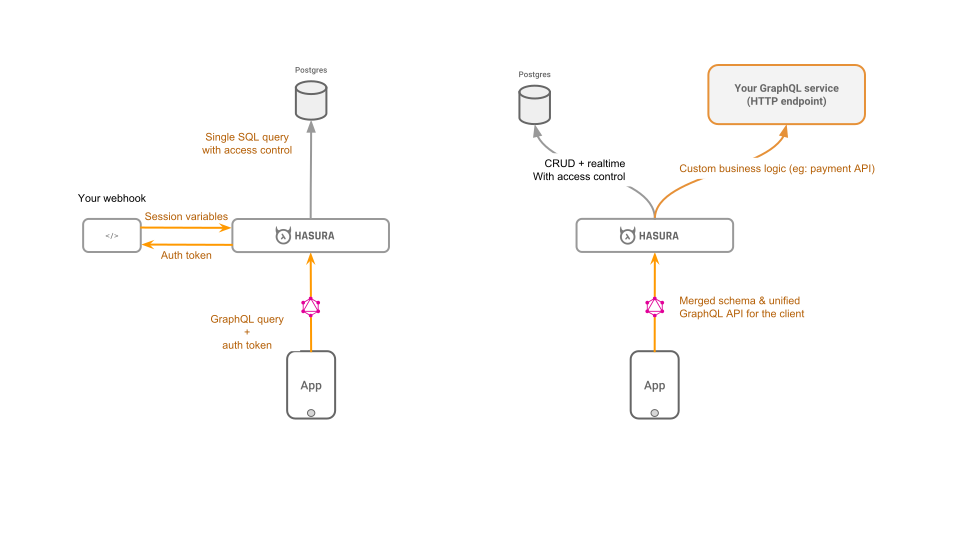

# Hasura GraphQL Engine

[](https://docs.hasura.io)
[](https://circleci.com/gh/hasura/graphql-engine)


<a href="https://discord.gg/vBPpJkS"></a>
<a href="https://twitter.com/intent/follow?screen_name=HasuraHQ"></a>
<a href="https://eepurl.com/dBUfJ5"></a>

Hasura GraphQLエンジンは **Postgres上で瞬時にリアルタイムのGraphQL API** を[**ウェブフックトリガー**](../event-triggers.md)をデータベースイベントで起動し、ビジネスロジック用の[**リモートスキーマ**](../remote-schemas.md)を提供する、非常に高速なGraphQLサーバーです。

Hasuraは、Postgresをバックエンドに持つGraphQLアプリケーションを構築したり、Postgresを使用して既存のアプリケーションをGraphQLに段階的に移行したりするのに役立ちます。

こちらと [hasura.io](https://hasura.io) こちらから [docs](https://docs.hasura.io)　詳細を読んでください。

------------------


------------------


-------------------

## 機能一覧

* **強力なクエリ**: 組み込みフィルタリング、ページ付け、パターン検索、一括挿入、更新、削除などのmutations
* **リアルタイム**: subscriptions使って様々なGraphQLクエリをライブクエリに変換
* **リモートスキーマのマージ**: 単一のGraphQLエンジンエンドポイントを介してビジネスロジック用のカスタムGraphQLスキーマにアクセスカスタムのGraphQLスキーマにアクセス [**続きを読む**](../remote-schemas.md).
* **ウェブフックやサーバーレス機能を起動する**: Postgresのinsert / update / deleteイベント時 ([続きを読む](../event-triggers.md))
* **既存のライブデータベースと連携**: 既存のPostgresデータベースから、すぐに使えるGraphQL APIが即座に作られます
* **きめ細かいアクセス制御**: 認証システムと統合する動的アクセス制御（例：auth0、firebase-auth）
* **管理UIと移行**: 最大15MBのドッカーイメージ。最大50MB RAM @ 1000 req/s。マルチコア対応
* **Postgres** ❤️: Postgresの型（PostGIS/地理位置など）をサポートし、ビューをグラフに変え、保存された関数や手順を変更した手続きを起動

こちらと [hasura.io](https://hasura.io) こちらから [docs](https://docs.hasura.io)詳細を読んでください。

## 目次
<!-- markdown-toc start - Don't edit this section. Run M-x markdown-toc-refresh-toc -->
**目次**

- [クイックスタート:](#quickstart)
    - [Herokuへのワンクリックでのデプロイ](#one-click-deployment-on-heroku)
    - [その他のデプロイ方法](#other-deployment-methods)
- [アーキテクチャ](#architecture)
- [クライアント側ツール](#client-side-tooling)
- [ビジネスロジックの追加](#add-business-logic)
    - [リモートスキーマー](#remote-schemas)
    - [データベースイベントによるウェブフックの起動](#trigger-webhooks-on-database-events)
- [デモ](#demos)
    - [リアルタイムアプリケーション](#realtime-applications)
    - [動画](#videos)
- [サポート&トラブル対応](#support--troubleshooting)
- [開発への参加](#contributing)
- [ブランド資産](#brand-assets)
- [ライセンス](#license)

<!-- markdown-toc end -->

## クイックスタート:

### Herokuへのワンクリックでのデプロイ

Hasuraを試す最も早い方法はHerokuを使うことです。

1. 無料のPostgresアドオン経由でHerokuにGraphQLエンジンをデプロイするには、次のボタンをクリックしてください:

    [](https://heroku.com/deploy?template=https://github.com/hasura/graphql-engine-heroku)

2. Hasuraコンソールを開きます。

   こちらのリンクから `https://<app-name>.herokuapp.com` (*\<app-name\>を自分のアプリ名で置き換えます*) 管理コンソールにアクセスしてください。

3. 最初のGraphQLのクエリを発行

   テーブルを作成して、最初のクエリを実行します。こちらの [シンプルなガイド](https://docs.hasura.io/1.0/graphql/manual/getting-started/first-graphql-query.html)を参考にしてください。

### 他のワンクリックでデプロイする方法

以下のワンクリックデプロイの方法もチェックしてみてください:

| **インフラ業者** | **ワンクリックリンク** | **追加情報** |
|:------------------:|:------------------------------------------------------------------------------------------------------------------------------------------------------------------------------------------------------------------------------------------------------------------:|:-------------------------------------------------------------------------------------------------------------------------------------------------:|
| DigitalOcean | [](https://marketplace.digitalocean.com/apps/hasura?action=deploy&refcode=c4d9092d2c48&utm_source=hasura&utm_campaign=readme) | [ドキュメント](https://docs.hasura.io/1.0/graphql/manual/guides/deployment/digital-ocean-one-click.html#hasura-graphql-engine-digitalocean-one-click-app) |
| Azure | [](https://portal.azure.com/#create/Microsoft.Template/uri/https%3a%2f%2fraw.githubusercontent.com%2fhasura%2fgraphql-engine%2fmaster%2finstall-manifests%2fazure-container-with-pg%2fazuredeploy.json) | [ドキュメント](https://docs.hasura.io/1.0/graphql/manual/guides/deployment/azure-container-instances-postgres.html) |

### 他のデプロイ方法

Dockerでのデプロイと高度なカスタマイズオプションについては [デプロイガイド](https://docs.hasura.io/1.0/graphql/manual/getting-started/index.html) か
[インストールマニフェスト](../install-manifests)を参考にしてください。

## アーキテクチャ

Hasura GraphQLエンジンはPostgresデータベースインスタンスの前で動作し、クライアントアプリケーションからGraphQLのリクエストを受け取ることができます。既存の認証システムと連携するように設定でき、認証システムからの動的変数を含むフィールドレベルのルールを使用してアクセス制御を処理できます。

リモートのGraphQLスキーマをマージして、統一されたGraphQL APIを提供することもできます。



## クライアント側ツール

HasuraはどのGraphQLクライアントでも動作します。[Apolloクライアント](https://github.com/apollographql/apollo-client)を使うのをおすすめします。. [awesome-graphql](https://github.com/chentsulin/awesome-graphql)にクライアントのリストがあります。

## ビジネスロジックの追加

GraphQLエンジンは、バックエンドにカスタムビジネスロジックを追加するための、理解しやすくスケーラブルで高性能なメソッドを提供します。

### リモートスキーマ

HasuraのPostgresベースのGraphQLスキーマに加えて、リモートスキーマにカスタムリゾルバを追加します。支払いAPIの実装、データベースに無いデータの問い合わせなどのユースケースに最適です - [続きを読む](../remote-schemas.md)。

### データベースイベントによるウェブフックの起動

データベースイベントから起動する非同期ビジネスロジックを追加します。
通知、Postgresからのデータパイプライン、または非同期に最適です - [続きを読む](../event-triggers.md)。

### 派生データまたはデータ変換

PostgreSQLのデータを変換するか、あるいはその上でビジネスロジックを実行することでGraphQLエンジンを使用して問い合わせることができる別のデータセットを派生させる事ができます。[続きを読む](https://docs.hasura.io/1.0/graphql/manual/queries/derived-data.html).

## デモ

[コミュニティ・サンプル](../community/sample-apps) ディレクトリにあるサンプルアプリケーションをチェックできます。

### リアルタイムアプリケーション

- Reactを使用して構築されたグループチャットアプリケーション。タイピングインジケーター、オンラインユーザー、新しいメッセージ通知が含まれます。
  - [試してみよう](https://realtime-chat.demo.hasura.app/)
  - [チュートリアル](../community/sample-apps/realtime-chat)
  - [APIの参照](https://realtime-chat.demo.hasura.app/console)

- 現在の場所を追跡できるアプリ。地図上を移動する乗り物の現在のGPS座標を表示します。
  - [試してみよう](https://realtime-location-tracking.demo.hasura.app/)
  - [チュートリアル](../community/sample-apps/realtime-location-tracking)
  - [APIの参照](https://realtime-location-tracking.demo.hasura.app/console)

- 常にに変化するデータを集約するリアルタイムダッシュボード。
  - [試してみよう](https://realtime-poll.demo.hasura.app/)
  - [チュートリアル](../community/sample-apps/realtime-poll)
  - [APIの参照](https://realtime-poll.demo.hasura.app/console)

### 動画

* [サーバーにホストされたGitlabのインスタンスにGraphQLを追加](https://www.youtube.com/watch?v=a2AhxKqd82Q) (*3分44秒*)
* [Auth0とGraphQLバックエンドに持つTodoアプリ](https://www.youtube.com/watch?v=15ITBYnccgc) (*4分00秒*)
* [GitLab上のGitLab Authと動作するGraphQL](https://www.youtube.com/watch?v=m1ChRhRLq7o) (*4分05秒*)
* [GPS位置情報の付いた1000万回の乗車のダッシュボード (PostGIS, Timescale)](https://www.youtube.com/watch?v=tsY573yyGWA) (*3分06秒*)

## サポート&トラブルシューティング

ドキュメントとコミュニティは、ほとんどの問題のトラブルシューティングに役立ちます。あなたがバグに遭遇したか、または私達と連絡をとる必要があるならば、あなたは以下の方法の1つを使ってコンタクトすることができます：

* サポート&フィードバック: [Discord](https://discord.gg/vBPpJkS)
* 問題&バグトラッキング: [GitHub issues](https://github.com/hasura/graphql-engine/issues)
* プロダクトアップデートをフォロー: [@HasuraHQ](https://twitter.com/hasurahq)
* 直接話す [ウェブサイトチャット](https://hasura.io)

私たちはこのコミュニティの中でオープンで心地よい環境を達成することを約束します。 [行動規範](../code-of-onduct.md)をご覧ください。

セキュリティに関する問題はこちらから報告をお願いします。[詳細を読む](../SECURITY.md).

## 開発への参加

[開発者へのガイド](../CONTRIBUTING.md) を参照してください。

## ブランド資産

Hasuraブランドの資産（ロゴ、Hasuraマスコット、バッジなどを使用）[ブランド資産](../assets/brand)フォルダにあります。自由に使用してください。
あなたが作ったアプリに"Powered by Hasura"を追加してもらえるととてもうれしいです！

<div style="display: flex;">
  
  
</div>

```html
<!-- 明るいバックグラウンド用 -->
<a href="https://hasura.io">
  
</a>

<!-- 暗いバックグラウンド用 -->
<a href="https://hasura.io">
  
</a>
```

## ライセンス

GraphQLエンジンのコアは[Apache License 2.0](https://www.apache.org/licenses/LICENSE-2.0)（Apache-2.0）の下で提供されています。

全ての **その他のコンテンツ** ([`サーバー`](../server), [`クライアント`](../cli) と
[`コンソール`](../console) ディレクトリ以外) は [MITライセンス](../LICENSE-community)の下に提供されます。
これは [`ドキュメント`](../docs) と [`コミュニティ`](../community) ディレクトリに入っているもの全てを含みます。
