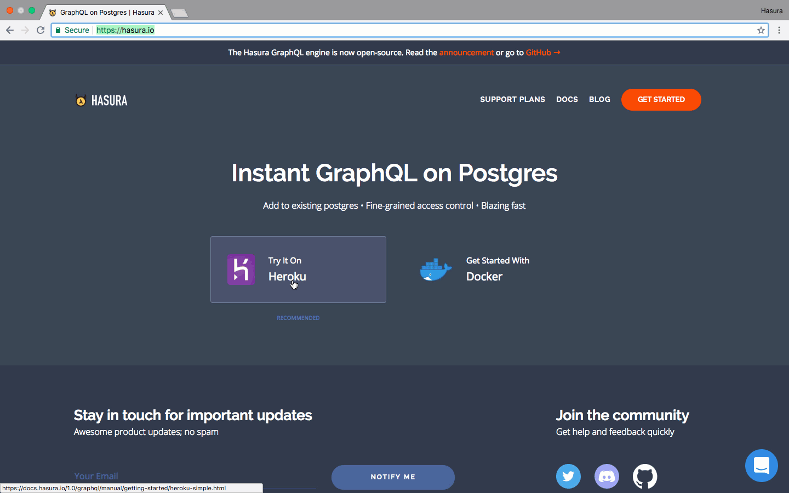
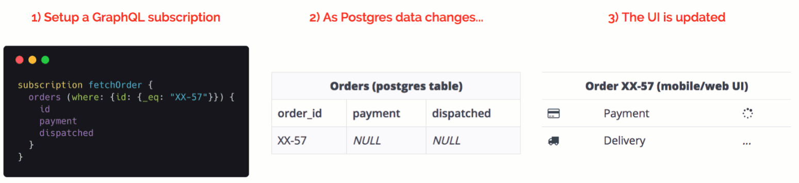
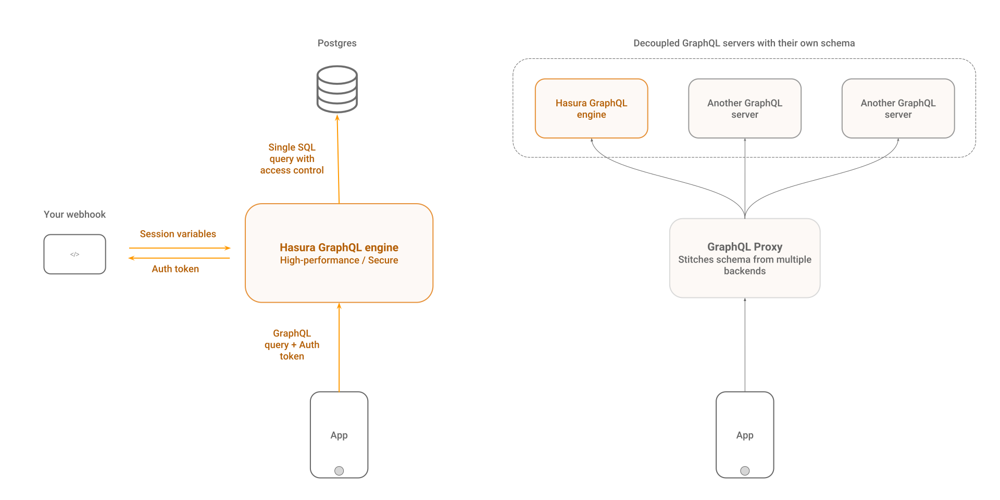

# Motor Hasura GraphQL

[](https://hasura.io/docs)
[](https://circleci.com/gh/hasura/graphql-engine)


<a href="https://discord.gg/vBPpJkS"></a>
<a href="https://twitter.com/intent/follow?screen_name=HasuraHQ"></a>
<a href="https://eepurl.com/dBUfJ5"></a>

El motor de Hasura GraphQL es un potente servidor de GraphQL que provee de **APIs instantáneas y en tiempo real a través de Postgres**, con [**lanzadores de webhook**](../event-triggers.md) basados en los eventos de la base de datos, y [**esquemas remotos**](../remote-schemas.md) para la lógica de negocio.

Hasura te ayuda a crear aplicaciones GraphQL respaldadas por Postgres o de manera gradual permite migrar a aplicaciones GraphQL desde aplicaciones que usan Postgres. 

Leer más en [hasura.io](https://hasura.io) y en [docs](https://hasura.io/docs).

------------------



------------------



-------------------
 
## Características

* **Crea potentes consultas**: Incorpora filtrado, paginación, búsqueda de patrones, inserción masiva, actualización y eliminación de mutaciones.
* **En tiempo real**: Convierte cualquier consulta de GraphQL en una consulta en tiempo real mediante el uso de subscripciones.
* **Une esquemas remotos**: Accede a esquemas GraphQL personalizados para lógica de negocios mediante un único extremo del motor GraphQL. [**Leer más**](../remote-schemas.md).
* **Ejecuta webhooks o funciones sin servidor**: En los eventos insertar/actualizar/eliminar de Postgres ([leer más](../event-triggers.md)).
* **Trabaja con bases de datos existentes en tiempo real**: Señala una base de datos existente de Postgres, para que de manera instantánea obtenga una API GraphQL lista para usar.
* **Control de acceso Fine-grained**: Control de acceso dinámico que se integra con su sistema de autenticación (ejemplos: auth0, firebase-auth).
* **Alto rendimiento y bajo consumo**: ~15MB imagen de docker; ~50MB RAM @ 1000 req/s; multi-núcleo.
* **Interfaz de administración y Migraciones**: Interfaz de administración y esquema de migraciones inspiradas en Rails.
* **Postgres** ❤️: Soporta los tipos de Postgres (PostGIS/geo-location, etc.), convierte las vistas a *gráficas*, ejecuta funciones almacenadas o procedimientos con mutaciones.

Leer más en [hasura.io](https://hasura.io) y en [docs](https://hasura.io/docs).

## Tabla de contenidos
<!-- markdown-toc start - Don't edit this section. Run M-x markdown-toc-refresh-toc -->
**Tabla de contenidos**

- [Inicio rápido:](#inicio-rápido)
    - [Despliegue en un click con Heroku](#despliegue-en-un-click-con-heroku)
    - [Otros métodos de despliegue](#otros-métodos-de-despliegue)
- [Arquitectura](#arquitectura)
- [Herramientas client-side](#herramientas-client-side)
- [Agregar lógica de negocio](#agregar-lógica-de-negocio)
    - [Esquemas remotos](#esquemas-remotos)
    - [Ejecutar webhooks con eventos de la base de datos](#ejecutar-webhooks-con-eventos-de-la-base-de-datos)
- [Demos](#demos)
    - [Aplicaciones en tiempo real](#aplicaciones-en-tiempo-real)
    - [Videos](#videos)
- [Soporte y solución de problemas](#soporte-y-solución-de-problemas)
- [Contribuir](#contribuir)
- [Archivos de marca](#archivos-de-marca)
- [Licencia](#licencia)
- [Traducciones](#traducciones)

<!-- markdown-toc end -->

## Inicio rápido:

### Despliegue en un click con Heroku

La manera más rápida de probar Hasura es usando Heroku.

1. Da click en el siguiente botón para desplegar el motor GraphQL en Heroku con el add-on gratuito de Postgres:

    [](https://heroku.com/deploy?template=https://github.com/hasura/graphql-engine-heroku)

2. Abre la consola de Hasura

   Visita `https://<app-name>.herokuapp.com` (*reemplaza \<app-name\> con el nombre de tu aplicacion*) para abrir la consola de administrador.

3. Haz tu primer consulta con GraphQL

   Crea una tabla e instantáneamente ejecuta tu primer consulta. Sigue esta [guía simple](https://hasura.io/docs/latest/graphql/core/getting-started/first-graphql-query.html).

### Otras opciones de despliegue en un clic

Revisa las instrucciones para las siguientes opciones de despliegue en un click:

| **Proveedor de infraestructura** | **Enlace en un clic** | **Información adicional** |
|:------------------:|:------------------------------------------------------------------------------------------------------------------------------------------------------------------------------------------------------------------------------------------------------------------:|:-------------------------------------------------------------------------------------------------------------------------------------------------:|
| DigitalOcean | [](https://marketplace.digitalocean.com/apps/hasura?action=deploy&refcode=c4d9092d2c48&utm_source=hasura&utm_campaign=readme) | [docs](https://hasura.io/docs/latest/graphql/core/guides/deployment/digital-ocean-one-click.html#hasura-graphql-engine-digitalocean-one-click-app) |
| Azure | [](https://portal.azure.com/#create/Microsoft.Template/uri/https%3a%2f%2fraw.githubusercontent.com%2fhasura%2fgraphql-engine%2fmaster%2finstall-manifests%2fazure-container-with-pg%2fazuredeploy.json) | [docs](https://hasura.io/docs/latest/graphql/core/guides/deployment/azure-container-instances-postgres.html) |

### Otros métodos de despliegue

Para el despliegue basado en Docker y opciones de configuración avanzadas, revisar [guías de despliegue](https://hasura.io/docs/latest/graphql/core/getting-started/index.html) o
[manifiesto de instalación](../install-manifests).

## Arquitectura

El motor de Hasura GraphQL lidera una instancia de base de datos Postgres y puede aceptar peticiones desde sus aplicaciones cliente. Puede ser configurada para trabajar con su sistema ya existente de autenticación, y puede manejar el control de acceso haciendo uso de reglas "field-level" con variables dinámicas desde su sistema de autenticación. 

También puede unir esquemas remotos de GraphQL y proveer de una API unificada de GraphQL.



## Herramientas client-side

Hasura trabaja con cualquier cliente GraphQL. Recomendamos usar [Apollo Client](https://github.com/apollographql/apollo-client). Ver [awesome-graphql](https://github.com/chentsulin/awesome-graphql) para una lista de clientes.

## Agregar lógica de negocio

El motor GraphQL provee de métodos faciles de razonar, escalables y de desempeño para agregar una lógica de negocio personalizada a su servidor.

### Esquemas remotos

Agrega solucionadores personalizados, mediante un esquema remoto adicional al esquema de GraphQL basado en Postgres de Hasura. Ideal para casos de uso, como la implementación de una API de pagos, o la consulta de información que no esta en su base de datos - [leer más](../remote-schemas.md).

### Ejecutar webhooks con eventos de la base de datos

Agrega la lógica de negocios de forma asíncrona, la cual es ejecutada en base a los eventos de la base de datos.
Ideal para notificaciones, canales de datos de Postgres o procesamiento asíncrono - [leer más](../event-triggers.md).

### Datos derivados o transformación de datos

Transforma datos en Postgres o ejecuta la lógica de negocio en ellos para derivar otro conjunto de datos que puedan ser consultados usando el motor de GraphQL - [leer más](https://hasura.io/docs/latest/graphql/core/queries/derived-data.html).

## Demos

Revisa todos los ejemplos de aplicaciones en la carpeta de [community/sample-apps](../community/sample-apps).

### Aplicaciones en tiempo real

- Aplicación de Chat Grupal creada con React, incluye un indicador de escribiendo, usuarios en línea y notificaciones       para nuevos mensajes.
  - [Pruébala](https://realtime-chat.demo.hasura.app/)
  - [Tutorial](../community/sample-apps/realtime-chat)
  - [Buscar APIs](https://realtime-chat.demo.hasura.app/console)
 
- Aplicación de rastreo de ubicación en tiempo real, que muestra a un vehículo en movimiento cambiando sus coordenadas en   el GPS mientras se mueve en un mapa. 
  - [Pruébala](https://realtime-location-tracking.demo.hasura.app/)
  - [Tutorial](../community/sample-apps/realtime-location-tracking)
  - [Buscar APIs](https://realtime-location-tracking.demo.hasura.app/console)

- Un panel en tiempo real para agregar datos que estan cambio constante. 
  - [Pruébala](https://realtime-poll.demo.hasura.app/)
  - [Tutorial](../community/sample-apps/realtime-poll)
  - [Buscar APIs](https://realtime-poll.demo.hasura.app/console)

### Videos

* [Agregar GraphQL a una instancia "auto-hosted" de GitLab](https://www.youtube.com/watch?v=a2AhxKqd82Q) (*3:44 mins*)
* [Aplicación ToDo con Auth0 y servidor GraphQL](https://www.youtube.com/watch?v=15ITBYnccgc) (*4:00 mins*)
* [GraphQL en GitLab integrado con aunteticación de GitLab](https://www.youtube.com/watch?v=m1ChRhRLq7o) (*4:05 mins*)
* [Panel para 10 millones de viajes con geolocalización (PostGIS, Timescale)](https://www.youtube.com/watch?v=tsY573yyGWA) (*3:06 mins*)


## Soporte y solución de problemas

La documentación y la comunidad te ayudarán a solucionar la mayoría de los problemas. Si encuentras un error o necesitas contactarte con nosotros, puedes hacerlo usando uno de los siguientes canales: 

* Soporte y retroalimentación: [Discord](https://discord.gg/vBPpJkS)
* Problemas y seguimiento de errores: [GitHub issues](https://github.com/hasura/graphql-engine/issues)
* Sigue las actualizaciones del producto: [@HasuraHQ](https://twitter.com/hasurahq)
* Habla con nosotros en nuestro [chat](https://hasura.io)

Estamos comprometidos a fomentar un ambiente abierto y acogedor en la comunidad. Por favor revisa el [Código de Conducta](../code-of-conduct.md).

Si quieres reportar un problema de seguridad, por favor [lee esto](../SECURITY.md).

## Contribuir

Revisa nuestra [guía de contribución](../CONTRIBUTING.md) para más detalles.

## Archivos de marca

Los archivos de marca de Hasura (logotipos, la mascota de Hasura, la insignia: "powered by", etc.) pueden ser encontradas en la carpeta [assets/brand](../assets/brand). Siéntete libre de usarlos en tu
aplicación, sitio web, etc. Estaremos encantados si agregas la insignia "Powered by Hasura" a tus aplicaciones creadas con Hasura. ❤️

<div style="display: flex;">
  
  
</div>

```html
<!-- For light backgrounds -->
<a href="https://hasura.io">
  
</a>

<!-- For dark backgrounds -->
<a href="https://hasura.io">
  
</a>
```

## Licencia

El núcleo del motor GraphQL está disponible bajo la [Licencia Apache 2.0](https://www.apache.org/licenses/LICENSE-2.0) (Apache-2.0).

Todos **los contenidos** (excepto aquellos incluidos en los directorios [`server`](../server), [`cli`](../cli) y
[`console`](../console)) están disponibles bajo la [Licencia MIT](../LICENSE-community).
Esto incluye todo en los directorios [`docs`](../docs) y [`community`](../community).

## Traducciones

Este archivo está disponible en los siguientes idiomas:

- [Japonés :jp:](../translations/README.japanese.md) (:pray: [@moksahero](https://github.com/moksahero))
- [Francés :fr:](../translations/README.french.md) (:pray: [@l0ck3](https://github.com/l0ck3))
- [Griego 🇬🇷](../translations/README.greek.md) (:pray: [@MIP2000](https://github.com/MIP2000))
- [Español 🇲🇽](../translations/README.mx_spanish.md)(:pray: [@ferdox2](https://github.com/ferdox2))
- [Indonesian :indonesia:](translations/README.indonesian.md) (:pray: [@anwari666](https://github.com/anwari666))
- [Brazilian Portuguese :brazil:](translations/README.portuguese_br.md) (:pray: [@rubensmp](https://github.com/rubensmp))
- [German 🇩🇪](translations/README.german.md) (:pray: [@FynnGrandke](https://github.com/FynnGrandke))
- [Marathi :india:](translations/README.marathi.md) (:pray: [@vieee](https://github.com/vieee))

Las traducciones para otros idiomas se encuentran [aquí](../translations).
