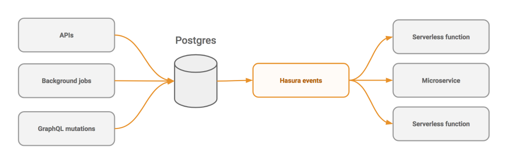

# Postgres上的事件触发器

使用Hasura GraphQL引擎的事件触发器在数据库事件上触发webhooks。

## 重点

* **构建反应式和异步应用程序/功能**: 触发异步无服务器或云功能，以降低服务器基础结构成本并简化开发者的 DevOps 工作。

* **原子和可靠**: 使用本机Postgres触发器，数据库上的每个相关操作都被視为事件。即使Hasura出现故障而关闭或正在更新，事件也会被捕获并尽快交付，并保证*至少一次*。您甚至可以配置传递策略，如“max_retries”和“retry_interval”。

* **可扩展性**: 事件触发系统是横向可扩展的——如果你需要处理更多的事件，只需投入更多的资源！

* **适用于现有的实时数据库**: 将其指向现有的Postgres数据库，以立即监听数据中的更改并调用webhooks。

* **可观察性和监控准备就绪**: 生成的事件会自动附加一个事件 ID，而 Hasura 发出的结构化日志使您可以轻松使用您喜欢的工具，在生产环境中运行基于事件驱动的后端。 ([观看](https://youtu.be/WOPA52r3bzU) 使用概述 [Honeycomb](https://honeycomb.io/)).

## 快速入门:

### 在Heroku上一键部署

最簡單尝试事件触发器的方法是通过Heroku。

1. 点击以下按钮，并使用免费的Postgres插件在Heroku上部署GraphQL引擎:

   

2. 打开Hasura控制台

   访问 `https://<app-name>.herokuapp.com` (*将 \<app-name\> 替换为您的应用程序名称*) 打开管理控制台。

3. 配置你的第一个事件触发器和webhook

   创建表, 配置要用作触发器的数据库更新，并通过在表中添加新行立即调用webhook。 遵循此教学 [简单指南](https://hasura.io/docs/latest/graphql/core/getting-started/first-event-trigger.html).

### 其他部署方法

用于基于Docker的部署和高级配置选项， 访问 [部署指南](https://hasura.io/docs/latest/graphql/core/getting-started/index.html).

### 演示 (*30 秒*)

[在60秒内创建事件触发器和webhook](https://youtu.be/EaTUVWnDCvA)

### Serverless样板代码

使用其中一个 [serverless触发器样板代码](community/boilerplates/event-triggers) 部署webhook
它可以捕获数据库事件。
无服务器/云功能平台的样板：

* [AWS Lambda](community/boilerplates/event-triggers/aws-lambda)
* [Google Cloud Functions](community/boilerplates/event-triggers/google-cloud-functions)
* [Azure Functions](community/boilerplates/event-triggers/azure-functions)
* [Zeit Now](community/boilerplates/event-triggers/zeit-now)

## 系统架构

## 演示及教学: 构建响应式和异步应用/功能

### 通知

根据数据库事件触发推送通知和电子邮件。尝试下面的演示和教程，看看当用户插入一些数据时，浏览器推送通知是如何触发的：

* [观看演示](https://www.youtube.com/watch?v=nuSHkzE2-zo)
* [尝试运行](https://serverless-push.demo.hasura.io/)
* [教程](https://github.com/hasura/sample-apps/tree/main/serverless-push)

<!--
### 异步业务逻辑

将复杂的、长时间运行的业务逻辑转换为事件驱动、异步和故障恢复。尝试下面的演示和教程，了解如何异步运行图像处理作业以将图像转换为黑白版本：

* [观看演示](https://some-youtube-demo.com) (*10:00 分钟*)
* [尝试运行](https://some-link/)
* [教程](https://some-other-link)

-->

### 数据转换 (ETL)

将数据转换并加载到外部数据存储中。查看下面的演示和教程，了解如何转换Postgres数据以构建和填充Algolia索引：

* [观看演示](https://youtu.be/kWVEBWdEVAA)
* [尝试运行](https://serverless-etl.demo.hasura.io/)
* [教程](https://github.com/hasura/sample-apps/tree/main/serverless-etl)

### 使用实时GraphQL为异步后端构建反应式用户体验

通过GraphQL订阅和实时查询，可以轻松地将事件驱动和异步信息传播到UI客户端。

**观看**: [构建具有异步后端的响应式应用程序](https://youtu.be/kTSOxRrtCeI) (*04:15 分钟*)

## 翻译

本文档有以下翻译版本:

- [French :fr:](translations/event-triggers.french.md)