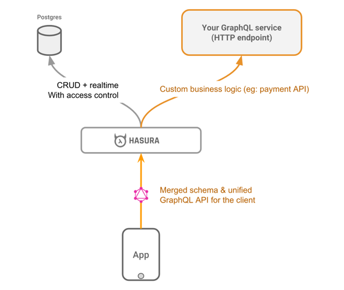

# Schémas distants

Fusionnez des schémas GraphQL distants avec le schéma basé sur Postgres de GraphQL engine, pour requêter tous vos types GraphQL à partir du même point de terminaison. Les schémas distants sont idéaux pour des cas d'utilisation tels que:

* Personnaliser des mutations (*ex: exécuter des validations avant des insertions*)
* Supporter des fonctionnalités telles que les paiements, etc ... et fournir une interface cohérente pour y accéder, c'est à dire au travers de l'API GraphQL Engine.
* Récupérer de la donnée hétérogène à partir d'autres sources (*ex: d'une API de météo ou d'une autre base de données*)

Pour supporter votre propre logique métier, vous devrez créer un serveur GraphQL (voir [kits de démarrage](../community/boilerplates/graphql-servers)) et fusionner son schéma avec celui de GraphQL Engine.



## Démo (*40 secondes*)

[](https://www.youtube.com/watch?v=eY4n9aPsi0M)

[Fusionnez des schémas GraphQL distants (lien YouTube)](https://youtu.be/eY4n9aPsi0M)

## Démarrage Rapide

La manière la plus rapide d'essayer les schémas distants est via Heroku.

1. Cliquez sur le bouton suivant pour déployer GraphQL Engine sur Heroku avec l'add-on Postgres gratuit:

    [](https://heroku.com/deploy?template=https://github.com/hasura/graphql-engine-heroku)

2. Ouvrez la console Hasura

   Visitez `https://<app-name>.herokuapp.com` (*remplacez \<app-name\> avec le nom de votre application*) pour ouvrir la console d'admin.

3. Fusionnez votre propre schéma est requêtez le

  Dans la console d'administration, ouvrez l'onglet ``Remote Schemas`` et cliquez sur le bouton ``Add``. Renseignez les détails suivants:
  * Nom du schéma distant: ``countries`` (*un alias pour ce schéma distant*).
  * URL du serveur GraphQL: ``https://countries.trevorblades.com/`` (*Une API GraphQL publique que nous allons utiliser pour rapidement tester cette fonctionnalité; maintenue par [@trevorblades](https://github.com/trevorblades)*.
  * Ignorez le reste de la configuration et cliquez sur le bouton ``Add Remote Schema``.

  Rendez vous dans l'onglet ``GraphiQL`` et exécutez la requête suivante (*copiez la dans la fenêtre de requête à gauche et cliquez sur le bouton* ▶️ *(play)*):

    ```graphql
    {
        countries {
          emoji
          name
          languages {
            name
            native
          }
        }
    }
    ```

  Vous pouvez explorer les types GraphQL du schéma distant au moyen de l'explorateur ``Docs`` dans le coin supérieur-droit de l'interface ``GraphiQL``.

## Kits de démarrage

Des kits de démarrage pour vos propres serveurs GraphQL sont disponibles dans plusieurs langages/frameworks populaires.

* [Kits de démarrage traditionnels](../community/boilerplates/graphql-servers) qui peuvent être déployés n'importe où.
* [Kits de démarrage Serverless](https://github.com/hasura/graphql-serverless) pouvant être déployés sur des plateformes serverless telles que AWS Lambda etc...

Veullez noter que des kits de démarrage pour d'autres langages, frameworks, plateformes serverless, etc ... sont ajoutés progressivement, et que les contribution de la communauté sont les bienvenues.


## Mises en Garde

**Limitations actuelles**:

* Nomenclature: Les noms de types et de noeuds doivent être uniques dans l'ensemble des schémas fusionnés (correspondance sensible à la casse). Lors des prochaines itération, le support de la fusion de types avec des noms et structures identiques sera disponible.
* Les noeuds provenant de différents serveurs GraphQL ne peuvent pas être utilisés dans la même query/mutation. Tous les noeuds de premier niveau doivent provenir du même serveur GraphQL.
* Les subscriptions à des serveurs GraphQL distants ne sont pas supportées.
* Les interfaces ne sont pas supportées - si un schéma distant possède des interfaces, une erreur sera remontée lorsque vous tenterez de le fusionner.

Ces limitations seront adressées dans les prochaines versions.

## Documentation

Consultez l'intégralité de la [documentation](https://docs.hasura.io/1.0/graphql/manual/remote-schemas/index.html).


