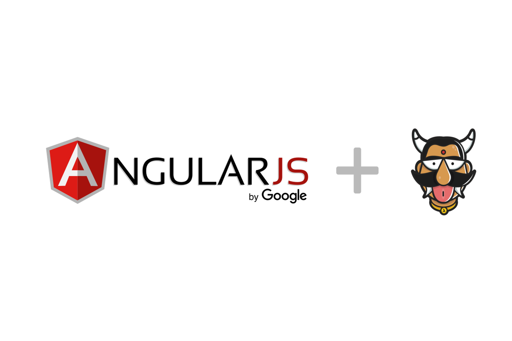

:orphan:

.. meta::
   :description: Use a starter kit & a JS SDK to build and deploy an AngularJS app that integrates with the Hasura Auth, Data, and File APIs
   :keywords: hasura, docs, tutorials, starter-kit, angularjs, js-sdk
   :content-tags: angularjs, web
   :created-on: 2017-07-28T10:20:35.073Z 

AngularJS starter-kit with Yeoman Generator and using Hasura JS SDK
===================================================================

.. rst-class:: featured-image

`AngularJS <https://angularjs.org/>`_ is a popular JavaScript MVW Framework used to develop frontend applications. `Hasura JS SDK <https://github.com/hasura/js-sdk>`_ can be used with AngularJS to super-power your application with backend capabilities like authentication, data and file APIs.

This guide lays out the required information for you to kickstart developing your AngularJS application using Hasura backend APIs.

We have also made a `AngularJS-Hasura starter-kit <https://github.com/hasura/quickstart-docker-git/tree/master/js-angularjs>`_ using `Yeoman Generator for AngularJS <https://github.com/yeoman/generator-angular>`_ which you can use to scaffold your application. This kit has complete working pages that demonstrates capabilities of Hasura APIs. You can refer to these to get started or even use this kit directly for your applications. 

:ref:`Click here to jump to How to use the starter-kit section <using-quickstart>`

Including Hasura JS SDK
-----------------------
Hasura JS SDK is available on `GitHub <https://github.com/hasura/js-sdk>`_. Add the following snippet to your app's ``index.html``.

.. code-block:: HTML 

  

This scipt will expose a global variable called ``hasura`` which is available in the ``window`` scope. For normal JS applications, this would be enough. But, for AngularJS, relying on global valiables are not recommended. We need to inject this object to the components that would require it. For that purpose, we wrap this object inside a AngularJS Factory and make it available as an AngularJS component.

In order to do this, we create a new component under the scope of the AngulaJS module. Create a file called ``hasura.js`` with the following content and add include it in ``index.html``.

.. code-block:: JavaScript
  
  'use strict';
  angular.module('angularjsHasuraApp')
    .factory('hasura', function ($window) {
      return $window.hasura;
    });

.. note:: 
  
  This assumes that the SDK has already loaded. Hence, make sure that the snippet including SDK comes before this file.

Now, you can inject ``hasura`` into any AngularJS component, like controllers etc. Before we can use the SDK to make queries and executing other actions, the SDK has to be initialised with a Hasura project. This can be done in the AngularJS app's ``run`` section. If you application is for logged in users only, you can make that check also in the same section. 

.. code-block:: JavaScript

  angular
    .module('angularjsHasuraApp', [
      'ngAnimate',
      'ngCookies',
      'ngResource',
      'ngRoute',
      'ngSanitize',
      'ngTouch'
    ])
    .run(function(hasura, $location){
      hasura.setProject('caddy89'); // if your domain is caddy89.hasura-app.io

      // Uncomment the following lines if you want to force users to login
      /**
      if (hasura.user.id === 0) {
      	$location.path('/login')
      }
      */
    })

.. note::

  This step also assumes that you have a Hasura project ready. In case you don't have one, please login to `Hasura Dashboard <https://dashboard.hasura.io>`_ and create a project.

Auth APIs
---------

Signup/Register
^^^^^^^^^^^^^^^

Sample controller for using Signup API is given below. Complete working example can be seen at the `AngularJS-Hasura quickstart template <https://github.com/hasura/quickstart-docker-git/tree/master/js-angularjs>`_

.. code-block:: JavaScript

  angular.module('angularjsHasuraApp')
    .controller('RegisterCtrl', function (hasura, $location) {
      this.doRegister = function () {
        if(this.password !== this.confirmpassword) {
          alert('passwords do not match');
        } else {
          hasura.setUsername(this.username);
          hasura.auth.signup(this.password, {}, function(){
            console.log('signup success');
          }, function(error){
            console.log('signup error');
          });
        }
      }
    });

Login
^^^^^

A sample controller for login using ``hasura`` would look like this. Complete working example can be seen at the `AngularJS-Hasura quickstart template <https://github.com/hasura/quickstart-docker-git/tree/master/js-angularjs>`_ 

.. code-block:: JavaScript

  angular.module('angularjsHasuraApp')
    .controller('LoginCtrl', function (hasura, $location) {
      // Uncomment the following lines if you don't want to
      // show login page if user is already logged in
      /**
      if (hasura.user.id !== 0) {
        $location.path('/');
      }
      */
      this.doLogin = function() {
        hasura.setUsername(this.username);
        hasura.auth.login(this.password, function(success) {
            console.log('login success');
            console.log(hasura.user);
            $location.path('/');
          }, function(error){
            console.log('login failed');
            console.log(error);
          });
      }
    });

Data APIs
---------

In order to use Data APIs, you need to create tables and create permission using Hasura Console. The example provided in quickstart is a ToDo app, where you can add todos and mark them as completed. You can also delete todos. The added advantage of using Hasura Data APIs is that you get instant JSON APIs to access and manipulate data along with easy to user permissions model where you can implement access controls.

* Create a new table called ``todo`` using Hasura Console, and add the following columns:

  * ``id`` : Integer (auto-increment)
  * ``title`` : Text
  * ``user_id`` : Integer
  * ``completed`` : Boolean

* Select ``id`` as the Primary Key
* Click Create
* Goto Permissions tab, click on 'Add permissions for a new role'
* Select ``user`` from the dropdown
* Enter ``{"user_id": "X-HASURA-USER-ID"}`` in all the Check and Filter fields
* Toggle All for Select section
* Tick ``completed`` on Update section
* Save changes

Now, you can use the following APIs. 

.. note:: 

  Complete working example can be seen at the `AngularJS-Hasura quickstart template <https://github.com/hasura/quickstart-docker-git/tree/master/js-angularjs>`_ 

Select
^^^^^^

In order to select all the todos that belongs to a user, you can execute the following query:

.. code-block:: JavaScript

  hasura.data.query({
    type: 'select',
    args: {
      table: 'todo',
      columns: ['id', 'user_id', 'title', 'completed'],
      order_by: ['+completed', '+id']
    }},
    function(data){
      $scope.todos = data;
      $scope.$apply(); // Need to do this since angular wouldn't know when to re-render the scope
    },
    function(error){
      console.log(error);
    }
  });

Insert
^^^^^^

Create a new ToDo

.. code-block:: JavaScript

  hasura.data.query({
    type: 'insert',
    args: {
      table: 'todo',
      objects: [{
        user_id: hasura.user.id,
        title: title,
        completed: false
      }]
    }},
    function(data){
      console.log(data);
    },
    function(error){
      console.log(error);
    }
  );

Update
^^^^^^

Toggle completed state of an existing ToDo

.. code-block:: JavaScript

  hasura.data.query({
    type: 'update',
    args: {
      table: 'todo',
      where: { id: id },
      $set: { completed: !status }
    }},
    function(data){
      console.log(data);
    },
    function(error){
      console.log(error);
    }
  );

Delete
^^^^^^

Delete a ToDo

.. code-block:: JavaScript

  hasura.data.query({
    type: 'delete',
    args: {
      table: 'todo',
      where: { id: id }
    }},
    function(data){
      console.log(data);
    },
    function(error){
      console.log(error);
    }
  );

File API
--------

Upload
^^^^^^

.. code-block:: JavaScript

  var input = document.getElementById('file-upload'); 
  hasura.file.upload(
    input,
    function (successResponse) {
      fileId = successResponse.file_id;
      $scope.file = fileId;
      $scope.$apply();
      console.log('Uploaded file: ' + fileId);
    },
    function (errorResponse) {
      console.log('Error uploading file');
      console.log(errorResponse);
    });

Download
^^^^^^^^

.. code-block:: JavaScript

  hasura.file.download(file, function(success){
    alert('file downloaded');
  }, function(error){
    alert('download failed');
  }); // This will use the HTML5 download attribute to start downloading the file

Delete
^^^^^^

.. code-block:: JavaScript

  hasura.file.delete(file, function(success){
    alert('file deleted');
    $scope.file = undefined;
    $scope.$apply();
  }, function(error){
    alert('file delete failed');
  });

.. _using-quickstart:

Using the Quick-start Template
------------------------------

Step 1a: Get a Hasura Project
^^^^^^^^^^^^^^^^^^^^^^^^^^^^^

Sign up on `Hasura Dashboard <https://dashboard.hasura.io>`_ and get yourself a Hasura project.
Creating a hasura project will give you a domain. Something like: `project42.hasura-app.io`
You will also get an email with your `admin` credentials for your project console and your
database (search for "hasura credentials" in your inbox if you're having trouble finding the email).

Specifically, note your project name.

.. code::

   #Project name: project42
   Console link: https://project42.hasura-app.io

Step 1b: Install ``hasuractl``
^^^^^^^^^^^^^^^^^^^^^^^^^^^^^^

Install the hasura command line tool: :ref:`hasuractl`.

Once you're done with that, login and setup ``hasuractl``:

.. code-block:: Bash

   # This will pop a browser open, where you should login with your hasura.io account
   $ hasuractl login

Make ``hasuractl`` talk to the specific project you created in Step 1a.
(this was ``project42`` in the example above)

.. code-block:: Bash

   $ hasuractl set-context <project-name>

Step 2: Initialise an AngularJS project with an app name
^^^^^^^^^^^^^^^^^^^^^^^^^^^^^^^^^^^^^^^^^^^^^^^^^^^^^^^^

Run the following command to initialise a Laravel app that can be instantly deployed:

.. code-block:: Bash

   $ hasuractl quickstart js-angularjs my-app --create

Step 3: Add project name to the Hasura JS SDK
^^^^^^^^^^^^^^^^^^^^^^^^^^^^^^^^^^^^^^^^^^^^^

Edit the file ``app/src/scripts/app.js``, and change the following line to use your project name

.. code-block:: JavaScript 

  hasura.setProject('project42'); // if your domain is project42.hasura-app.io

Step 4: Use hasuractl to add your SSH key to the Hasura project
^^^^^^^^^^^^^^^^^^^^^^^^^^^^^^^^^^^^^^^^^^^^^^^^^^^^^^^^^^^^^^^

You can't just start pushing code to a new hasura project without making sure
that you are really you! ``hasuractl`` can push your SSH key to your hasura project cluster
so that you can start pushing your code.

.. code-block:: Bash

   $ hasuractl add-ssh-key

Step 5: ``git push`` and you're done!
^^^^^^^^^^^^^^^^^^^^^^^^^^^^^^^^^^^^^

.. code-block:: Bash

   # make changes to code, git commit and then push
   $ git push hasura master
