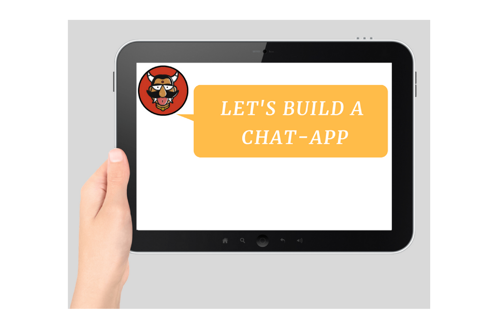
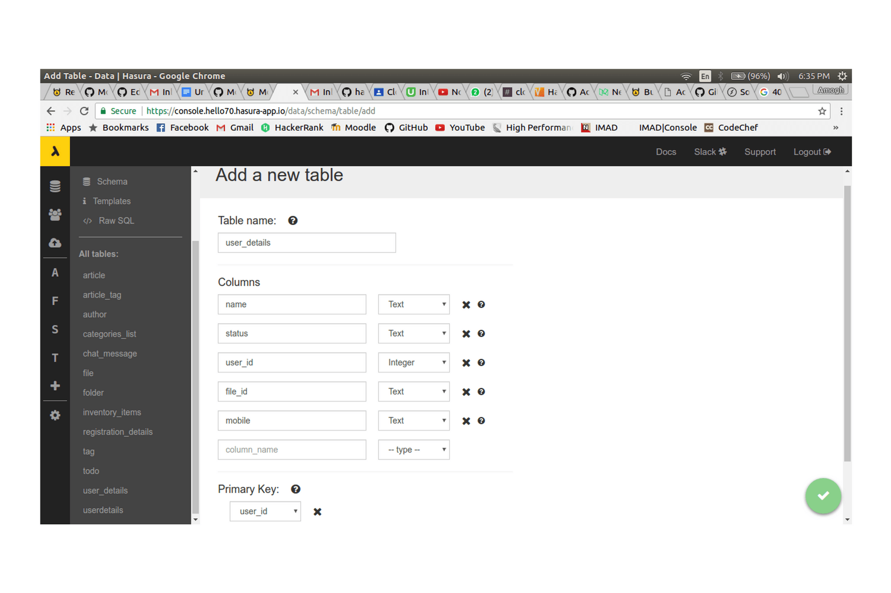
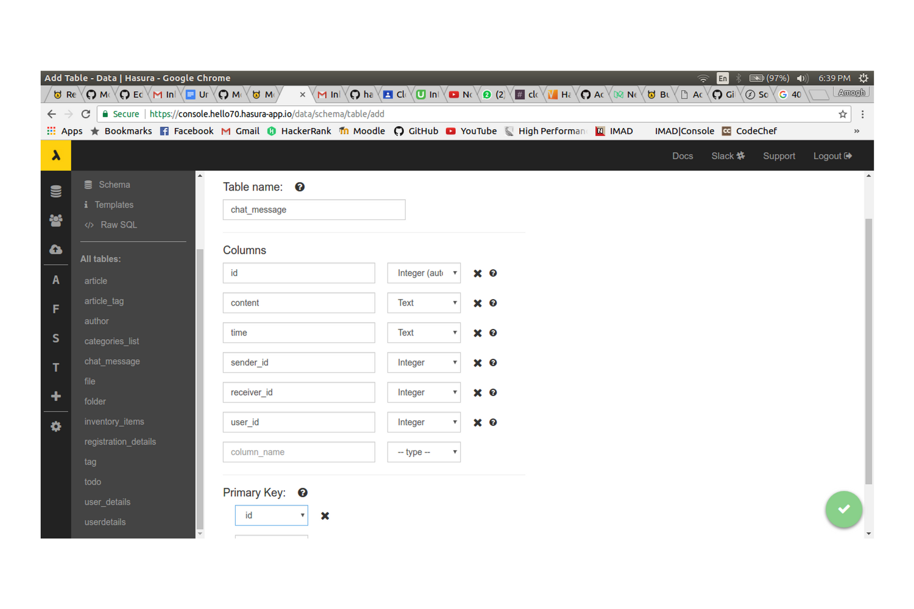
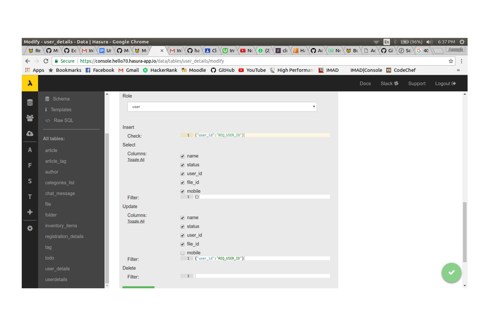
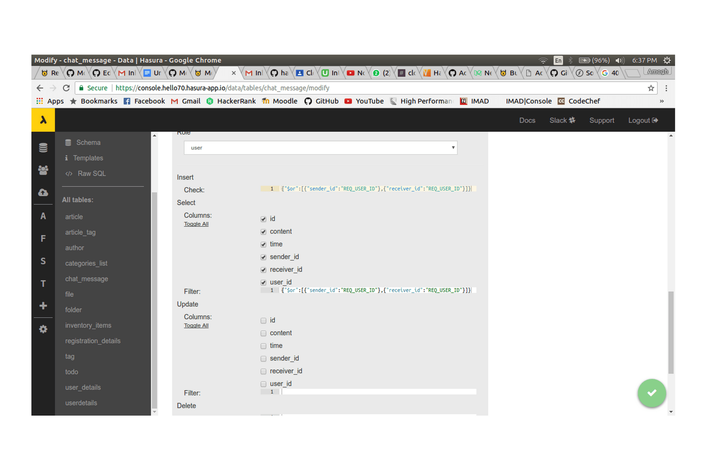

:orphan:

.. meta::
   :description: Learn how to build a real-time chat app using the Hasura Android SDK to integrate with the Data, and Auth APIs and a socket.io server
   :keywords: hasura, docs, tutorials, user-modeling, user data
   :created-on: 2017-07-25T10:20:35.073Z 

================================
Building a Chat App using Hasura
================================

.. rst-class:: featured-image

This tutorial shows you how to build a simple chatting application using Hasura. For building this app, we will be using Hasura Auth, Hasura Data and a Socket Server for sending messages which will be hosted as a CustomService on Hasura.

Let's get Started!!

1.Using the Hasura Data Service
===============================

The Hasura Data Service provides you a query interface to the the tables you create on Postgres. Go to your console and click on **Data and Schema Management** in the left side bar.

Creating Tables
---------------
We will need to create two tables, one for storing user details and the other for storing chat messages.

``UserDetails table:``

Create a new table ``user_details`` and insert the following columns:

Click on create.

``ChatMessage table:``

Create a new table ``chat_message`` and insert the following columns:

Click on create.

Adding Permissions
------------------
By default, the Hasura Data Service allows only admin to access the table information. To open up access of information to ``role: user``, we add permissions.

Head to **Modify Table, Relationships and Permissions** in the console and scroll to the bottom to find the permissions field.

``UserDetails table:``

Under Permissions, click on **Add Permissions** for new Role to add a new permission as follows.

``Check : {"user_id":"X-HASURA-USER-ID"}``

The above statement says that allow access only if value of ``user_id`` equals ``X-HASURA-USER-ID`` where "X-HASURA-USER-ID" is a special varialbe used by the Hasura Data Service that holds the Hasura-User-Id corresponding to the Authorization Header.

``ChatMessage table:``

Under Permissions, click on **Add Permissions** for new Role to add a new permission as follows.

``{"$or":[{"sender_id":"X-HASURA-USER-ID"},{"receiver_id":"X-HASURA-USER-ID"}]}``

A chat is associated with a user if he either sends or receives the message. Thus, we give access to messages where either the ``sender_id`` or the ``receiver_id`` of a chat message is equal to ``X-HASURA-USER-ID``.

2: Configuring the Hasura Android SDK:
======================================
Once you have created your android project, you will have to add ``Hasura-Android SDK`` and a few other dependencies. To do so, I am using Gradle.

Add the following code to the App level build.gradle file

.. code-block::groovy

       compile 'com.github.hasura.android-sdk:sdk:v0.0.5'

These are the other dependencies that will be used in this project:

.. code-block::groovy

        compile 'com.android.support:appcompat-v7:25.3.1'
        compile 'com.squareup.retrofit2:retrofit:2.1.0'
        compile 'com.squareup.retrofit2:converter-gson:2.1.0'
        compile 'com.squareup.okhttp3:logging-interceptor:3.4.1'
        compile 'com.android.support:recyclerview-v7:25.3.1'
        compile 'com.android.support:cardview-v7:25.3.1'
        compile 'com.android.support:design:25.3.1'
        compile 'me.zhanghai.android.materialprogressbar:library:1.3.0'
        testCompile 'junit:junit:4.12'
        compile ('io.socket:socket.io-client:0.8.3') {
            exclude group: 'org.json', module: 'json'
        }
        annotationProcessor 'com.jakewharton:butterknife-compiler:8.5.1'
        compile 'io.github.luizgrp.sectionedrecyclerviewadapter:sectionedrecyclerviewadapter:1.0.4'
        compile 'com.github.jaisontj:BottomSheetImagePicker:v1.0'
        compile 'com.jakewharton:butterknife:8.5.1'
        compile 'com.android.support.constraint:constraint-layout:1.0.1'

Make the following changes to Project level build.gradle file

.. code-block::groovy

    allprojects {
            repositories {
              jcenter()

              maven { url 'https://jitpack.io' }
            }
        }

For more information go to `Hasura Android SDK <https://github.com/hasura/android-sdk>`_.

3: Initializing your Hasura Project:
====================================
To access your Hasura Project through android, you will have to first initialize it.

This initialization should be before you start using the SDK(like beginning of your launcher activity), else you will get an error.

.. code-block:: java
    
    Hasura.setProjectConfig(new ProjectConfig.Builder()
                .setProjectName("Project-Name")
                .build())
                .enableLogs()
                .initialise(this);

4: SignUp and Login:
====================

Regarding the signUp/Login part, please refer to `Hasura Android Module 1-Login <https://github.com/hasura/Modules-Android/tree/master/Module_1-Login>`_.

You can implement any one of the methods in the above module for performing SignUp/Login.

In this tutorial, we will be using ``Mobile OTP`` for Registration and Login.

5: Storing Profile Information:
===============================

Regarding storing user information, please refer to `Hasura Android Module 2-Registration <https://github.com/hasura/Modules-Android/tree/master/Module_2-Registration>`_.

In this case, we will also be storing the mobile number of the user in the user details table.

After the ``ProfileActivity``, direct the user to ``MainActivity``, which will show the conversations of the user.

6: Socket Server and CustomService:
===================================
We build a socket-server using ``Socket.io`` for sending messages from one device to another.

Step 1:
-------

Clone the `Hasura Quick-Start <https://github.com/hasura/quickstart-docker-git>`_ repository.

Step 2:
-------
Copy the node-express folder. This will be your base folder.

Go to the folder ``app/src``. Here you will find a package.json file, where you will have to add the dependencies for your node server.

When you are in the app/src folder, open a terminal and run the following commands to populate the required dependencies in the package.json file.

.. code-block:: bash

    npm install --save express@4.15.2

    npm install --save socket.io

Step 3:
-------
Now we write our ``server.js`` file

**Initializing**

.. code-block:: JavaScript

    // Initializing
    var Express = require('express');
    var http = require('http');
    var _io = require('socket.io');
    var rp = require('request-promise');

    const app = new Express();
    const server = new http.Server(app);
    const io = _io(server);

The server will be adding the received messages to our database.

**Initializing contents for data query**

.. code-block:: JavaScript

    const data_url = 'http://data.hasura/';
    const headers = {
      'Content-Type': 'application/json',
        'X-Hasura-Role': 'admin',
        'X-Hasura-User-Id': 1
    };

**When the user connects to the server:**

.. code-block:: JavaScript

    const sockets = {};
            io.on('connection', (socket) => {
            console.log('User connected: ' + socket.id);
            if (socket.handshake.headers['x-hasura-user-role'] ==='anonymous') {
                  console.log('User connected: anonymous');
                return;
            }
        }    

The ``socketId`` of every user should be mapped to some unique value. In this case, the unique value is the user's ``Hasura-User-Id``

.. code-block:: JavaScript

    const userId = socket.handshake.headers['x-hasura-user-id'];
    sockets[userId] = socket;
    console.log('Socket handshake accepted from: ' + userId.toString());

**When the user sends a new message to the server, it is handled in the following manner:**

.. code-block:: JavaScript

    socket.on('chatMessage', (_params) => {
        try {
            const params = JSON.parse(_params);
            const sender_id = parseInt(userId, 10);
            const receiver_id = params.receiver_id;
            const message = params.content;
            const chattimestamp = params.time;
 
      //Adding to database via server
            var httpRequestOptions = {
                method: 'POST',
                uri: data_url + 'v1/query',
                    headers: headers,
                body: {
                        type: 'insert',
                        args: {
                            table: 'chat_message',
                            objects: [{
                                content: message,
                                time: chattimestamp,
                                sender_id: sender_id,
                                receiver_id: receiver_id,
                                user_id: sender_id
                            }]
                        }
                    },
                json: true // Automatically stringifies the body to JSON
            };

      //Send message to the receiver here
            
    } catch (e) {
      console.error(e);
      console.error(e.stack);
      console.error(
        'Some error in the "chatMessage" event');
    }
  });

**Sending the message from the server to the receiver:**

.. code-block:: JavaScript

    rp(httpRequestOptions)
    .then(function (parsedBody) {
        if (sockets[receiver_id]) {  //Finding the receiver based on his hasura-user-id
            const toSocket = sockets[receiver_id];
            toSocket.emit('chatMessage', JSON.stringify({params}));
            console.log('Emmitted to connected user: ' + _params);
        } else {
            console.log('User not connected to socket');
        }
    })
    .catch(function (err) {
        console.log('Error adding to db :' + err.toString());
    });

**If user disconnects from server**

.. code-block:: JavaScript

    socket.on('disconnect', () => {
           if (userId) {
           sockets[userId] = null;
           console.log('User: ' + userId + ' disconnected');
           }
     });

**Make the server listen on port 8080:**

.. code-block:: JavaScript

    server.listen(8080, function() {
        console.log('Server app listening on port 8080!');
    });

For more, visit `ChatServer <https://github.com/hasura/Modules-Android/blob/master/Module_3-Chat/chat-server/app/src/server.js>`_

Step 4:
-------
Now go to your Console and add a new CustomService by clicking the ``+`` button in the left side panel.

Give a name to your CustomService, enable Git Push under Image Details and then click ``Create``.

Step 5:
-------
We have to add the Hasura remote now. From the terminal go to the folder that you had copied when you cloned Hasura Quick-Start ( this-folder/app/src contains your server.js file).

First do

.. code-block:: bash

    git init

Then, copy the link corresponding to ``Add the Hasura remote`` and enter it in the terminal.

Now enter ``git push hasura master`` to deploy your CustomService.

6. Using the Socket-Server
==========================
Basic usages
------------

``socket.connect();``

This will connect to the socket server.

``socket.emit("chat message",msg);``

This wil emit "msg" to the chat server. "chat message" is like an identifier.

``socket.on("sent message",msg);``

This is used to receive a message which has an identifier "sent message".

``socket.disconnect();``

This will disconnect the user from the socket server.

For more visit `Socket.io <https://socket.io/get-started/chat/>`_

7.Local Database (SQLite)
=========================
Everytime we use the app, we need not fetch all the messages from Hasura Data. We can rather store these messages in a local database on the device itself.

Creating a local db table:
--------------------------
Create a new java class called ``DataBaseHandler`` and make it extend ``SQLiteOpenHelper``.

Now, within the ``OnCreate`` method, enter the following lines of code:

.. code-block:: java

    String CREATE_TABLE_MESSAGE = "CREATE TABLE " + TABLE_MESSAGE + "(" + MESSAGE_CONTENTS + " TEXT," + MESSAGE_TIME + " TEXT," + MESSAGE_SENDER + " INTEGER," + MESSAGE_RECEIVER + " INTEGER," + USER_ID + "INTEGER" + ")";

    db.execSQL(CREATE_TABLE_MESSAGE);

Writing Functions for using SQLite:
-----------------------------------
**Inserting a new chat message:**

.. code-block:: java

    public void insertMessage(ChatMessage chatMessage){
            SQLiteDatabase db = this.getWritableDatabase();

            ContentValues values = new ContentValues();
            values.put(MESSAGE_CONTENTS,chatMessage.getContent());
            values.put(MESSAGE_TIME,chatMessage.getTime());
            values.put(MESSAGE_SENDER,chatMessage.getSender());
            values.put(MESSAGE_RECEIVER,chatMessage.getReceiver());

            db.insert(TABLE_MESSAGE,null,values);
            db.close();
        }

**Fetching all the chat messages from the db:**

.. code-block:: java

    public void insertMessage(ChatMessage chatMessage){
            SQLiteDatabase db = this.getWritableDatabase();

            ContentValues values = new ContentValues();
            values.put(MESSAGE_CONTENTS,chatMessage.getContent());
            values.put(MESSAGE_TIME,chatMessage.getTime());
            values.put(MESSAGE_SENDER,chatMessage.getSender());
            values.put(MESSAGE_RECEIVER,chatMessage.getReceiver());

            db.insert(TABLE_MESSAGE,null,values);
            db.close();
        }

**Fetching all contacts:**

.. code-block:: java

    public List<ChatMessage> getAllContacts(){
            List<ChatMessage> contacts = new ArrayList<>();
            List<Integer> ids = new ArrayList<>();

            String selectContactIdQuery = "SELECT CASE " +
                    " WHEN SENDER_ID = " + user.getId() + " THEN RECEIVER_ID " +
                    " WHEN RECEIVER_ID = " + user.getId() + " THEN SENDER_ID " +
                    " ELSE -1" +
                    " END " +
                    " FROM "+ TABLE_MESSAGE + " ORDER BY TIMESTAMP DESC";
            SQLiteDatabase db = this.getWritableDatabase();
            Cursor cursor = db.rawQuery(selectContactIdQuery,null);

            if(cursor.moveToFirst()){
                do {
                    if(cursor.getInt(0) != -1) {
                        if(!(ids.contains(cursor.getInt(0)))) {
                            ids.add(cursor.getInt(0));
                        }
                    }
                }while (cursor.moveToNext());
            }
            cursor.close();

            int i;
            for (i = 0;i < ids.size();i++){
                String selectContactQuery = "SELECT * FROM " + TABLE_MESSAGE + " WHERE SENDER_ID = " + ids.get(i) + " OR RECEIVER_ID = " + ids.get(i) + " ORDER BY TIMESTAMP DESC";
                Cursor cursor1 = db.rawQuery(selectContactQuery,null);

                if(cursor1.moveToFirst()){
                    ChatMessage contact = new ChatMessage(cursor1.getString(0),cursor1.getString(1),cursor1.getInt(2),cursor1.getInt(3),cursor1.getInt(4));
                    contacts.add(contact);
                }
                cursor1.close();
            }
            db.close();
            return contacts;
        }

**Getting the time of the latest message:**

After getting the time of the latest message in the local db, we can use this time for checking if there are any new messages in Hasura Data after this time, and fetching only these new messages online.

This would also be useful when a user logins in from a different device as he would still have all his messages.

.. code-block:: java

    public String getLatest(){
            String selectLatest = "SELECT TIMESTAMP FROM " + TABLE_MESSAGE +
                    " ORDER BY TIMESTAMP DESC LIMIT 1";

            SQLiteDatabase db = this.getWritableDatabase();
            Cursor cursor = db.rawQuery(selectLatest,null);

            if(cursor.moveToFirst()){
                return cursor.getString(0);
            }

            return null;
        }

8. Displaying Conversations
===========================
Create a new Java class called ``MainActivity``. This activity will have 2 fragments,namely ``ConversationsFragment`` and ``AllContactsFragment``, one for displaying all the conversations and the other for displaying all the contacts that we will fetch from the user's mobile.

We will use a ``viewPager`` to display these two fragments. For implementation, visit `ViewPager <https://developer.android.com/training/animation/screen-slide.html>`_.

Loading Conversations:
----------------------
Create a new fragment called ``ConversationsFragment`` and follow the steps given below.

``Step 1: Initializing the local db``

.. code-block:: java

    db = new DataBaseHandler(context,DATABASE_NAME,null,DATABASE_VERSION);

The database must be initialized in the activity before it can be used.

``Step 2: Getting the latest messages``

First, get the time of the latest message using the ``getLatest()`` function. Then, fire a selectMessages query to Hasura DB to get the latest messages.

**SelectMessagesQuery**

.. code-block:: java

    public class SelectMessagesQuery {
        @SerializedName("type")
        String type = "select";

        @SerializedName("args")
        Args args;

        class Args{
            @SerializedName("table")
            String table = "chat_message";

            @SerializedName("columns")
            String[] columns = {"content","time","sender_id","receiver_id","user_id"};

            @SerializedName("where")
            Where where;
        }

        class Where{
            @SerializedName("time")
            GT gt;
        }
        class GT{
            @SerializedName("$gt")
            String timestamp;
        }

        public SelectMessagesQuery(String time){
            args = new Args();
            args.where = new Where();
            args.where.gt = new GT();
            args.where.gt.timestamp = time;
        }

    }

Now, we get all the messages using this query.

.. code-block:: java

    latestTime = db.getLatest();

        client
                .useDataService()
                .setRequestBody(new SelectMessagesQuery(latestTime))
                .expectResponseTypeArrayOf(ChatMessage.class)
                .enqueue(new Callback<List<ChatMessage>, HasuraException>() {
                    @Override
                    public void onSuccess(List<ChatMessage> chatMessages) {
                        int i;
            //Add all new messages to local db.
                        for(i = 0; i < chatMessages.size(); i++)
                            db.insertMessage(chatMessages.get(i));
                        adapter.setContacts(db.getAllContacts());
                    }

                    @Override
                    public void onFailure(HasuraException e) {
            
                    }
                });

Here we are using ``RecyclerView`` to display all contacts. ``adapter`` is a RecyclerViewAdapter.

``adapter.setContacts(db.getAllContacts())`` would get all contacts and display them.

For how to implement recyclerView, visit `RecyclerView <https://developer.android.com/training/material/lists-cards.html>`_.

``Step 3: Listening for new messages``

If this is the currently open activity and we were to receive a new message, we must handle it properly.

Connect to the socket in the ``onCreateView`` method of the Fragment displaying the conversations.

.. code-block:: java

    socket.connect();

**Handling an incoming message:**

.. code-block:: java

    socket.on("sendMessage", new Emitter.Listener() {
            @Override
            public void call(final Object... args) {
                getActivity().runOnUiThread(new Runnable() {
                    @Override
                    public void run() {
                //Parse the Json response
                        ChatMessage incomingMessage = new Gson().fromJson((String) args[0], ChatMessage.class);
            
            //Insert the message into the local db
                        db.insertMessage(incomingMessage);
                    }
                });
            }
        });

When any conversation is clicked, we have to open the ``ChattingActivity``. For this, first we have to store the userId of that user and then open the ``ChattingActivity`` for this user.

For reference on how to obtain contacts from the mobile device, visit `AllContactsFragment <https://github.com/hasura/Modules-Android/blob/master/Module_3-Chat/app/src/main/java/com/example/android/chatmodule/AllContactsFragment.java>`_

9. Chatting
===========
When the chatting activity open, the main goal is to load chats corresponding to that particular user only. To do this, we call ``getAllMessages()``.

.. code-block:: java

    allData = db.getAllMessages();
        if (allData.size() != 0)
            adapter.setChatMessages(allData);

Again, we are using a recyclerView to display item dynamically.``adapter`` is the adapter for this recyclerView.

**Note:** ``setChatMessages(allData)`` is a function that you have to define in the ``RecyclerViewAdapter``.

Sending a new Message:
----------------------
To send a new message, you have to press the ``Send`` button.

When the ``Send`` button is pressed, we will send our message to the socket-server, and the server will insert the message into Hasura DB for us.

Also when we send a message, we must also add that message to our local db and reflect the same changes in our view.

``Step 1:``

Connect to the socket-server in the same way as mentioned in the previous section.

``Step 2:``

When the ``Send`` button is pressed, we have to emit an event to the server via the socket.

.. code-block:: java

    //Convert the message to JSON and then emit.
    socket.emit("chatMessage",new Gson().toJson(chat), Global.receiverId);

    //Reflecting the changes in the view.
    adapter.addMessage(chat);

    //Adding the message to the local db.
    db.insertMessage(chat);

``Step 3: Listening on new messages``

Again, implement listening to messages in the same fashion as mentioned in the previous section.

There should be only one change being that if the incoming message corresponds to the user whose ``ChattingActivity`` is currently open, then reflect the changes in the view.

.. code-block:: java

    adapter.addMessage(incomingMessage);

When the user presses the back button, redirect him back to the ``MainActivity``.

Great!! You are now done creating your own ChatApp using Hasura :)

