:orphan:

.. meta::
   :description: A tutorial on building a simple FB Messenger bot on Hasura
   :keywords: hasura, docs, tutorials, bot, chat bot, facebook, fb, messenger, fb messenger, facebook messenger
   :created-on: 2017-08-09T10:20:35.073Z

===========================================
Building a Facebook Messenger Bot on Hasura
===========================================

.. rst-class:: featured-image
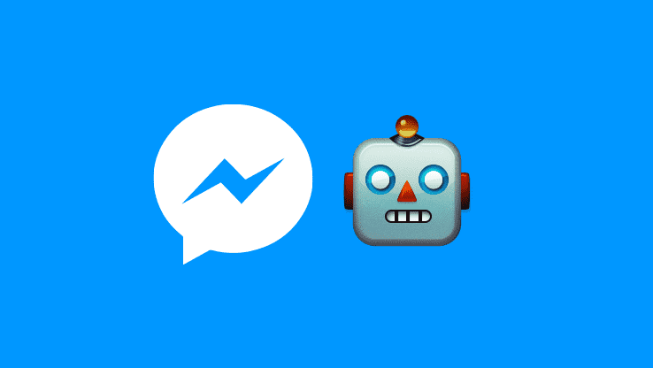

Problem
=======

* Build a bot on Facebook Messenger
* Given a movie name it should reply back with details about the movie and a poster image as well as a **More Details** button. Clicking on this button should redirect the user to a page with more details on the movie.

Architecture
============

.. image:: ../img/tutorial_fb_bot_architecture.png

Lets get started
================

Step 1 - Hosting your server
============================

For the chat bot to function we'll need a server that will receive the messages sent by the Facebook users, process this message and respond back to the user. To send messages back the server will use the graph API provided by Facebook. For the Facebook servers to talk to our server, the endpoint URL of our server should be accessible to the Facebook server and should use a secure HTTPS callback URL. For this reason, running our server locally will not work and instead we need to host our server online. In this tutorial, we are going to deploy our server on Hasura which automatically provides SSL-enabled domains. We will use Node.js along with the express framework to build our server.
Ensure that you have Node installed on your computer, do this by running node-v in the terminal. If you do not have Node installed you can get it from https://nodejs.org

Create a Hasura project
-----------------------

Signup or login to `Hasura <https://hasura.io/login>`_ and then head over to your `dashboard <https://dashboard.hasura.io>`_ to create a new project. Note down your project name (You will receive an email with the credentials to your project console or you could head back to your dashboard to check for the name). In this case, the project name I received was **apology69**.

Download and install Hasuractl
------------------------------

**hasuractl** is a command line tool. You can get instructions to download and install it from `here <https://docs.hasura.io/0.14/ref/cli/hasuractl.html>`_.

Once you have installed `hasuractl`.

* Run **hasuractl login** in your terminal
* After login, run **hasuractl set-context apology69** (Replace apology69 with your project name).

Creating your custom microservice on Hasura
-------------------------------------------

We are now going to create a microservice on Hasura where we will deploy our nodejs app. To do this :

* Run **hasuractl quickstart nodejs-express <app-name> --create**

  - Here, the <app-name> is the name you want to give to your service. In this tutorial I am going with bot. So that would be :

    + hasuractl quickstart nodejs-express bot --create
    + This creates a new service on Hasura called ‘bot’

Deploying your code on the custom microservice
----------------------------------------------

We are now going to deploy our nodejs app onto the microservice we created in the above step.

* Add your ssh-key to the project -> Run **hasuractl add-ssh-key**
* Initialize your project to be a git repository.

  - For this, at the root directory of your project. In this case, /bot
  - Run a **git init**
  - Commit your changes -> Run **git commit -am “Initial Commit”**

* To deploy -> Run **git push hasura master**
* Navigating to bot.apology69.hasura-app.io/ (replace *apology69* with your project name) will now respond with a ‘Hello World’.
* Switch back to your terminal and navigate to **/bot/app/src** and open **service.js** file using the text editor of your choosing.

.. code-block:: JavaScript

    var express = require('express');
    var app = express();

    //your routes here
    app.get('/', function (req, res) {
      res.send("Hello World!");
    });

    app.listen(8080, function () {
      console.log('Example app listening on port 8080!');
    });

As you can see, our app is listening on Port 8080, which is the default port that our microservice listens to as well.
Another thing to note is that the module 'express' is already added to our app.

* Next, let's install additional Node dependencies.
* Go back to your terminal, navigate to **/bot/app/src**. Type **npm install request body-parser --save** and hit enter.

  - The above command installs two modules(libraries) "request" and "body-parser" into our app.
  - **request** is for sending out messages and **body-parser** is to process messages.

* Once again, open up the **server.js** and add the following at the top of your file:

.. code-block:: JavaScript

    var bodyParser = require('body-parser');
    var request = require('request');

and the following after **var app = express();**

.. code-block:: JavaScript

    // Process application/x-www-form-urlencoded
    app.use(bodyParser.urlencoded({extended: false}));

    // Process application/json
    app.use(bodyParser.json());

* Your **server.js** file should now look like so:

.. code-block:: JavaScript

    var bodyParser = require('body-parser');
    var request = require('request');
    var express = require('express');
    var app = express();

    // Process application/x-www-form-urlencoded
    app.use(bodyParser.urlencoded({extended: false}));

    // Process application/json
    app.use(bodyParser.json());

    //your routes here
    app.get('/', function (req, res) {
      res.send("Hello World!");
    });

    app.listen(8080, function () {
      console.log('Example app listening on port 8080!');
    });

Step 2 - Setting up a Facebook Application
==========================================

* Navigate to https://developers.facebook.com/apps/
* Click on **'+ Add a new app’**.

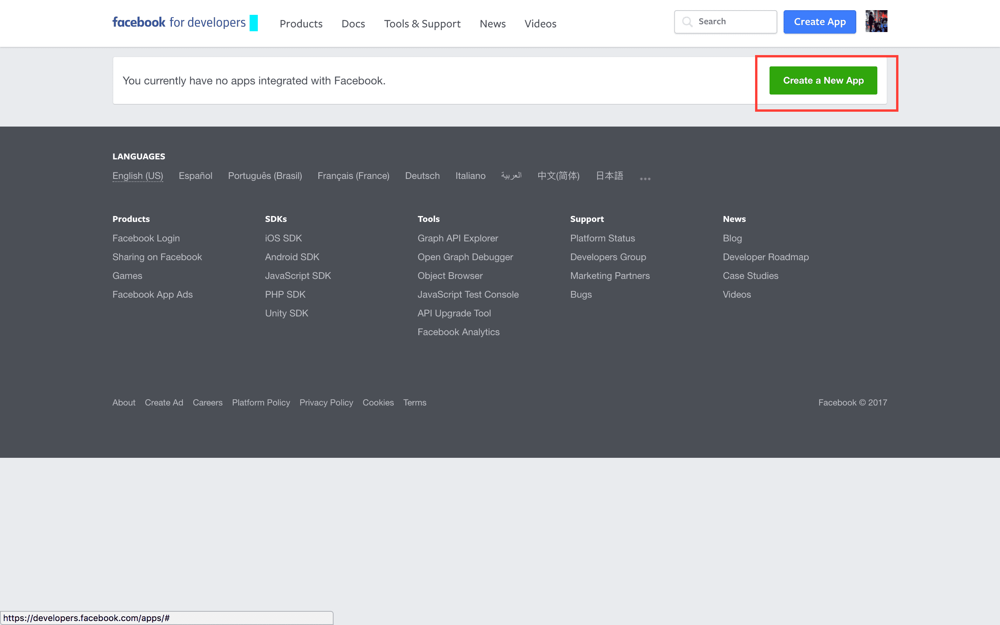

* Give a display name for your app and a contact email.

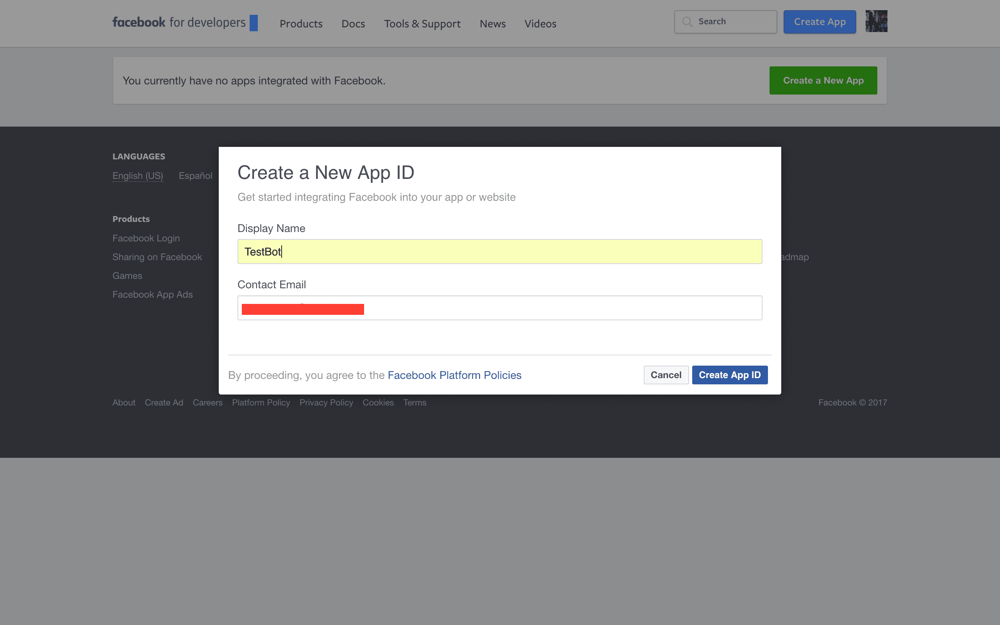

* In the select a product screen, hover over **Messenger** and click on **Set Up**

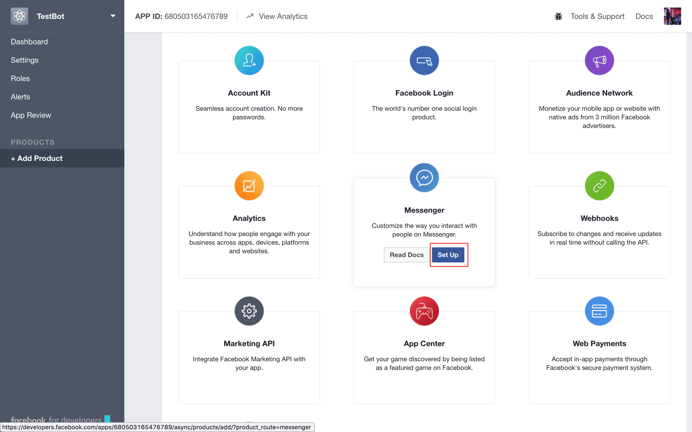

-----------------
Enabling Webhooks
-----------------

* Scroll to down to the **Webhooks** section and click on the **Setup Webhooks** button.

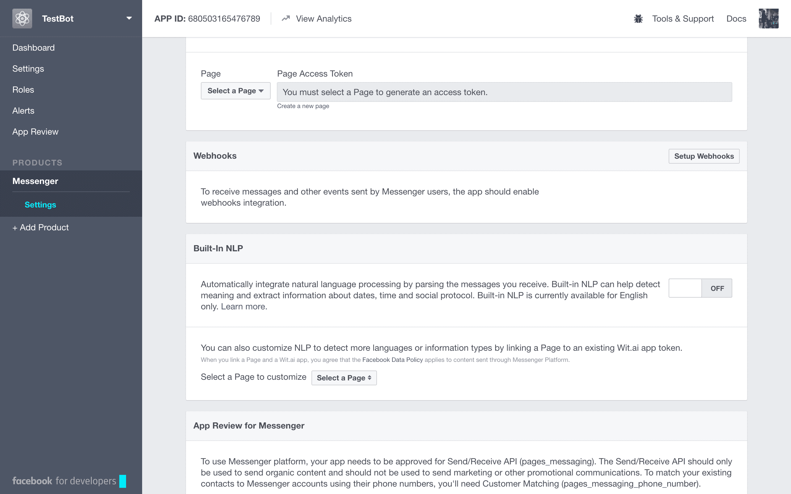

On the pop up that comes up, we need to fill in a box with a `Callback URL` and another one with a `Verify Token`.

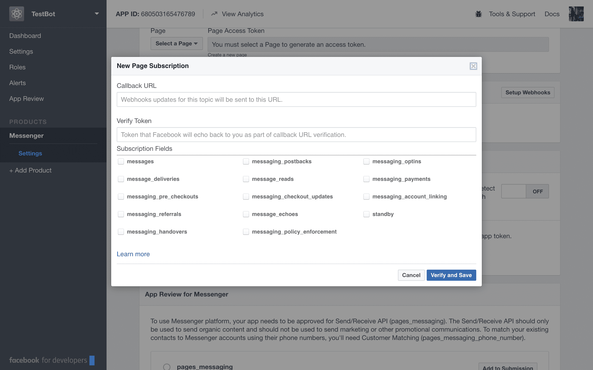

* The **Callback URL** is the url that the facebook servers will hit

  + To verify our server with the **Verify Token** we give it. This will be a GET request.
  + To send the messages that our bot receives from users. This will be a POST request.

* This means that we need to create a path on our server which can be used by the facebook server to communicate to our server. To do this, switch back to your terminal and open **service.js** file.
* Paste the following code:

.. code-block:: JavaScript

    let FACEBOOK_APP_PASSWORD = 'messenger_bot_password';

    // for Facebook verification
    app.get('/webhook/', function (req, res) {
      if (req.query['hub.verify_token'] === FACEBOOK_APP_PASSWORD) {
          res.send(req.query['hub.challenge'])
      }
      res.send('Error, wrong token')
    })

    // All callbacks for Messenger will be POST-ed here
    app.post("/webhook", function (req, res) {
        console.log('Request received at webhook: ' + JSON.stringify(req.body));
        res.sendStatus(200);
    });

In the above code

* we are choosing an arbitrary password that we will use as our **Verify Token** while **Enabling Webhooks**.
* creating a path **\\webhook\\** which will accept :

  - A GET request to verify the **Verify Token** being sent by the facebook servers. Incase, the token is not the same as the one we have set, we respond with an error.
  - A POST request where all of the messages that our bot receives will be posted to, by the facebook server.

    + Here, we are just printing out the received request and responding with a status code of 200.

* Let's deploy this code

  - Navigate to /bot/
  - Run **git add.**
  - Run **git commit -am "Commit message"**
  - Run **git push hasura master**
*Note: For the rest of the tutorial, when we say "Deploy your code", you need to perform the above mentioned steps.*

* Now, switch back to your facebook app page and fill in the pop up with:

  + **Callback URL**: https://bot.apology69.hasura-app.io/webhook/
  + **Verify Token**: messenger_bot_password
  + **Subscription Fields**: Check all

* Click on **Verify and save**.

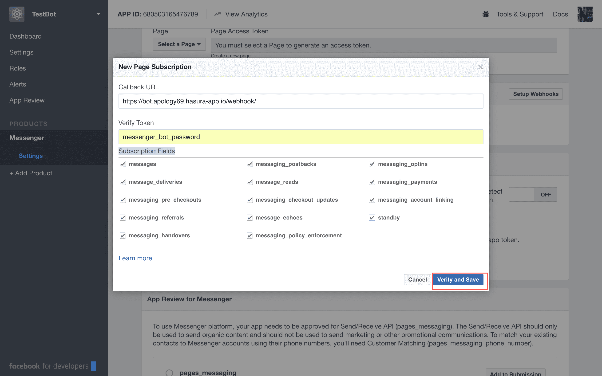

-----------------
PAGE ACCESS TOKEN
-----------------

To start using the bot, we need a facebook page to host our bot.

* Scroll over to the **Token Generation** section
* Choose a page from the dropdown (Incase you do not have a page, create one)
* Once you have selected a page, a *Page Access Token* will be generated for you.

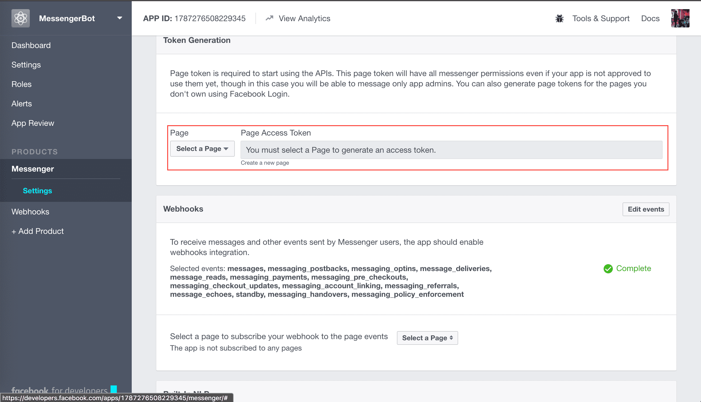

* Copy this page access token in your server.js file

.. code-block:: JavaScript

    let FACEBOOK_PAGE_ACCESS_TOKEN = "EAATZCaDcXCGMBAKAFATDhosSC5PyrdwrIqmAlGuLvYVq1lnuzOTFeDZCFkgARElOffIZAZCiIJYGvzkN9cIbZAYDT7WyD3aWlmsWAoawsMqUh4VpZAmgBZAwREjZAaHy3usjoAfgcSWg7ZAI9J2P4FGJiOyO3pc5WgZAgZDZD";

* Now, we need to trigger the facebook app to start sending us messages

  - Switch back to the terminal
  - Paste the following command - curl -X POST "https://graph.facebook.com/v2.6/me/subscribed_apps?access_token=<PAGE_ACCESS_TOKEN>"
  - Replace <PAGE_ACCESS_TOKEN> with the page access token you just generated.
  - Hit Enter

* Let's check if everything is working fine.
* In your **server.js** file, add the following

.. code-block:: JavaScript

    app.post('/webhook/', function(req, res) {
      console.log(JSON.stringify(req.body));
      res.sendStatus(200);
    })

We have created a POST endpoint with the same path name as '\webhook\' and we are simply printing out the request in the console and responding with a status of 200;

* Deploy this code.
* Switch to your browser and open up the page you just created to generate the Page Access Token.
* Click on the button named **+ Add Button**.

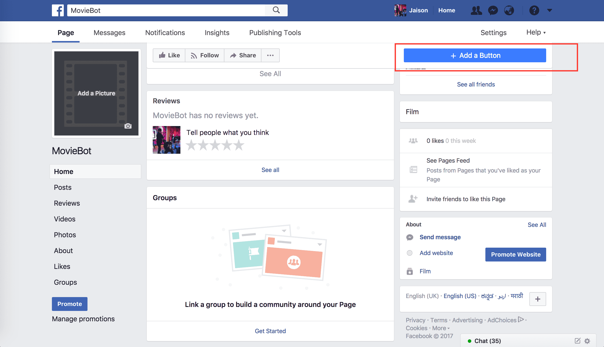

* Next, click on **Use our messenger bot**. Then, **Get Started** and finally **Add Button**.
* You will now see that the **+ Add button** has now changed to **Get Started**. Hovering over this will show you a list with an item named **Test this button**. Click on it to start chatting with your bot.
* Send a message to your bot.
* Head to your Hasura Project Console at https://console.apology69.hasura-app.io/ (Replace apology69 with your project name and the credentials to login will be in your email).

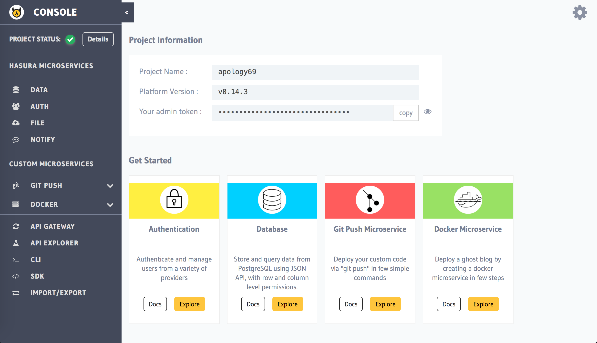

* On the left panel, click on **Git push**

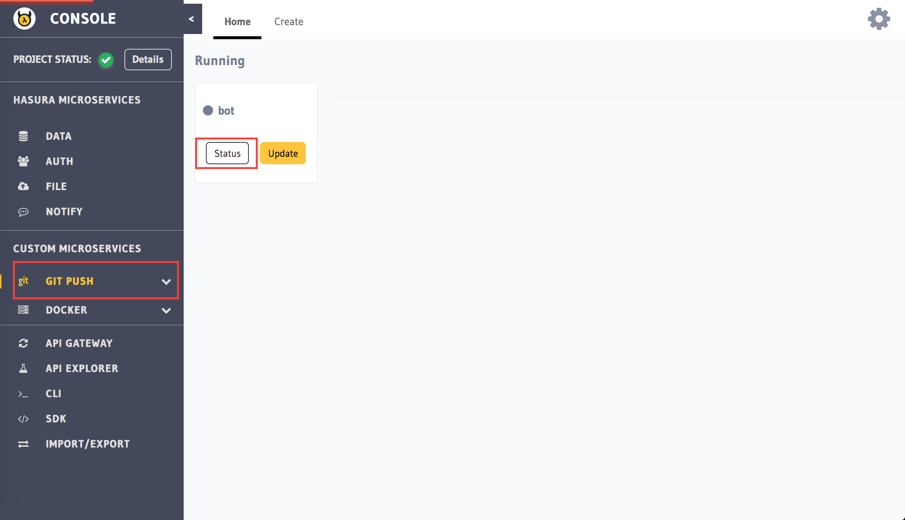

* You will see that there is a service named **bot**. Click on status.
* And then click on Logs on the top.

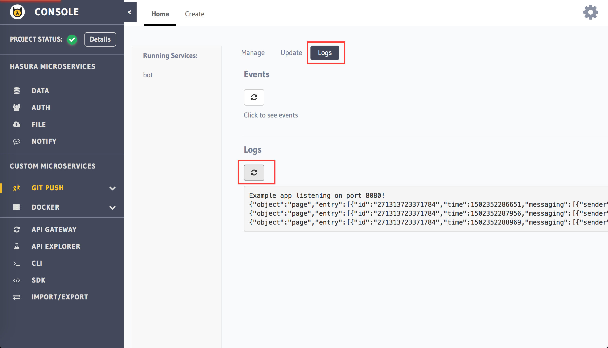

* The response printed in the logs will look like so

.. code-block:: JSON

    {
    	"object": "page",
    	"entry": [
    		{
    			"id": "2713137123371784",
    			"time": 1502352288969,
    			"messaging": [
    				{
    					"sender": {
    						"id": "123123123123"
    					},
    					"recipient": {
    						"id": "2354234324234"
    					},
    					"timestamp": 1502352288017,
    					"message": {
    						"mid": "mid.$asdqfqfqefqcw",
    						"seq": 47322,
    						"text": "Hello"
    					}
    				}
    			]
    		}
    	]
    }

* The **senderId** and the **text** keys need to be extracted from this reponse.

Step 3 - Coding out the bot
===========================

Parsing the request and responding
----------------------------------

Now that the facebook servers and our server can talk to each other, let's start developing our bot.

* Switch back to your server.js file
* Add the following to your your POST '\webhook\' function:

.. code-block:: JavaScript

    app.post('/webhook/', function(req, res) {
      console.log(JSON.stringify(req.body));
      //1
      if (req.body.object === 'page') {
        //2
        if (req.body.entry) {
          //3
          req.body.entry.forEach(function(entry) {
            //4
            if (entry.messaging) {
              //5
              entry.messaging.forEach(function(messagingObject) {
                  //6
                  var senderId = messagingObject.sender.id;
                  //7
                  if (messagingObject.message) {
                    //8
                    if (!messagingObject.message.is_echo) {
                      //9
                      var textMessage = messagingObject.message.text;
                      //10
                      sendMessageToUser(senderId, textMessage);
                    }
                  }
              });
            } else {
              console.log('Error: No messaging key found');
            }
          });
        } else {
          console.log('Error: No entry key found');
        }
      } else {
        console.log('Error: Not a page object');
      }
      res.sendStatus(200);
    })

* In the above code we are basically parsing through the request and extracting the message:

  - 1: We are checking whether the object field in request being sent has a value **page**
  - 2: Next, we are checking whether it has a key named **entry**
  - 3: After ensuring that it does an **entry** key, we are looping through each element in the **entry** array.
  - 4: For each element inside entry, we are checking whether it has a **messaging** key.
  - 5: After ensuring that it does have a **messaging** key, we are then looping through each element inside the **messaging** array.
  - 6: Getting **senderId** of the user who sent us the message.
  - 7: For each element inside messaging, we are checking whether it has a **message** key.
  - 8: When we send a message to our bot, the facebook server *echos* back that message with a field **is_echo** as true. In such cases, we are ignoring the messages.
  - 9: Extracting the message sent by the user to a variable called **textMessage**.
  - 10: We send the **senderId** and the *textMessage** extracted from the request body to a function named **sendMessageToUser**. This function sends the textMessage sent to it, to the senderId provided.

* Let's have a look at our **sendMessageToUser** function.

.. code-block:: JavaScript

    function sendMessageToUser(senderId, message) {
      request({
        url: 'https://graph.facebook.com/v2.6/me/messages?access_token=' + FACEBOOK_PAGE_ACCESS_TOKEN,
        method: 'POST',
        json: {
          recipient: {
            id: senderId
          },
          message: {
            text: message
          }
        }
      }, function(error, response, body) {
            if (error) {
              console.log('Error sending message to user: ' + error);
            } else if (response.body.error){
              console.log('Error sending message to user: ' + response.body.error);
            }
      });
    }

* This is a graph API provided by Facebook to send a message to our bot.
* Deploy this code.
* Switch back to your bot and send it a message. It should respond with the same message.

Fetching movie details
----------------------

Now that our bot responds to the user. Let's take the message sent by the user (assuming that it is a movie name), get some details on the movie.

* Switch back to your server.js file
* To fetch details on the movie, we are going to use the APIs provided by https://www.themoviedb.org/

  - APIs provided by https://www.themoviedb.org/ are not open, so you'll need to create an account with them and get an API key.
  - After creating an account, follow the instructions here https://developers.themoviedb.org/3/getting-started to get an API key.
  - We are going to use a npm library called moviedb

    - Switch to your terminal
    - Navigate to **/bot/app/src/**
    - Type **npm install moviedb --save** and hit enter.
    - Add the following to your **server.js**

.. code-block:: JavaScript

    //Replace YOUR_API_KEY with the api key you got from https://www.themoviedb.org/
    let mdb = require('moviedb')('YOUR_API_KEY');

* Next, we are going to write a new function to get the movie details:

.. code-block:: JavaScript

    function getMovieDetails(senderId, movieName) {
      mdb.searchMovie({ query: movieName }, (err, res) => {
        if (err) {
          console.log('Error using movieDB: ' + err);
          sendMessageToUser(senderId, 'Error finding details on ' + movieName);
        } else {
            console.log(res);
            sendMessageToUser(senderId, 'Found information on ' + movieName);
          } else {
            sendMessageToUser(senderId, message);
          }
        }
      });
    }

* Here, we are fetching details on the movie and printing it out on the console.

  - **mbd.searchMovie** is a method provided by the moviedb library.

* Deploy the code to see what details we get on the movie.
* Test out the API we are using at https://developers.themoviedb.org/3/search/search-movies and take a look at the response that you are getting.

.. code-block:: JSON

    {
      "page": 1,
      "total_results": 5,
      "total_pages": 1,
      "results": [
        {
          "vote_count": 1149,
          "id": 374720,
          "video": false,
          "vote_average": 7.5,
          "title": "Dunkirk",
          "popularity": 51.70826,
          "poster_path": "/cUqEgoP6kj8ykfNjJx3Tl5zHCcN.jpg",
          "original_language": "en",
          "original_title": "Dunkirk",
          "genre_ids": [
            28,
            18,
            36,
            53,
            10752
          ],
          "backdrop_path": "/fudEG1VUWuOqleXv6NwCExK0VLy.jpg",
          "adult": false,
          "overview": "Miraculous evacuation of Allied soldiers from Belgium, Britain, Canada, and France, who were cut off and surrounded by the German army from the beaches and harbor of Dunkirk, France, between May 26 and June 04, 1940, during Battle of France in World War II.",
          "release_date": "2017-07-19"
        },
        .....
      ]
    }

* The **results** key is what contains a list of object with details on the movie.
* For now, let's just access a single object from this list and respond back to the user with the movie name and overview.
* Your **getMovieDetails** function will now look like this.

.. code-block:: JavaScript

    function getMovieDetails(senderId, movieName) {
      mdb.searchMovie({ query: movieName }, (err, res) => {
        if (err) {
          console.log('Error using movieDB: ' + err);
          sendMessageToUser(senderId, 'Error finding details on ' + movieName);
        } else {
          console.log(res);
          if (res.results) {
            if (res.results.length > 0) {
              var result = res.results[0];
              var movieName  = result.original_title
              var overview = result.overview;
              sendMessageToUser(senderId, movieName + ": " + overview);
            } else {
              sendMessageToUser(senderId, 'Could not find any information on ' + movieName);
            }
          } else {
            sendMessageToUser(senderId, message);
          }
        }
      });
    }

* Deploy this code and test it out.

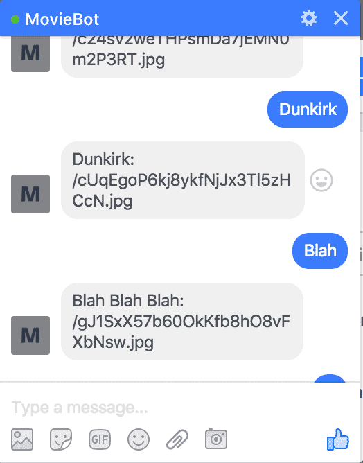

Sending Generic Response
------------------------

Currently, the response sent by our bot looks ugly. So let's improve our response UI.

* Switch to your **server.js** file.
* Add the following function

.. code-block:: JavaScript

    function sendUIMessageToUser(senderId, elementList) {
      request({
        url: FACEBOOK_SEND_MESSAGE_URL,
        method: 'POST',
        json: {
          recipient: {
            id: senderId
          },
          message: {
            attachment: {
              type: 'template',
              payload: {
                template_type: 'generic',
                elements: elementList
              }
            }
          }
        }
      }, function(error, response, body) {
            if (error) {
              console.log('Error sending UI message to user: ' + error.toString());
            } else if (response.body.error){
              console.log('Error sending UI message to user: ' + JSON.stringify(response.body.error));
            }
      });
    }

* This function accepts a senderId and an elementList. We will get to what the element list is in a bit.
* Next, modify your **getMovieDetails** function like so:

.. code-block:: JavaScript

    function getMovieDetails(senderId, movieName) {
      var message = 'Found details on ' + movieName;
      mdb.searchMovie({ query: movieName }, (err, res) => {
        if (err) {
          console.log('Error using movieDB: ' + err);
          sendMessageToUser(senderId, 'Error finding details on ' + movieName);
        } else {
          console.log(res);
          if (res.results) {
            if (res.results.length > 0) {
              //1
              var elements = []
              //2
              var resultCount =  res.results.length > 5 ? 5 : res.results.length;
              //3
              for (i = 0; i < resultCount; i++) {
                var result = res.results[i];
                //4
                elements.push(getElementObject(result));
              }
              sendUIMessageToUser(senderId, elements);
            } else {
              sendMessageToUser(senderId, 'Could not find any informationg on ' + movieName);
            }
          } else {
            sendMessageToUser(senderId, message);
          }
        }
      });
    }

* In the above code:

  - 1: We are initializing an empty array called **elements**.
  - 2: Here, we have a variable whose value will be at max 5 or the number of elements in the result given to us (if its more than 5).
  - 3: We are now looping through the elements in **res.results**.
  - 4: **getElementObject()** is a function that we will write to get details on the movie in a format that is recognizable by our bot. We are pushing that returned value into the **elements** array.

* Let's have a look at what **getElementObject()** looks like:

.. code-block:: JavaScript

    function getElementObject(result) {
      var movieName  = result.original_title
      var overview = result.overview;
      var posterPath = 'http://image.tmdb.org/t/p/w185/' + result.poster_path;
      return {
        title: movieName,
        subtitle: overview,
        image_url: posterPath,
        buttons: [
            {
              type: "web_url",
              url: 'https://www.themoviedb.org/movie/' + result.id,
              title: "View more details"
            }
        ]
      }
    }

* In the above code, we are returning a JSON object with some data. Everything should be self explanatory except

  - **buttons**:
    - This is show a button to the user named **View more details**
    - The **type: "web_url"** lets our bot know that, if a user clicks this button a new page should open with the value specified in the **url** key. Here, the url key is just a link to *themoviedb.org/movie* with the movie id.

* Deploy this code and test out your bot

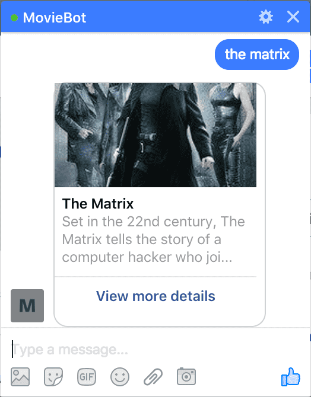

* Clicking on **View more details** should take you to a new page.

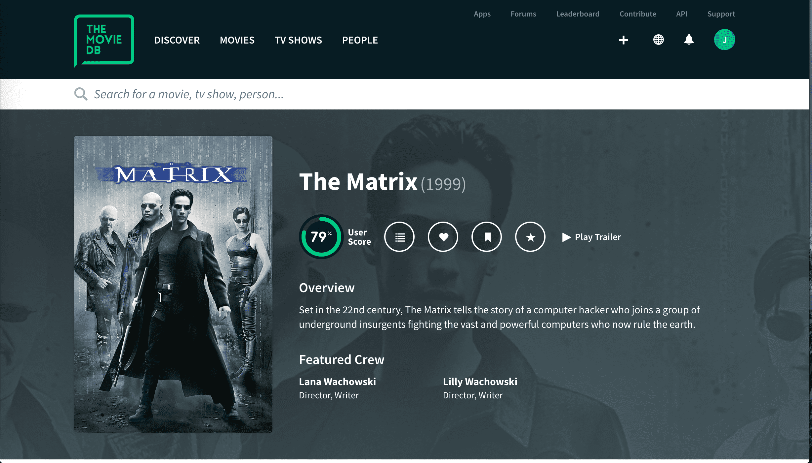

Congratulations! We have just built a messenger bot!!

Bonus: Typing Indicator
-----------------------

One thing that is missing in our bot is that, in the time between receiving the name of the movie to replying to the user with the details. The user does not have any idea about what is going on, it should be nice to show a loading indicator of sorts (the three dots that comes up in messenger when a user is typing something). Let's see how we can do that.

* Switch to your **server.js** file and add the following new function:

.. code-block:: JavaScript

    function showTypingIndicatorToUser(senderId, isTyping) {
      var senderAction = isTyping ? 'typing_on' : 'typing_off';
      request({
        url: 'https://graph.facebook.com/v2.6/me/messages?access_token=' + FACEBOOK_PAGE_ACCESS_TOKEN,
        method: 'POST',
        json: {
          recipient: {
            id: senderId
          },
          sender_action: senderAction
        }
      }, function(error, response, body) {
        if (error) {
          console.log('Error sending typing indicator to user: ' + error);
        } else if (response.body.error){
          console.log('Error sending typing indicator to user: ' + response.body.error);
        }
      });
    }

* The function accepts a senderId and a boolean value(isTyping). Based on the value of **isTyping**, the variable **senderAction** takes a value between *typing_on* and *typing_off*. Using this, we use the Graph API to send a request to the Facebook server.
* You can now use this function in your getMovieDetails function like so:

.. code-block:: JavaScript

    function getMovieDetails(senderId, movieName) {
      showTypingIndicatorToUser(senderId, true);
      var message = 'Found details on ' + movieName;
      mdb.searchMovie({ query: movieName }, (err, res) => {
        showTypingIndicatorToUser(senderId, false);
        if (err) {
          console.log('Error using movieDB: ' + err);
          sendMessageToUser(senderId, 'Error finding details on ' + movieName);
        } else {
          console.log(res);
          if (res.results) {
            if (res.results.length > 0) {
              var elements = []
              var resultCount =  res.results.length > 5 ? 5 : res.results.length;
              for (i = 0; i < resultCount; i++) {
                var result = res.results[i];
                elements.push(getElementObject(result));
              }
              sendUIMessageToUser(senderId, elements);
            } else {
              sendMessageToUser(senderId, 'Could not find any informationg on ' + movieName);
            }
          } else {
            sendMessageToUser(senderId, message);
          }
        }
      });
    }

Let's see this in action:

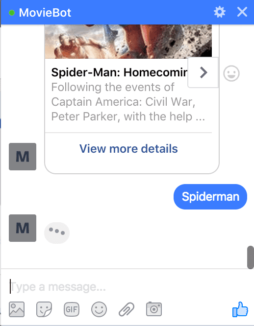

Publishing your bot
-------------------

Currently, our bot is not published and for it to work with users other than you. You need to submit your bot to Facebook for review. Once Facebook approves your bot, it will be live :)
The steps involved in publishing your bot to Facebook is out of the scope of this tutorial and maybe covered in another tutorial.

Future Scope
------------

Currently, our bot is quite simple and does no analysis(NLP) on the messages sent by the user. You can integrate with `wit.ai <https://wit.ai/>`_ to do this.
