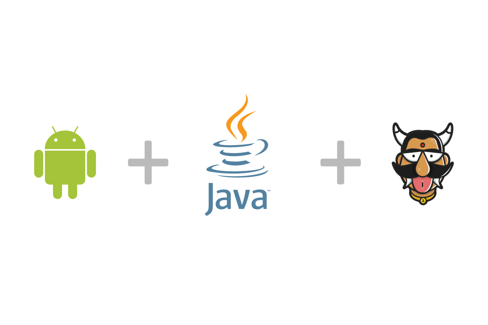

:orphan:

.. meta::
   :description: A tutorial on building an Android app using Hasura 
   :keywords: hasura, docs, tutorials, android, java
   :content-tags: android, java
   :created-on: 2017-07-25T10:20:35.073Z 

Building an Android app using a Java based backend
==================================================

.. rst-class:: featured-image

The following tutorial on building an Android app using Java for the backend on Hasura was originally published here: 

`Building an Android app using Hasura <https://blog.hasura.io/server-side-development-for-android-developers-using-java-on-hasura-417eb9aa8542>`_

