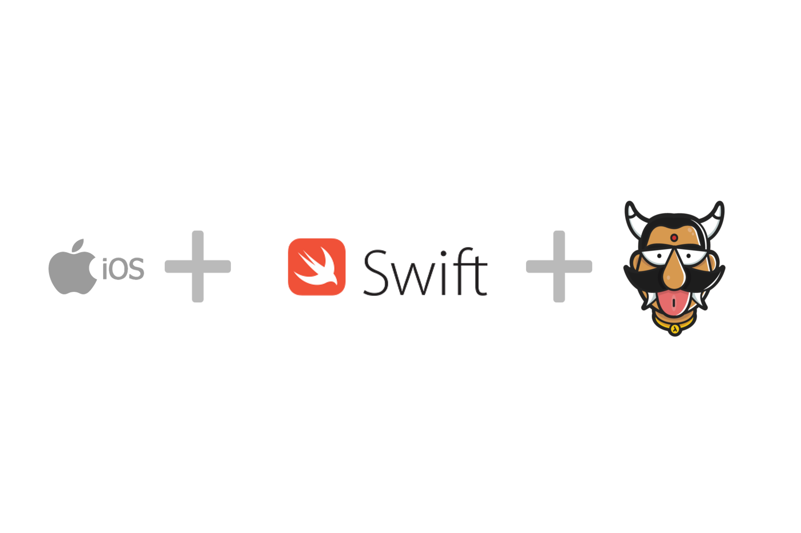

:orphan:

.. meta::
   :description: A tutorial on building an IOS app using Swift for the backend on Hasura 
   :keywords: hasura, docs, tutorials, IOS, swift
   :content-tags: ios, swift

Building an IOS app with a Swift based backend
==============================================

.. rst-class:: featured-image

The following tutorial on building an IOS app using Swift for the backend on Hasura was originally published here: 

`Building an IOS app using Hasura <https://blog.hasura.io/server-side-development-for-ios-developers-using-swift-on-hasura-bb17ed95c822>`_

