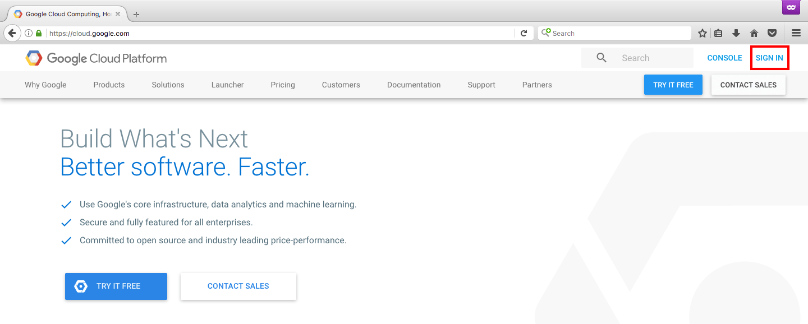
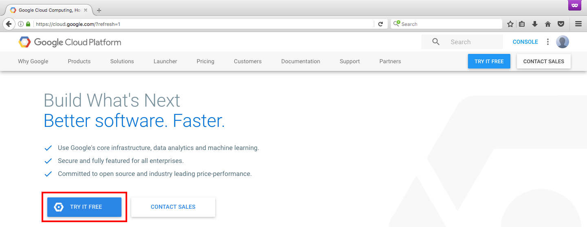
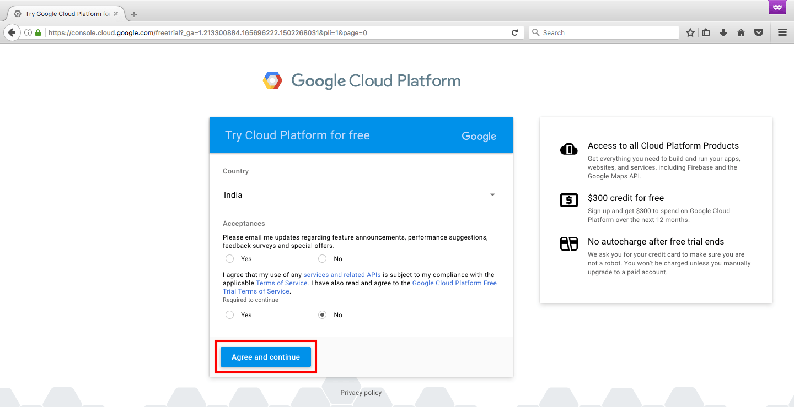
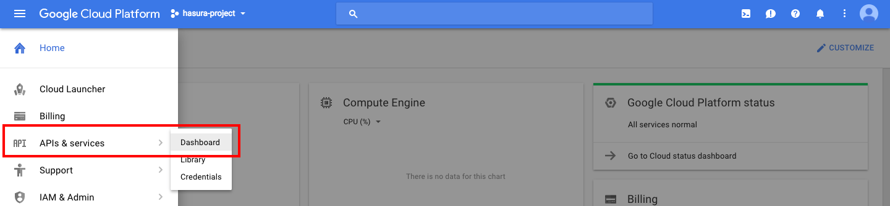
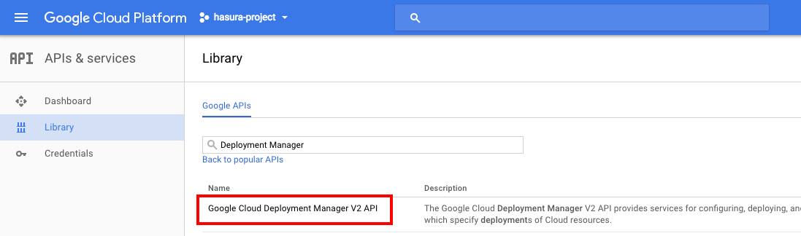
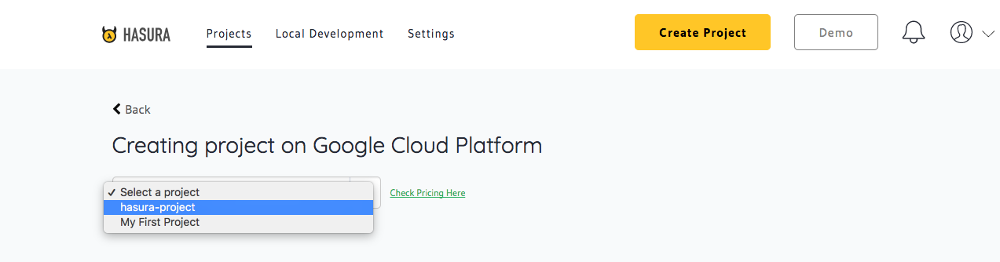

:orphan:

.. meta::
   :description: A video tutorial on creating a Hasura project on Google Cloud Platform
   :keywords: hasura, docs, tutorial, Google Cloud Platform, install, create
   :content-tags: Google Cloud,create project
   :created-on: 2017-08-10T10:20:35.073Z 

Creating a Hasura project on Google Cloud Platform
==================================================

.. rst-class:: featured-image

Introduction
------------

`Google Cloud Platform <https://cloud.google.com/>`_ (GCP) is one of the biggest cloud infrastructure providers. Based on the same infrastructure used by Google, it is a great option for developers looking to deploy applications to the cloud.

.. tip:: **Free $300 credits for new users!**

   GCP offers $300 credits for free to first time users that are valid for an entire year. This makes GCP a great option for developers looking for an affordable cloud provider to deploy their applications.

In this tutorial, we will take a look at how to sign-up on Google Cloud Platform using its free tier, configure the account for Hasura and then create a Hasura project in your account.   

.. You can follow the video tutorial below or check out the written instructions that follow it.

.. _GCP_signup:

Step-1: Sign-up on Google Cloud Platform
----------------------------------------

Navigate to https://cloud.google.com and click on the sign-in link.

.. note:: **Signing up**

   If you don't have a Google account (from Gmail or any other Google service), you will need to sign-up for one. Click on the `More options` link to create a new account.

 .. image:: ../img/GCP-signup-option.png

Once you are logged in, you can check out GCP for free by registering for a free trial. Click on the `TRY IT FREE` button. If you already have a GCP account or have registered for the free trial, please follow the instructions to :ref:`configure your account <GCP_prereq_config>` for use with Hasura.

Once you agree to the terms & conditions, you will be prompted for your tax, address and payment details.  Enter these details as applicable and start your free trial.

.. _GCP_prereq_config:

Step-2: Configuring your GCP account for Hasura
-----------------------------------------------

According to Google, GCP projects form the basis for creating, enabling, and using all Cloud Platform services including managing APIs, enabling billing, adding and removing collaborators, and managing permissions for Cloud Platform resources.

Hasura needs an active GCP project with billing and a few APIs enabled. In this section we will take a look at handling these mandatory prerequisite steps.

1. Creating a Google Cloud Project
^^^^^^^^^^^^^^^^^^^^^^^^^^^^^^^^^^
If you followed the instructions in **Step-1** above, then a GCP project named `My First Project` would have been created for you with billing enabled. You can move on to the next prerequisite step #3 (*unless you want to use a different GCP project*).

To create a new project, navigate to https://console.cloud.google.com/projectcreate and follow the simple instructions there.

2. Enabling billing for your GCP Project
^^^^^^^^^^^^^^^^^^^^^^^^^^^^^^^^^^^^^^^^

As mentioned above, if you are on the GCP free trial, you are good to proceed to the next step. If you aren't, then please check out this Google tutorial on `managing GCP billing accounts <https://support.google.com/cloud/answer/6288653?hl=en>`_

3. Enabling Deployment Manager API
^^^^^^^^^^^^^^^^^^^^^^^^^^^^^^^^^^

Hasura uses the Deployment Manager API to automate the management of GCP resources. To authorize Hasura to use this API, navigate to the `APIs & services` -> `Dashboard` option from the navigation menu on the project dashboard as shown here:

Click on the `ENABLE APIS AND SERVICES` button and search for **Google Deployment Manager API**. Select the link for the `Google Cloud Deployment Manager V2` API that shows up in the search results

Click on the `ENABLE` button and you are done with this step! It may take a minute or two for the API to be enabled, so you can move on to the next step.

4. Enabling Compute Engine API
^^^^^^^^^^^^^^^^^^^^^^^^^^^^^^

Hasura uses the `Google Compute Engine API` to create and manage virtual machines on GCP. Typically, enabling the Deployment Manager API should also enable this one. But if that is not the case, search for and enable the `Google Compute Engine API` exactly as described in the previous step.

Verification of prerequisite steps
^^^^^^^^^^^^^^^^^^^^^^^^^^^^^^^^^^

To verify that you have successfully completed all the prerequisite steps, please head to the `APIs & services` dashboard of your GCP project and check that the aforementioned APIs are part of the list of enabled APIs.

.. important::

   If you have multiple GCP projects, please ensure that you are verifying the configuration of aforementioned APIs and billing under the right project.

Step-3: Creating a project using the Hasura Dashboard 
-----------------------------------------------------

Sign-up at the `Hasura Project Dashboard`_ if you haven't already done so. Click on the `Create Project` button.

Click on the `Sign-in & Authorize` button to select and sign-in to your Google Cloud Platform account using your Google ID from Gmail (or any other Google service). For more details on how to sign-in and claim the free $300 credits, please refer to :ref:`these instructions <GCP_signup>` above.

Once you have signed-in, the Hasura Dashboard fetches a list of GCP projects linked to your account. Please select the GCP project where you want to create the Hasura project.

.. important::

   **Potential Errors**

   If your Google Cloud account does not have a project linked to it or it is not configured for use with Hasura as specified in the above section on :ref:`prerequisite steps <GCP_prereq_config>`, you will be prompted to go to your Google Cloud console and setup the necessary configuration. You may follow the instructions provided in this section to do so.

Once you have selected a properly configured project, you will be prompted to select a Google Cloud region and zone based mostly on the location of application users. You may refer to this Google tutorial on `how to pick the right region and zone for your application <https://cloud.google.com/compute/docs/regions-zones/regions-zones>`_.

You will then be prompted to pick from a list of VM instance types offered by Google in the region/zone selected by you. The instance type recommended for early stage applications by Hasura will be marked as such.

This is the final step in creating a Hasura project - once you have selected the right instance type, you may click on the `Create Project` button. 

And that's it! In just a few minutes, you will have a spanking new Hasura project on your own Google Cloud infrastructure.
