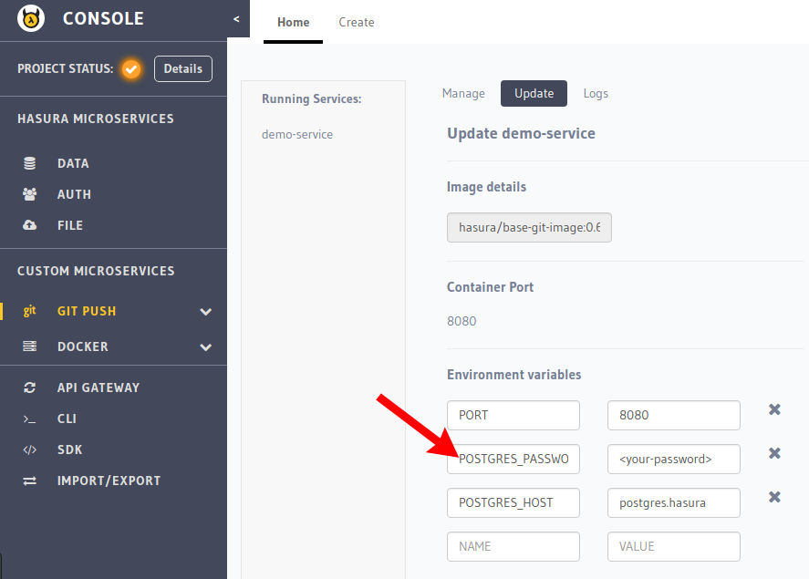

:orphan:

.. meta::
   :description: A tutorial on deploying a Django web application using Hasura complete with migrations and a postgres database
   :keywords: hasura, docs, tutorials, python, django, web-application,  migrations, postgres
   :content-tags: python, django, deployment, web-application
   :created-on: 2017-07-28T10:20:35.073Z 

Deploying a Django app
===========================

.. rst-class:: featured-image

This tutorial will take you over deploying a Django application on Hasura.

Benefits of using Hasura to deploy and host your Django app:

1. A Hasura project comes with a pre-configured Postgres that's ready to be used

2. ``git push hasura master`` inside your django app will deploy your application to your server

3. Migrations are automatically handled whenever you update and deploy your application to the server!

Basic deployment
----------------

Follow the 4 steps below so that you can start off and deploy a Django app
within minutes. Refer to the next section on :ref:`local-development`, to connect to
the Postgres database when you're developing and testing locally.

Step 1: Get a hasura project
^^^^^^^^^^^^^^^^^^^^^^^^^^^^

Sign up on http://dashboard.hasura.io and get yourself a Hasura project.
Creating a hasura project will give you a domain. Something like: `project42.hasura-app.io`
You will also get an email with your `admin` credentials for your project console and your
database (search for "hasura credentials" in your inbox if you're having trouble finding the email).

.. code::

   #Hasura Project name: project42
   Console link: https://project42.hasura-app.io

   #Postgres
   username: admin
   password: password

Step 2: Install `hasuractl` and initialise a Hasura project
^^^^^^^^^^^^^^^^^^^^^^^^^^^^^^^^^^^^^^^^^^^^^^^^^^^^^^^^^^^

Install ``hasuractl`` following the instructions at :doc:`../ref/cli/hasuractl`
 

Once hasuractl is installed, you need to login to your Hasura account
.. code:: 

    $ hasuractl login

After logging in, set the Hasura project name with 

.. code::

    $ hasuractl set-context <hasura-project-name>

This is the domain you got when you created a Hasura project on the dashboard. (this was `project42` in the example above)

Step 3: Configure your Django `settings.py` file and set the postgres password
^^^^^^^^^^^^^^^^^^^^^^^^^^^^^^^^^^^^^^^^^^^^^^^^^^^^^^^^^^^^^^^^^^^^^^^^^^^^^^

Once you've finished setting up ``hasuractl``, you can initialise a Django project as follows

.. code::

    $ hasuractl quickstart python-django <project-name> --create

This will automatically set up the following file structure:

.. code::

    <project-name>
    ├── app
    │   ├── conf
    │   │   ├── gunicorn_config.py
    │   │   └── requirements.txt
    │   └── src
    │       └── helloworld
    │           ├── helloworld
    │           │   ├── __init__.py
    │           │   ├── settings.py
    │           │   ├── urls.py
    │           │   ├── views.py
    │           │   └── wsgi.py
    │           └── manage.py
    ├── docker-config.yaml
    ├── Dockerfile
    └── README.md

You will need to set your database details as environment variables in the hasura console for the  
custom service that hasuractl created for you, so that your app will have access to them when deployed. You
can do this at
``console.<hasura-project-name>.hasura-app.io/gitpush/<project-name>/update``
.. code::

    POSTGRES_PASSWORD :  <postgres-password-from-email>
    POSTGRES_HOST : postgres.hasura

After setting up the variables as shown below, be sure to save!

.. rst-class:: featured-image

.. admonition::
    You can also remove the helloworld folder and create your own Django project in
    its place using 

    .. code::

        $ django-admin startproject <project-name>

    If you decide to create a new project, make sure to edit the Docker file and replace
    the `helloworld` in the following line near the end of the file

    .. code::
        
        WORKDIR /usr/src/app/helloworld

    with your project name 
    .. code::

        WORKDIR /usr/src/app/<project-name>

    Now edit your django settings.py file to get the database credentials from
    environment variables.

    Replace the Database section of your settings.py file with the following
    .. code::

        DATABASES = {
            'default': {
                'ENGINE': 'django.db.backends.postgresql_psycopg2',
                'NAME': 'hasuradb',
                'USER': 'admin',
                'PASSWORD': os.environ.get('POSTGRES_PASSWORD'),
                'HOST': os.environ.get('POSTGRES_HOST'),
                'PORT': '5432',
            }
        }

    This ensures that your app uses the correct database credentials.

    Also remember to edit your Available Hosts to look as follows

    .. code::

        ALLOWED_HOSTS = ['*']

    With this we've finished configuring our project to work with Hasura.

Step 3: Use hasuractl to add your SSH key to the Hasura project
^^^^^^^^^^^^^^^^^^^^^^^^^^^^^^^^^^^^^^^^^^^^^^^^^^^^^^^^^^^^^^^

You can't just start pushing code to a new hasura project without making sure
that you are really you! :doc:`../ref/cli/hasuractl` can push your SSH key to your hasura project cluster
so that you can start pushing your code.

In case you do not have an ssh-key,  you can create one following the
instructions `here <https://confluence.atlassian.com/bitbucketserver/creating-ssh-keys-776639788.html>`_.

.. code::

    $ hasuractl add-ssh-key

Step 4: `git push` and you're done!
^^^^^^^^^^^^^^^^^^^^^^^^^^^^^^^^^^^

Now you just ``git add --all`` and ``git commit -m "Init"`` your code, and
you're ready to deploy!
To deploy your code, now just do 

.. code::

    $ git push hasura master

Voila, your service is deployed and live! In case there are any errors in building or deploying your code,
the ``git push`` command will show you errors and the push will fail. Fix the error, and push again!

.. _local-development:

Local development
-----------------

Considering that the postgres database is already on the Hasura project cluster, when you are
developing on your own mahcine, on your application you might want to connect to the database too.

Step 1: Setup a secure tunnel to your database
----------------------------------------------

You can use the following command to set up an ssh tunnel in order to access
postgres at ``127.0.0.1:5432`` for any process on your machine to use!

.. code::

    $ hasuractl forward 5432:postgres.hasura:5432
 
Leave this running in one terminal session, and continue development in another
session. 

Step 2: Run your app locally! 
-----------------------------

Now use manage.py runserver in your project directory to run your app locally!

.. code::

    $ POSTGRES_PASSWORD='<password>' POSTGRES_HOST='localhost' python3 manage.py runserver

Go to ``127.0.0.1:8000`` to see your app live!
