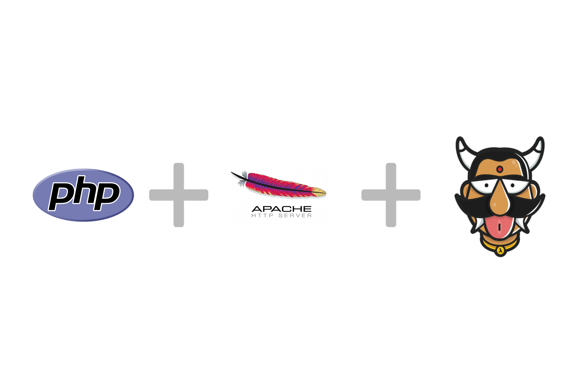

:orphan:

.. meta::
   :description: A tutorial on deploying a Laravel PHP/Apache web application using Hasura complete with migrations and a postgres database
   :keywords: hasura, docs, tutorials, php, apache, web-application, laravel, migrations, postgres
   :content-tags: php, apache, deployment, web-application

Deploying a Laravel PHP app
===========================

.. rst-class:: featured-image

This tutorial will take you over deploying a Laravel PHP application on Hasura.

Benefits of using Hasura to deploy and host your Laravel app:

1. A Hasura project comes with a pre-configured Postgres that's ready to be used
2. `git push hasura master` inside your laravel app will deploy your application to your server
3. Migrations are automatically handled whenever you update and deploy your application to the server!

Basic deployment
----------------
Follow the 4 steps below so that you can start off and deploy a Laravel app
within minutes. Refer to the next section on :ref:`local development`, to connect to
the Postgres database when you're developing and testing locally.

Step 1a: Get a hasura project and make a note of your credentials
^^^^^^^^^^^^^^^^^^^^^^^^^^^^^^^^^^^^^^^^^^^^^^^^^^^^^^^^^^^^^^^^^

Sign up on http://dashboard.hasura.io and get yourself a Hasura project.
Creating a hasura project will give you a domain. Something like: `project42.hasura-app.io`
You will also get an email with your `admin` credentials for your project console and your
database (search for "hasura credentials" in your inbox if you're having trouble finding the email).

Specifically, note your project name postgres credentials:

.. code::

   #Project name: project42
   Console link: https://project42.hasura-app.io

   #Postgres
   username: admin
   password: password

Step 1b: Install `hasuractl`
^^^^^^^^^^^^^^^^^^^^^^^^^^^^

Install the command line tool: `hasuractl`.
Read full instructions here:

But on \*nix systems:

.. code::
   curl -Lo hasuractl https://storage.googleapis.com/hasuractl/v0.1.7/linux-amd64/hasuractl && chmod +x hasuractl && mv hasuractl /usr/local/bin/

If you get a permission denied error for `/usr/local/bin`, sudo it:

.. code::
   curl -Lo hasuractl https://storage.googleapis.com/hasuractl/v0.1.7/linux-amd64/hasuractl && chmod +x hasuractl && sudo mv hasuractl /usr/local/bin/

Once you're done with that, login and setup `hasuractl`:

.. code::
   # This will pop a browser open, where you should login with your hasura.io account
   hasuractl login

Make `hasuractl` talk to the specific project you created in Step 1a.
(this was `project42` in the example above)

.. code::
   hasuractl set-context <project-name>

Step 2: Initialise a Laravel project with an app name
^^^^^^^^^^^^^^^^^^^^^^^^^^^^^^^^^^^^^^^^^^^^^^^^^^^^^

Run the following command to initialise a Laravel app that can be instantly deployed:

.. code::
   hasuractl quickstart php-laravel my-app --create

This is the file structure that will be setup:

.. code::

   my-app/
   - Dockerfile
   - app/ # contains your Laravel project
   ---- .env
   ---- composer.json
   ---- artisan
   ---- app/
   ---- database/
   ---- config/
   ---- routes/
   ---- ... # and more
   - .gitignore
   - .git

Step 3: Configure your laravel `.env` file and set the postgres password
^^^^^^^^^^^^^^^^^^^^^^^^^^^^^^^^^^^^^^^^^^^^^^^^^^^^^^^^^^^^^^^^^^^^^^^^

Use the postgres password from Step 1a, and set that in your `.env` file.

.. code::

   DB_PASSWORD=password

Step 3: Use hasuractl to add your SSH key to the Hasura project
^^^^^^^^^^^^^^^^^^^^^^^^^^^^^^^^^^^^^^^^^^^^^^^^^^^^^^^^^^^^^^^

You can't just start pushing code to a new hasura project without making sure
that you are really you! `hasuractl` can push your SSH key to your hasura project cluster
so that you can start pushing your code.

.. code::

   hasuractl add-ssh-key

Step 4: `git push` and you're done!
^^^^^^^^^^^^^^^^^^^^^^^^^^^^^^^^^^^

xxxx

.. _local-development:
Local development
-----------------

Considering that the postgres database is already on the Hasura project cluster, when you are
developing on your own mahcine, on your application you might want to connect to the database too.

Step 1: Setup a secure tunnel to your database
----------------------------------------------

This will make postgres available on 127.0.0.1:5432 for any process on your machine :)

.. code::
   hasuractl forward 5432:postgres.hasura:5432

Step 2: Change your `.env` environment variables
------------------------------------------------

Change `DB_HOST` to `localhost`. The original value would have been `postgres.hasura`.

.. code::

   DB_HOST=localhost

Step 3: Run your database migrations
------------------------------------
Make sure that the tunnel to your database is on (Step 1) and then run:

.. code::

   php artisan migrate

Step 3: Run `php artisan serve`!
--------------------------------

.. code::

   php artisan serve

And everything works. :)
