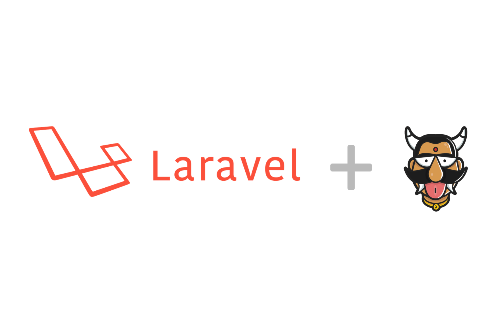
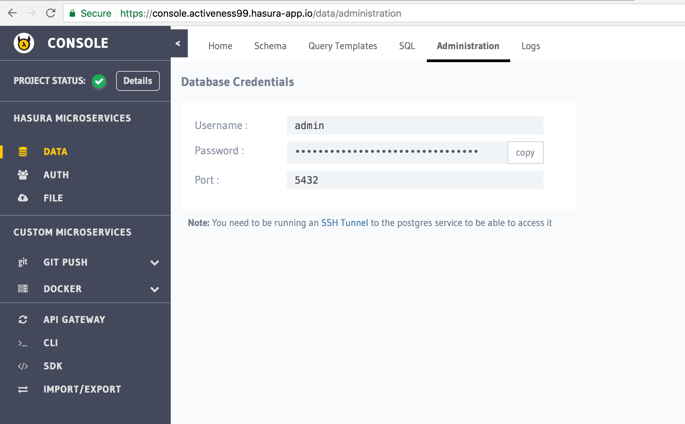
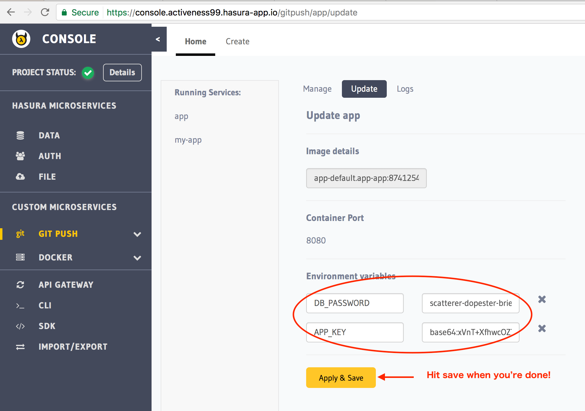
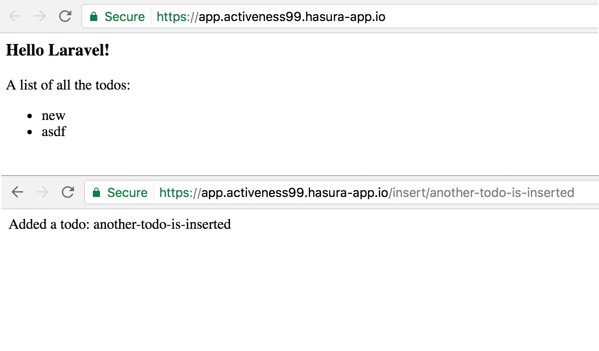

:orphan:

.. meta::
   :description: A tutorial on deploying a Laravel PHP/Apache web application using Hasura complete with migrations and a postgres database
   :keywords: hasura, docs, tutorials, php, apache, web-application, laravel, migrations, postgres
   :content-tags: php, apache, deployment, web-application
   :created-on: 2017-07-28T10:20:35.073Z 

Deploying a Laravel PHP app
===========================

.. rst-class:: featured-image

This tutorial will take you over deploying a Laravel PHP application on Hasura.

Benefits of using Hasura to deploy and host your Laravel app:

1. A Hasura project comes with a pre-configured Postgres that's ready to be used
2. `git push hasura master` inside your git repo will deploy your application to your server

Basic deployment
----------------
Follow the 4 steps below so that you can start off and deploy a Laravel app
within minutes. Refer to the next section on :ref:`laravel-local-development`
 for when you're developing and testing locally.

Step 1a: Get a hasura project and make a note of your credentials
^^^^^^^^^^^^^^^^^^^^^^^^^^^^^^^^^^^^^^^^^^^^^^^^^^^^^^^^^^^^^^^^^

Sign up on http://dashboard.hasura.io and get yourself a Hasura project.
Creating a hasura project will give you a domain. Something like: `project42.hasura-app.io`
You will also get an email with your `admin` credentials for your project console and your
database (search for "hasura credentials" in your inbox if you're having trouble finding the email).

Specifically, note your project name postgres credentials:

.. code::

   #Project name: project42
   Console link: https://project42.hasura-app.io

   #Postgres
   username: admin
   password: password

Step 1b: Install ``hasuractl``
^^^^^^^^^^^^^^^^^^^^^^^^^^^^^^

Install the command line tool: ``hasuractl``.

Read full instructions `here <https://docs.hasura.io/0.14/ref/cli/hasuractl.html>`_.

But on \*nix systems:

.. code-block:: Bash

   $ curl -Lo hasuractl https://storage.googleapis.com/hasuractl/v0.1.7/linux-amd64/hasuractl && chmod +x hasuractl && mv hasuractl /usr/local/bin/

If you get a permission denied error for ``/usr/local/bin``, sudo it:

.. code-block:: Bash

   $ curl -Lo hasuractl https://storage.googleapis.com/hasuractl/v0.1.7/linux-amd64/hasuractl && chmod +x hasuractl && sudo mv hasuractl /usr/local/bin/

Once you're done with that, login and setup ``hasuractl``:

.. code-block:: Bash

   # This will pop a browser open, where you should login with your hasura.io account
   $ hasuractl login

Make ``hasuractl`` talk to the specific project you created in Step 1a.
(this was ``project42`` in the example above)

.. code-block:: Bash

   $ hasuractl set-context <project-name>

Step 2: Initialise a Laravel project with an app name
^^^^^^^^^^^^^^^^^^^^^^^^^^^^^^^^^^^^^^^^^^^^^^^^^^^^^

Run the following command to initialise a Laravel app that can be instantly deployed:

.. code-block:: Bash

   $ hasuractl quickstart php-laravel my-app --create

This is the file structure that will be setup:

.. code-block:: Bash

   ├── my-app
   │   ├── app/ #contains your laravel project 
   │   ├── artisan/
   │   ├── bootstrap/
   │   ├── composer.json
   │   ├── composer.lock
   │   ├── config/
   │   ├── database/
   │   ├── .env.example
   │   ├── .gitattributes
   │   ├── .gitignore
   │   ├── .... 
   ├── Dockerfile
   ├── .dockerignore
   ├── .git/
   └── README

Step 3: Configure your laravel ``.env`` file and set the postgres password
^^^^^^^^^^^^^^^^^^^^^^^^^^^^^^^^^^^^^^^^^^^^^^^^^^^^^^^^^^^^^^^^^^^^^^^^^^

Use the postgres password from Step 1a, and set that in your ``.env`` file.

.. code-block:: Bash

   DB_PASSWORD=password

Step 3: Use hasuractl to add your SSH key to the Hasura project
^^^^^^^^^^^^^^^^^^^^^^^^^^^^^^^^^^^^^^^^^^^^^^^^^^^^^^^^^^^^^^^

You can't just start pushing code to a new hasura project without making sure
that you are really you! ``hasuractl`` can push your SSH key to your hasura project cluster
so that you can start pushing your code.

.. code-block:: Bash

   $ hasuractl add-ssh-key

Step 4: Run the database migrations and generate a new application key
^^^^^^^^^^^^^^^^^^^^^^^^^^^^^^^^^^^^^^^^^^^^^^^^^^^^^^^^^^^^^^^^^^^^^^

Set up a tunnel to securely connect to the postgres database on the hasura project
and run the migrations.

.. code-block:: bash

   $ hasuractl forward 5432:postgres.hasura:5432

Now, in a different terminal:

.. code-block:: bash

   $ php artisan migrate
   Migration table created successfully.
   Migrating: 2014_10_12_000000_create_users_table
   Migrated:  2014_10_12_000000_create_users_table
   Migrating: 2014_10_12_100000_create_password_resets_table
   Migrated:  2014_10_12_100000_create_password_resets_table
   Migrating: 2017_07_27_102621_create_todos_table
   Migrated:  2017_07_27_102621_create_todos_table
   Migrating: 2017_07_27_215357_add_columns_to_todos
   Migrated:  2017_07_27_215357_add_columns_to_todos

   $ php artisan key:generate
   Application key [base64:xVnT+XfhwcOZ76qaNcbFeb3YXWsoLLylqtKp6rdO5EQ=] set successfully.

Note the exact value between the `[` and the `]`. This is the application key, and we'll be using it later:
`base64:xVnT+XfhwcOZ76qaNcbFeb3YXWsoLLylqtKp6rdO5EQ=`

Step 5: ``git push`` and you're done (almost)!
^^^^^^^^^^^^^^^^^^^^^^^^^^^^^^^^^^^^^^^^^^^^^^

.. code-block:: Bash

   $ git push hasura master

Step 6: Set the database password as an environment variable
^^^^^^^^^^^^^^^^^^^^^^^^^^^^^^^^^^^^^^^^^^^^^^^^^^^^^^^^^^^^

Head to the `Data > Administration` section of the console and copy the database password.

Head do the `Git push > my-app > update` section of the console and create a new environment
variable called `DB_PASSWORD` and paste the password as the value. Create another env variable
called `APP_KEY` and paste the application key from above. Make sure you copy the exact string since
it is base64 encoded and will error out if you miss any characters.

Step 7: You're done: view your app!
^^^^^^^^^^^^^^^^^^^^^^^^^^^^^^^^^^^

Head to **my-app.project42.hasura-app.io** to view your app. This app is a simple app that uses
a single table in a database to store values and fetch values.
Remember to replace **project42** with your actual project's name!

.. _laravel-local-development:

Local development
-----------------

Considering that the postgres database is already on the Hasura project cluster, when you are
developing on your own mahcine, on your application you might want to connect to the database too.

Step 1: Run all the steps above (skip if you already have)
^^^^^^^^^^^^^^^^^^^^^^^^^^^^^^^^^^^^^^^^^^^^^^^^^^^^^^^^^^

Make sure that you've already run all the steps above.
**Step 5: Git push** is only important if you're deploying the app, so you can skip that.

.. code-block:: Bash

   $ hasuractl forward 5432:postgres.hasura:5432

Step 2: Run ``php artisan serve``!
^^^^^^^^^^^^^^^^^^^^^^^^^^^^^^^^^^

.. code-block:: bash

   $ php artisan serve
   Laravel development server started: <http://127.0.0.1:8000>

And everything works. :)
