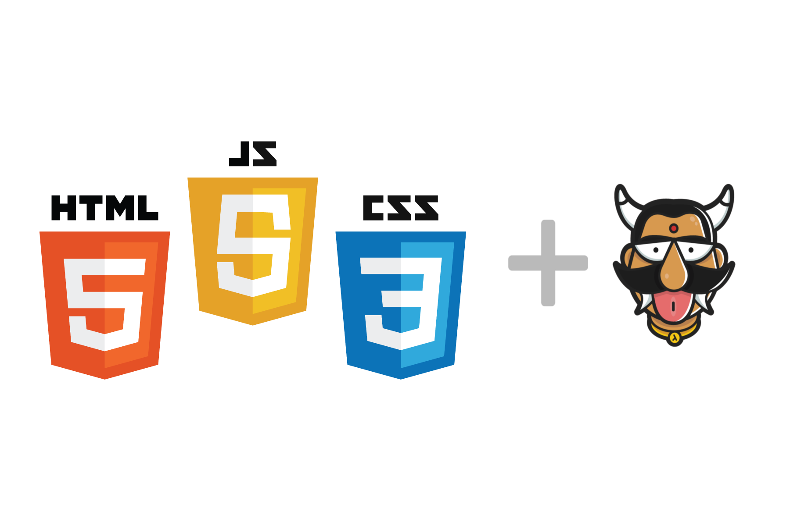

:orphan:

.. meta::
   :description: Use an Nginx-based starter kit to bootstrap an HTML-CSS-JavaScript app and quickly deploy it to the cloud with a git push command
   :keywords: hasura, docs, tutorials, html, javascript, css, web-application
   :content-tags: html, javascript, css, deployment, web-application
   :created-on: 2017-07-25T10:20:35.073Z 

Deploying an HTML/JavaScript/CSS web app using Hasura
=====================================================

.. rst-class:: featured-image

The following tutorial on quickly deploying an HTML/JavaScript/CSS based web application on Hasura was originally published here:

`Deploying an HTML/JavaScript/CSS web application using Hasura <https://blog.hasura.io/deploying-your-html-css-js-webapp-in-under-a-minute-with-hasura-5e1daec2e421>`_

