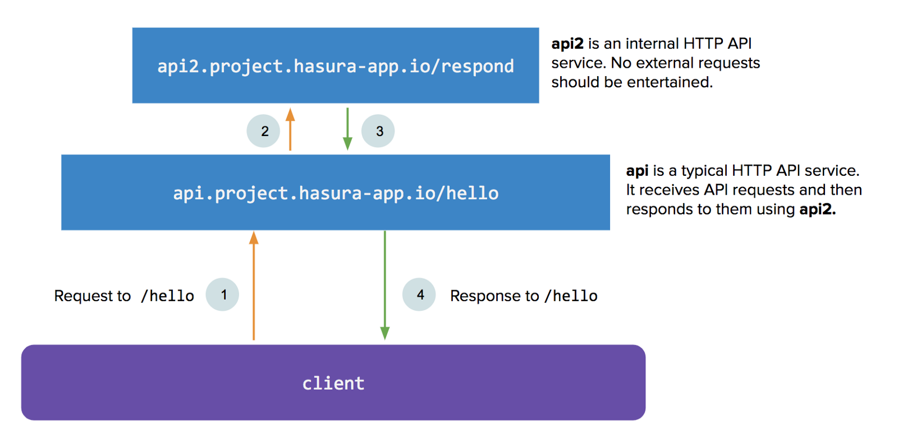
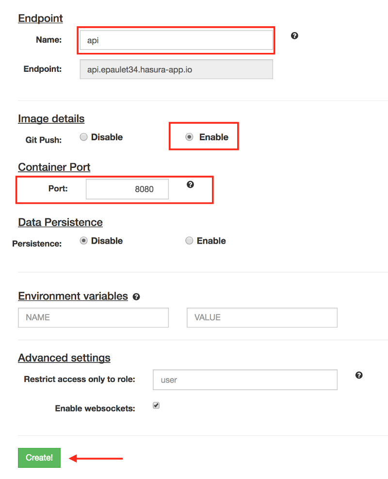
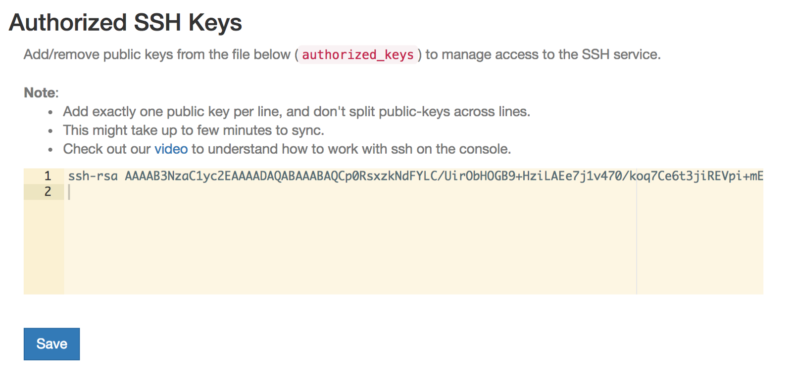
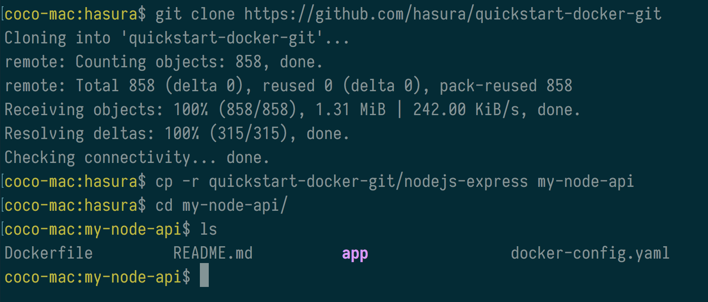
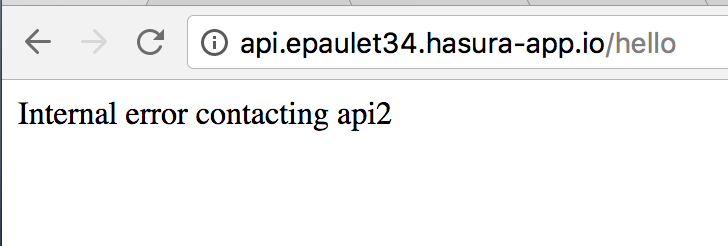
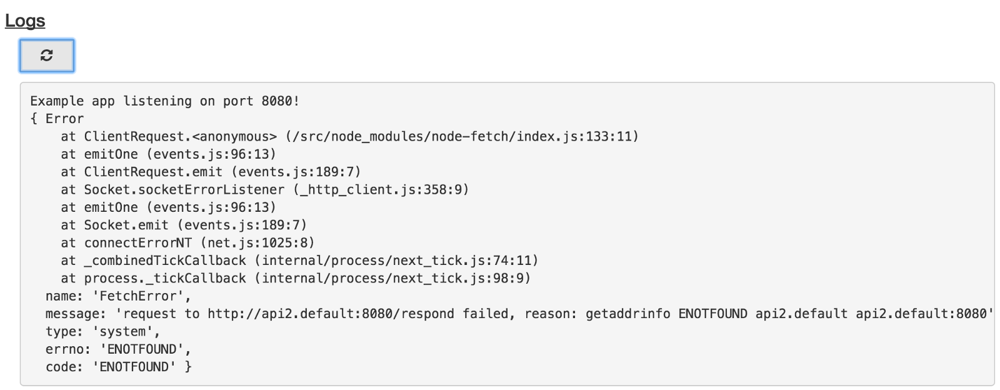
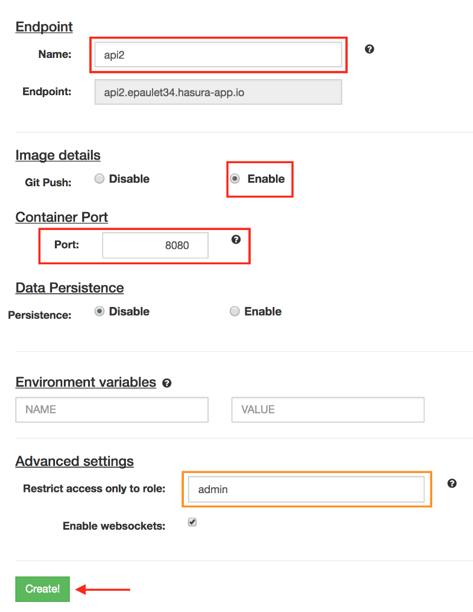
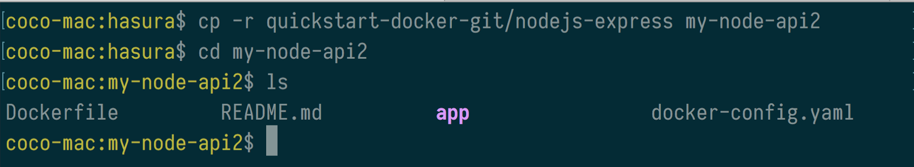
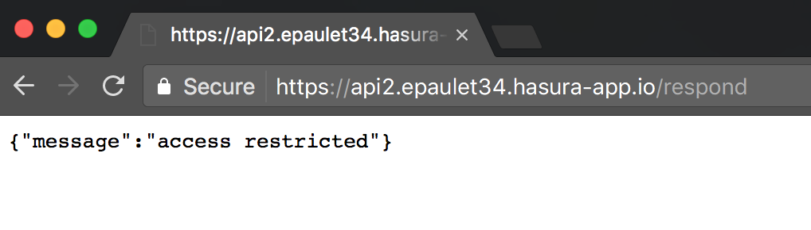
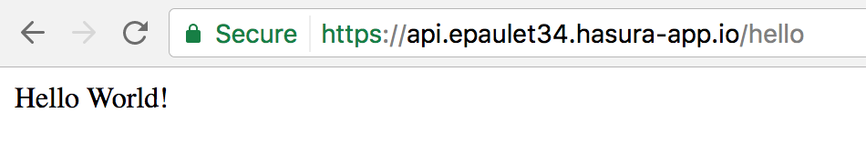

:orphan:

.. meta::
   :description: A tutorial for deploying a custom microservice that talks to a Hasura microservice using the internal DNS label.
   :keywords: hasura, docs, tutorials, inter-service communication, internal DNS
   :content-tags: custom-service, javascript, internal-DNS

===============================================
Inter-service communication in a Hasura backend
===============================================

.. rst-class:: featured-image

This tutorial shows you how an API service can internally contact another API service. The first service, titled ``api`` is accessible to clients. Clients make a request to the endpoint ``/hello``. ``api`` then makes a request to a service titled ``api2`` on the ``/respond`` endpoint. Once ``api`` receives a response from ``api2`` it responds to the client.
Let’s see how we’d create these services on Hasura. For a tl;dr, head to the :ref:`post-summary` directly.

Create and deploy the 'api' service
-----------------------------------
Head to the add service page, and add a custom ``git push`` based service.

Let’s write our code and ``git push`` away!

To deploy code, add your SSH public key to the advanced settings page in the console.

Next, create a ``nodejs-express`` git repository that can easily be git pushed. Use the https://github.com/hasura/quickstart-docker-git repo to get started quickly.

``my-node-api`` is going to be source code behind our api service. Let’s modify ``my-node-api/app/src/server.js`` to make an API request to ``api2``.

.. code-block:: JavaScript
	:emphasize-lines: 7-11

	const fetch = require('isomorphic-fetch');

	const express = require('express');
	const app = express();

	//your routes here
	app.get('/hello', function (req, res) {
	    const url = 'http://api2.default/respond';
	    const options = {
	      method: 'GET'
	    };
	    fetch(url, options).then(
	      (response) => {
	        if (response.ok) {
	          response.text().then(
	            (t) => {
	              // Send the response received from api2
	              res.send(t);
	            });
	        } else {
	          res.status(500)
	            .send('Error from api2: ' + response.status.toString());
	        }
	      },
	      (error) => {
	        console.error(error);
	        res.status(500).send('Internal error contacting api2');
	      });
	});

	app.listen(8080, function () {
	  console.log('Example app listening on port 8080!');
	});

To push this code, first initialise the git repo:

.. code-block:: bash

	cd my-node-api/app/src
	npm install --save isomorphic-fetch #Adds fetch to package.json
	echo '.node_modules' >> .gitignore
	cd ../../
	git init
	git add .
	git commit -m 'My first commit'

Then add the hasura server as a git remote:

.. code-block:: bash

	git remote add hasura ssh://hasura@api.epaulet34.hasura-app.io/~/git/api/
	git push hasura master

Let’s test this out:

This is expected because we don’t have ``api2`` deployed yet.
Let’s look at the logs:

Everything as expected. ``api`` throws an error because it can’t reach ``api2``.

Deploy code for the “api2” service
----------------------------------

Head to the add service page, and add a ``git push`` service titled ``api2``. However, since we don’t want ``api2`` accessible to web clients, let’s restrict access to only the ``admin`` role. This will not allow any requests from ``users`` (*whether logged in or not*) to reach ``api2``.

Next, create another ``nodejs-express`` git repository that can easily be git pushed. Again, use the base repo from https://github.com/hasura/quickstart-docker-git to get started quickly.

``my-node-api2`` is going to be the source code behind our ``api2`` service.

Let’s modify ``my-node-api2/app/src/server.js`` to have a ``/respond`` endpoint:

.. code-block:: JavaScript
	:emphasize-lines: 5-7

	var express = require('express');
	var app = express();

	//your routes here
	app.get('/respond', function (req, res) {
	    res.send("Hello World!");
	});

	app.listen(8080, function () {
	  console.log('Example app listening on port 8080!');
	});

To push this code, first initialise the git repo:

.. code-block:: bash

	cd my-node-api2
	git init
	git add .
	git commit -m 'My first commit'

Then add the hasura server as a git remote:

.. code-block:: bash

	git remote add hasura ssh://hasura@api.epaulet34.hasura-app.io/~/git/api2/
	git push hasura master

Let’s test this out from an incognito window:

This is expected because ``api2``‘s endpoints should not be accessible to any ``user`` (except ``admin``).
Let’s query ``api`` at ``/hello`` again:

Everything as expected! ``api`` contacts ``api2`` and responds successfully.

.. _post-summary:

Summary
-------
1) To create an internal service, restrict the role to ``admin`` during service creation on the Hasura console.

2) To contact one service from another use the ``internal endpoint``. This is the internal DNS label. Eg: http://api2.default/respond will resolve to the ``api2`` service from inside the cluster. ``api2`` in the hostname comes from the name of the server, and default comes from the kubernetes namespace that they are running in. Internal endpoints for every service are available on the **Manage** page.

.. image:: ../img/inter-service-communication-internal-endpoint.png
