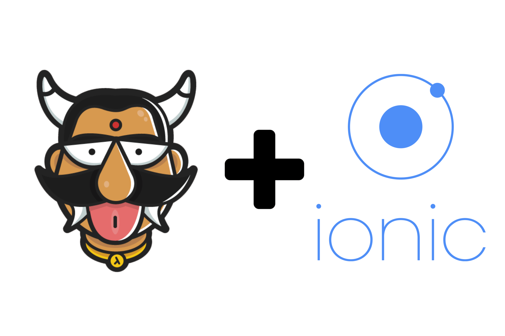

:orphan:

.. meta::
   :description: Sample code to use a starter kit and our JS SDK to develop an Ionic app that integrates with the Hasura Auth, Data, and File APIs
   :keywords: hasura, docs, tutorials, starter-kit, angularjs, js-sdk, ionicframework, ionic
   :content-tags: ionic, mobile app, app 
   :created-on: 2017-08-04T10:20:35.073Z 

Ionic V1 Starter-Kit with Hasura JS SDK
=======================================

.. rst-class:: featured-image

`Ionic Framework <https://ionicframework.com/>`_ is a popular hybrid app development framework. `Hasura JS SDK <https://github.com/hasura/js-sdk>`_ can be used with Ionic to super-power your application with backend capabilities like authentication, data and file APIs. 

This guide lays out the required information for you to kickstart developing your Ionic application using Hasura backend APIs. We are using ``Ionic V1`` apps which makes use of ``AngularJS``.

We have also made a `Ionic-Hasura starter-kit <https://github.com/hasura/ionic-v1-starter-kit>`_ which you can use to start your app. This kit has complete working pages that demonstrates capabilities of Hasura APIs. You can refer to these to get started or even use this kit directly for your applications. 

Including Hasura JS SDK
-----------------------
Hasura JS SDK is available on `GitHub <https://github.com/hasura/js-sdk>`_. The minified sdk is included in the starter-kit by default. In case you are starting your own app, download ``hasura.min.js`` and add the following snippet to your app's ``index.html``.

.. code-block:: HTML 

  

This scipt will expose a global variable called ``hasura`` which is available in the ``window`` scope. For normal JS applications, this would be enough. But, for AngularJS which is being used by Ionic, relying on global valiables are not recommended. We need to inject this object to the components that would require it. For that purpose, we wrap this object inside a AngularJS Factory and make it available as an AngularJS component.

In order to do this, we create a new component under the scope of the AngulaJS module. Create a file called ``hasura.js`` with the following content and add include it in ``index.html``.

.. code-block:: JavaScript
  
  'use strict';
  angular.module('starter')
    .factory('hasura', function ($window) {
      return $window.hasura;
    });

.. note:: 
  
  This assumes that the SDK has already loaded. Hence, make sure that the snippet including SDK comes before this file.

Now, you can inject ``hasura`` into any AngularJS component, like controllers etc. Before we can use the SDK to make queries and executing other actions, the SDK has to be initialised with a Hasura project. This can be done in the AngularJS app's ``run`` section. If you application is for logged in users only, you can make that check also in the same section. 

.. code-block:: JavaScript

  angular
    .module('starter', [
      'ionic',
    ])
    .run(function(hasura, $location){
      hasura.setProject('caddy89'); // if your domain is caddy89.hasura-app.io

      // Uncomment the following lines if you want to force users to login
      /**
      if (hasura.user.id === 0) {
      	$location.path('/login')
      }
      */
    })

.. note::

  This step also assumes that you have a Hasura project ready. In case you don't have one, please login to `Hasura Dashboard <https://dashboard.hasura.io>`_ and create a project.

Auth APIs
---------

Signup/Register
^^^^^^^^^^^^^^^

Sample controller for using Signup API is given below. Complete working example can be seen at the `Ionic Hausra Starter-Kit <https://github.com/hasura/ionic-v1-starter-kit>`_

.. code-block:: JavaScript

  angular.module('starter.controllers')
    .controller('RegisterCtrl', function($scope, hasura, $ionicPopup) {
      $scope.loginData = {
        username: '',
        password: '',
        repassword: '',
        email: ''
      };
      $scope.doRegister= function() {
        if($scope.loginData.password !== $scope.loginData.repassword) {
          $ionicPopup.alert({
            title: 'Error',
            template: 'Passwords do not match'
          });
        } else {
          hasura.setUsername($scope.loginData.username);
          hasura.auth.signup($scope.loginData.password, {}, function(){
            console.log('signup success');
            $ionicPopup.alert({
              title: 'Success',
              template: 'Register success'
            });
            $scope.$apply();
          }, function(error){
            console.log('signup error');
            $ionicPopup.alert({
              title: 'Error',
              template: 'Register failed'
            });
          });
        }
      };
  });

Login
^^^^^

Sample controller for using Login API is given below. Complete working example can be seen at the `Ionic Hausra Starter-Kit <https://github.com/hasura/ionic-v1-starter-kit>`_

.. code-block:: JavaScript

  angular.module('starter.controllers')
    .controller('LoginCtrl', function($scope, hasura, $ionicPopup) {
      $scope.loginData = {
        username: '',
        password: ''
      };
      $scope.doLogin = function() {
        hasura.setUsername($scope.loginData.username);
        hasura.auth.login($scope.loginData.password, function(success) {
          console.log('login success');
          console.log(hasura.user);
          $ionicPopup.alert({
            title: 'Success',
            template: 'Login success'
          });
          $scope.$apply();
          // execute code after login
        }, function(error){
          console.log('login failed');
          console.log(error);
          $ionicPopup.alert({
            title: 'Error',
            template: 'Login failed'
          });
          // handle login error
        });
      };
  });

Data APIs
---------

In order to use Data APIs, you need to create tables and create permission using Hasura Console. The example provided in starter-kit is a ToDo app, where you can add todos and mark them as completed. You can also delete todos. The added advantage of using Hasura Data APIs is that you get instant JSON APIs to access and manipulate data along with easy to user permissions model where you can implement access controls.

* Create a new table called ``todo`` using Hasura Console, and add the following columns:

  * ``id`` : Integer (auto-increment)
  * ``title`` : Text
  * ``user_id`` : Integer
  * ``completed`` : Boolean

* Select ``id`` as the Primary Key
* Click Create
* Goto Permissions tab, click on 'Add permissions for a new role'
* Select ``user`` from the dropdown
* Enter ``{"user_id": "X-HASURA-USER-ID"}`` in all the Check and Filter fields
* Toggle All for Select section
* Tick ``completed`` on Update section
* Save changes

Now, you can use the following APIs. 

.. note:: 

  Complete working example can be seen at the `Ionic Hausra Starter-Kit <https://github.com/hasura/ionic-v1-starter-kit>`_

Select
^^^^^^

In order to select all the todos that belongs to a user, you can execute the following query:

.. code-block:: JavaScript

  hasura.data.query({
    type: 'select',
    args: {
      table: 'todo',
      columns: ['id', 'user_id', 'title', 'completed'],
      order_by: ['+completed', '+id']
    }},
    function(data){
      $scope.todos = data;
      $scope.$apply(); // Need to do this since angular wouldn't know when to re-render the scope
    },
    function(error){
      console.log(error);
    }
  });

Insert
^^^^^^

Create a new ToDo

.. code-block:: JavaScript

  hasura.data.query({
    type: 'insert',
    args: {
      table: 'todo',
      objects: [{
        user_id: hasura.user.id,
        title: title,
        completed: false
      }]
    }},
    function(data){
      console.log(data);
    },
    function(error){
      console.log(error);
    }
  );

Update
^^^^^^

Toggle completed state of an existing ToDo

.. code-block:: JavaScript

  hasura.data.query({
    type: 'update',
    args: {
      table: 'todo',
      where: { id: id },
      $set: { completed: !status }
    }},
    function(data){
      console.log(data);
    },
    function(error){
      console.log(error);
    }
  );

Delete
^^^^^^

Delete a ToDo

.. code-block:: JavaScript

  hasura.data.query({
    type: 'delete',
    args: {
      table: 'todo',
      where: { id: id }
    }},
    function(data){
      console.log(data);
    },
    function(error){
      console.log(error);
    }
  );

File API
--------

Upload
^^^^^^

.. code-block:: JavaScript

  var input = document.getElementById('file-upload'); 
  hasura.file.upload(
    input,
    function (successResponse) {
      fileId = successResponse.file_id;
      $scope.file = fileId;
      $scope.$apply();
      console.log('Uploaded file: ' + fileId);
    },
    function (errorResponse) {
      console.log('Error uploading file');
      console.log(errorResponse);
    });

Download
^^^^^^^^

.. code-block:: JavaScript

  hasura.file.download(file, function(success){
    alert('file downloaded');
  }, function(error){
    alert('download failed');
  }); // This will use the HTML5 download attribute to start downloading the file

Delete
^^^^^^

.. code-block:: JavaScript

  hasura.file.delete(file, function(success){
    alert('file deleted');
    $scope.file = undefined;
    $scope.$apply();
  }, function(error){
    alert('file delete failed');
  });

