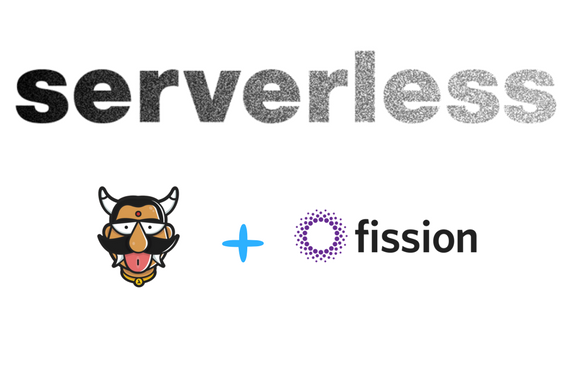
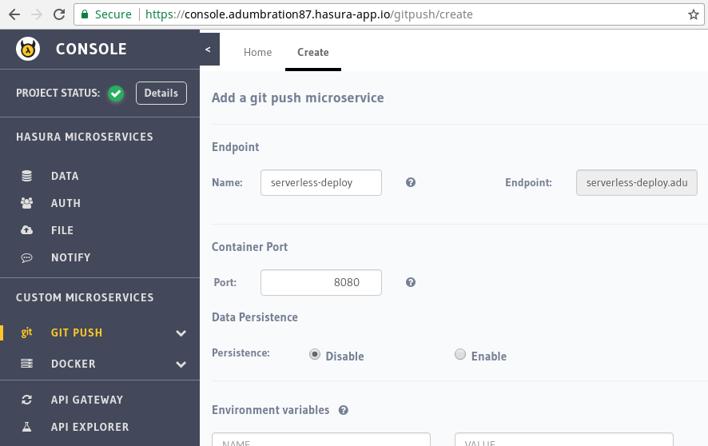
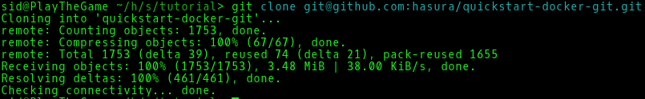
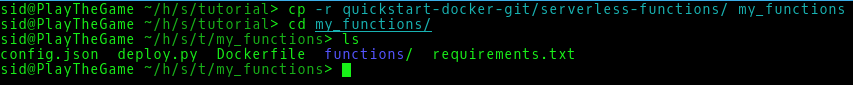
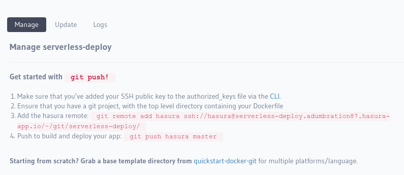
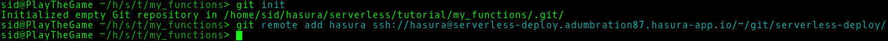
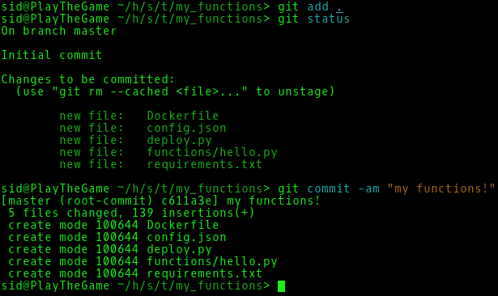
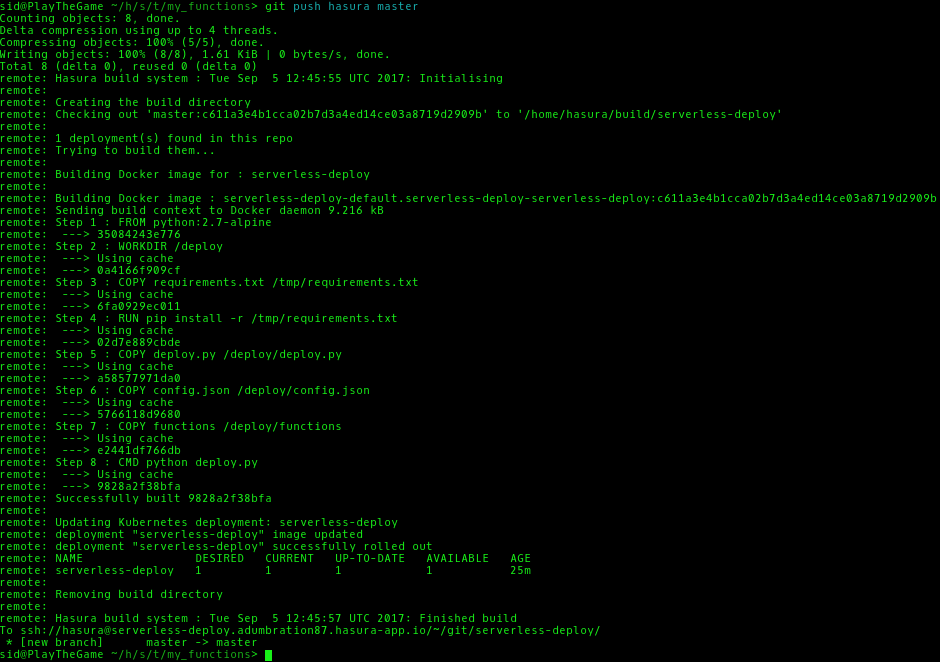
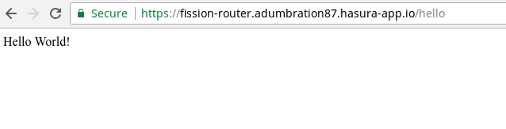

:orphan:

.. meta::
   :description: A tutorial on setting up serverless functions on Hasura and deploying them using git-push.
   :keywords: hasura, docs, tutorials, serverless, functions, faas, lambda, fission
   :content-tags: serverless, functions, faas
   
Setting up Serverless Functions (FaaS) on Hasura using Fission
=================================================================

.. rst-class:: featured-image

This tutorial will guide you how to set up and use serverless functions on Hasura using the Fission framework.

`Fission <https://fission.io>`_ is a Kuberenetes Functions-as-a-Service framework wherein you can write short-lived functions and set up 
http or event triggers for them. 

This tutorial assumes that you will be setting up Fission in a cloud-based Hasura cluster (such as GKE). 

Setup
======
Requirements
~~~~~~~~~~~~~

- A Kuberenetes cluster with the Hasura platform installed
- kubectl
- python 2.7

Your kubectl should point to the cluster you want to set things up on.

Installing Fission
~~~~~~~~~~~~~~~~~~

To install Fission, run the following commands:

.. code ::

    $ kubectl create -f http://fission.io/fission.yaml
    
    $ kubectl create -f http://fission.io/fission-cloud.yaml

Install the Fission UI:

.. code ::

    $ kubectl create -f https://raw.githubusercontent.com/fission/fission-ui/master/docker/fission-ui.yaml

Setup Hasura HTTP routes
~~~~~~~~~~~~~~~~~~~~~~~~

To expose Fission and the UI as a Hasura service, you need to add http routes to the hasura-project-conf. 

The `add_routes.py <https://github.com/hasura/serverless-tutorial/blob/master/add-route.py>`_ script will do this for you.
Run the following command to do so:

.. code ::
    
    $ curl -s https://raw.githubusercontent.com/hasura/serverless-tutorial/master/add-route.py|python -

This will add the following http endpoints to the hasura-project-conf:

- https://fission-ui.<project-name>.hasura-app.io : The Fission UI, accessible only to the admin.
    Check out Fission-UI on `github <https://github.com/fission/fission-ui>`_ to understand how to use it.

- https://fission-router.<project-name>.hasura-app.io : Fission router, to trigger functions, and is accessible to Hasura user
    The functions can be triggered by `https://fission-router.<project-name>.hasura-app.io/<http-trigger>`.

You are now ready to use Fission on Hasura!

Deploying functions using git-push
==================================
You can deploy functions by pushing to a git remote. This can be done using the serverless-functions 
`quickstart template <https://github.com/hasura/quickstart-docker-git>`_. 
To set this up, you can either use hasuractl :ref:`quickstart-cmd` to init the quickstart template or follow the steps 
below to manually set it up.

Create a git-push service from the console
~~~~~~~~~~~~~~~~~~~~~~~~~~~~~~~~~~~~~~~~~~

Navigate to your Hasura project's console and add a new git-push service. 
Just enter a service name and click 'Create'. Don't worry about the rest of the options.

We'll use this service to git-push and deploy functions.

Get the serverless-functions quickstart template
~~~~~~~~~~~~~~~~~~~~~~~~~~~~~~~~~~~~~~~~~~~~~~~~

Clone the `quickstart-docker-git <https://github.com/hasura/quickstart-docker-git>`_ repo  using

.. code::

    $ git clone git@github.com:hasura/quickstart-docker-git.git

Copy out the serverless-functions directory into a new directory

Initialize a git repo
~~~~~~~~~~~~~~~~~~~~~

Add the hasura git remote as mentioned in the console

Code your functions
~~~~~~~~~~~~~~~~~~~

You can write your functions in Python or NodeJS. You can also manually add environments using the Fission-UI.

The 'config.json' specifies the function names, files and HTTP routes for the functions to be deployed. 
All the functions must reside in the 'functions' directory. 

The quickstart provides a sample "Hello World" function. There is one file, 'hello.py' in the functions directory.

.. code:: python

    def main():
        return "Hello World!"

The config.json has one entry which specifies the function name, file name, environment and the HTTP triggers for 
this function. 

.. code:: javascript

    [
        {
            "name": "hello",
            "env": "python",
            "file": "hello.py",
            "http_triggers": [
                {
                    "method": "GET",
                    "urlpattern": "/hello"
                }
            ]
        }
    ]

To add more functions, simply add the function file and another entry in the config.json.

Commit your changes 
~~~~~~~~~~~~~~~~~~~

Push to deploy
~~~~~~~~~~~~~~

To deploy your functions, push to the hasura remote

.. code::

    $ git push hasura master

Great! Your functions have been deployed. 

You can access the endpoints via the Fission router.

You have completed the tutorial. The quickstart provides only a very simple example. In reality you'd want to write 
somewhat more complex functions such as getting the request parameters, doing something with them and returning a result.

You can check out the github repos of `Fission <https://github.com/fission/fission>`_ 
and `Fission-UI <https://github.com/fission/fission-ui>`_ for more on using Fission.
