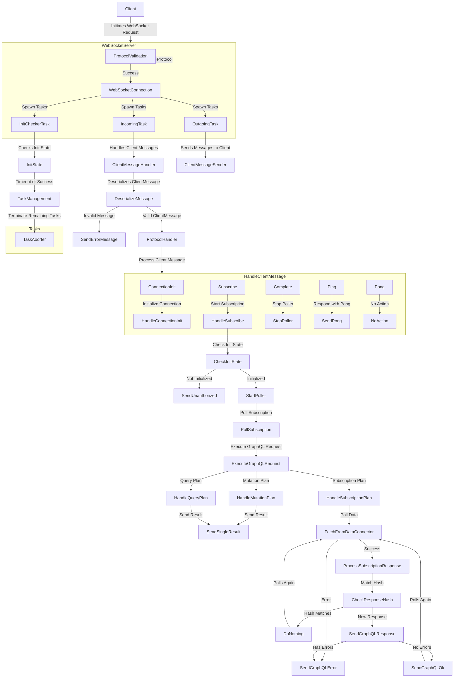

# Architecture of GraphQL over WebSockets

## WebSocket Handling Flow

### 1. Client Interaction

- **Initiates WebSocket Request**
  - Client sends a request to establish a WebSocket connection.

### 2. WebSocket Server

- **Validates Protocol**
  - Ensures the incoming request adheres to the expected `graphql-transport-ws`
    protocol.

### 3. Connection Establishment

- **WebSocket Connection**
  - Successfully establishes a connection after protocol validation.
  - **Spawns Tasks:**
    - **InitCheckerTask**: Verifies the protocol's initialization state.
    - **IncomingTask**: Handles incoming client messages.
    - **OutgoingTask**: Sends messages to the client.

### 4. Task Management

- **InitCheckerTask**
  - Checks initialization state and directs to Task Management.
- **IncomingTask**
  - **Client Message Handler**:
    - Deserializes client messages into appropriate types.
    - Routes valid messages to the **ProtocolHandler**.
    - Handles invalid messages by sending error responses.

### 5. Protocol Handling

- **ProtocolHandler**
  - Manages various client messages:
    - **ConnectionInit**: Initializes connection.
    - **Subscribe**: Starts polling for subscriptions.
    - **Complete**: Stops the corresponding poller.
    - **Ping/Pong**: Manages keep-alive messages.

### 6. Polling Mechanism

- **Polling Loop**
  - Fetches data from the data connector.
  - Processes responses:
    - Sends GraphQL responses or errors back to the client.
    - Repeats fetching at defined intervals.

## Diagram

