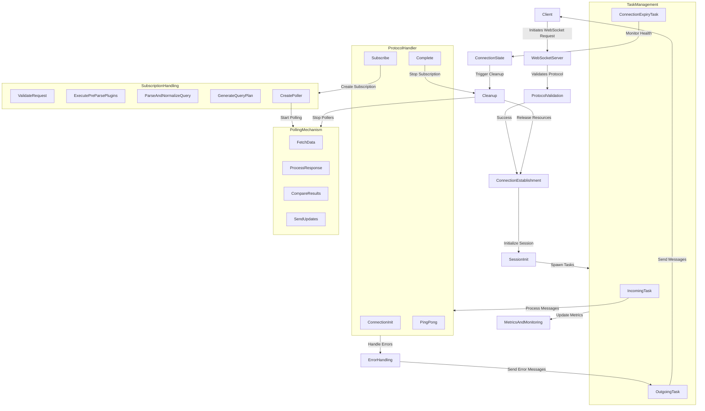

# Architecture of GraphQL over WebSockets

## WebSocket Handling Flow

### Client Interaction

- **Initiates WebSocket Request**
  - Client sends a request to establish a WebSocket connection.

### WebSocket Server

- **Validates Protocol**
  - Ensures the incoming request adheres to the expected GraphQL WebSocket
    protocol (`graphql-transport-ws`).

### Connection Establishment

- **WebSocket Connection**
  - Successfully establishes a connection after protocol validation.
  - **Initializes Session:**
    - Creates channels for incoming and outgoing messages.
    - Sets up connection state management.

### Task Management

- **Spawns Tasks:**
  - **IncomingTask**: Handles incoming client messages.
  - **OutgoingTask**: Sends messages to the client.
  - **ConnectionExpiryTask**: Monitors `graphql-transport-ws` protocol's
    `connection_init` timeout.

### Protocol Handling

- **ProtocolHandler**
  - Manages various client messages:
    - **ConnectionInit**: Initializes connection.
    - **Subscribe**: Starts a new subscription.
    - **Complete**: Stops a specific subscription.
    - **Ping/Pong**: Manages keep-alive messages.

### Subscription Handling

- **Subscription Creation**
  - Validates subscription request.
  - Executes pre-parse plugins (if configured).
  - Parses and normalizes GraphQL query.
  - Generates query execution plan.

- **Polling Mechanism**
  - Creates a dedicated poller for each subscription.
  - Poller continuously executes the GraphQL query:
    - Fetches data from the data connector.
    - Processes responses:
      - Compares with previous result.
      - Sends updates to the client if changed.

### Error Handling

- Comprehensive error handling at various levels.
- Communicates errors back to the client over the WebSocket connection.

### Metrics

- Tracks metrics related to WebSocket connections, subscriptions, and query
  execution.

### Cleanup

- Handles connection closure and expiry.
- Cleans up resources and stops active pollers when connections are terminated.

## Diagram

