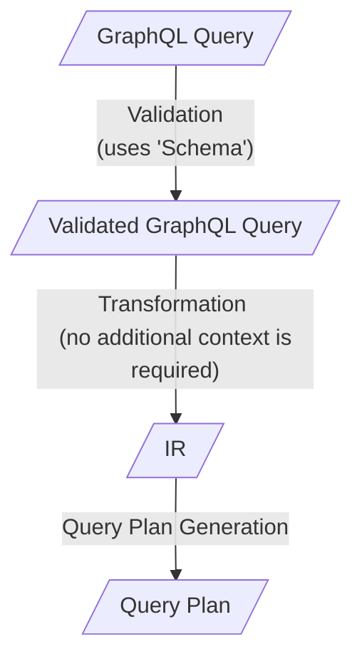
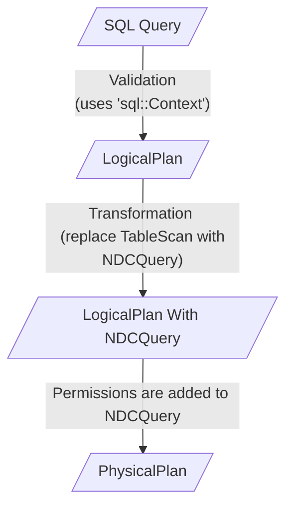
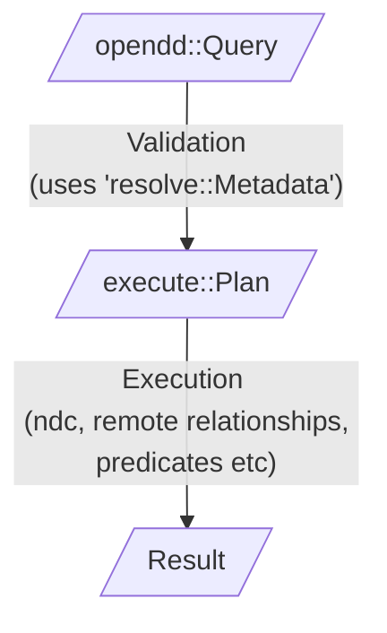

We are moving towards having multiple frontends to query an OpenDD graph:

1. GraphQL
2. SQL (work in progress)
3. REST (future)

This document outlines the challenges involved in adding a new frontend with the
existing architecture and proposes some changes to make our life easier in the
long run.

## Current query pipelines

A GraphQL query goes through the following pipeline



1. `IR` uses ndc entities and is a permission aware structure.

1. The transformation phase needs to understand OpenDD permissions, OpenDD to
   NDC mapping to constructs the `IR` with the right set of permissions and the
   right ndc fields.

A SQL query goes through a similar pipeline:



1. The 'Transformation' phase understands the OpenDD to NDC mapping to replace a
   'TableScan' node with an 'NDCQuery'

1. The final phase checks the applies permissions on top of the NDCQuery -
   checks for allowed fields, adds an additional filter etc.

> As the logic that generates `IR` is written against a normalized GraphQL
> query, the SQL layer couldn't use any of the permission related work that's
> done in the GraphQL layer. As it currently stands, both the frontends (GraphQL
> and SQL) need to be both permission aware and NDC aware to generate the right
> IR or an NDC Query. This is something that we shouldn't do.

## Proposal

1. Introduce an `opendd::Query` type which captures a query intent on an OpenDD
   model. Something along these lines:

   ```rust
   struct Query {
       model_name: Qualified<ModelName>,
       // where field could be one of scalar fields or relationship fields
       fields: Map<Alias, Field>,
       filter: Option<BooleanExpression>,
       order_by: Option<Vec<OrderByExpression>>,
       limit: Option<int32>,
       offset: Option<int32>,
   }
   ```

   Note the absence of any ndc mappings or permissions.

1. `resolved::Metadata` would have a function as follows:

   ```rust
   fn create_plan(&self, session: opendd::Sesion, query: opendd::Query) -> engine::Plan
   ```

   This will apply the right kind of permissions and generate the plan. If we
   were to view the generated `Plan`, it will have ndc concepts such an
   `ndc::Query`, the permission filters that were defined on the model etc. The
   `Plan` would be the same `Plan` that is currently defined in `execute` crate
   but without any GraphQL references in it.

Roughly speaking, this makes the following pipeline available for all frontends:



All the frontends will have some `Context` to map the API layer entities to
OpenDD entities. For example,

1. when the SQL layer sees a query such as this:

   ```sql
   SELECT id, name from Author
   ```

   the SQL frontend's job is to use its `Context` to convert this into

   ```rust
   Query {
       model_name: ModelName("Artist"),
       fields: Map[ ( Alias("id"), Field("id"),
                    ( Alias("name"), Field("name"),
                  ],
       filter: None,
       order_by: None
       limit: None,
       offset: None,
   }
   ```

   and run this down the above pipeline.

1. when the GraphQL layer sees a query such as this:

   ```graphql
   query {
     Author {
       id
       name
     }
   }
   ```

   it will be converted into the same OpenDD query that is listed above.

   Note that this is is a significant change for the GraphQL layer. Currently,
   once the above query is validated, the annotations on it would be roughly as
   follows:

   ```graphql
   query {
       Author @Annotation(connector: ..., collection: ..., permission_filter: ...) {
           id @Annotation(ndc_field_name: ..., ndc_field_type: ...)
           name @Annotation(ndc_field_name: ..., ndc_field_type: ...)
       }
   }
   ```

   Using the above annotations, we then generate `IR`.

   Once the GraphQL frontend starts using the common pipeline, the validated
   query would look like this:

   ```graphql
   query {
     Author @Annotation(model_name: "Author") {
       id @Annotation(field_name: "id")
       name @Annotation(field_name: "name")
     }
   }
   ```

   With the above annotations we instead generate an `opendd::Query`.

## Operational plan

- Introduce `opendd::Query`.

- Get rid of GraphQL references from `execute::Plan`. If this is too invasive,
  we'll have to copy this into a new crate, work off of that.

- Look at the permissions and ndc mapping logic from the `schema` crate to write
  the `create_plan` function. This will probably only handle the subset of
  queries that the SQL frontend will generate.

- The SQL frontend will start using this new pipeline.

- At some point in the future `create_plan` will understand all of
  `opendd::Query` and the GraphQL can switch to this new pipeline.
